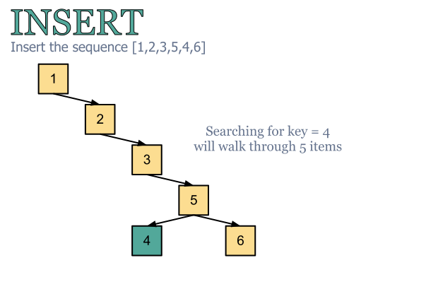
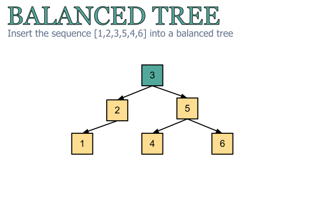
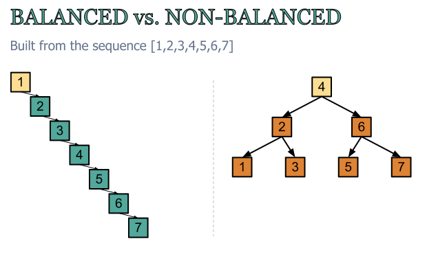
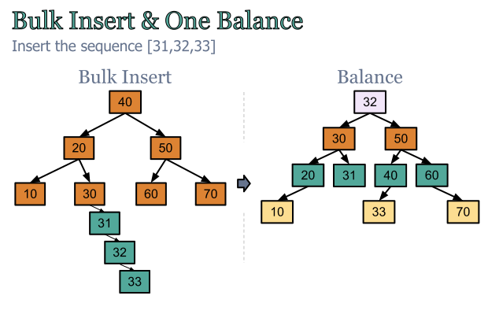
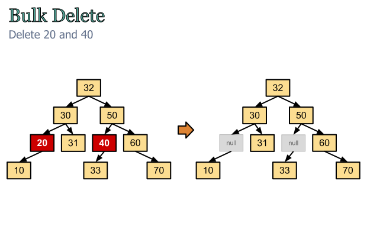

# Computer Algorithms: Balancing a Binary Search Tree

## Introduction

The [binary search tree](/2012/06/22/computer-algorithms-binary-search-tree-data-structure/) is a very useful data structure, where searching can be significantly faster than searching into a linked list. However in some cases searching into a binary tree can be as slow as searching into a linked list and this mainly depends on the input sequence. Indeed in case the input is sorted the binary tree will seem much like a linked list and the search will be slow. 

[](../images/1.-Inserting-into-a-binary-search-tree.png)A binary search tree may seem much like a linked lists if the input is nearly sorted!

To overcome this we must change a bit the data structure in order to stay well balanced. It’s intuitively clear that the searching process will be better if the tree is well branched. This is when finding an item will become faster with minimal effort.

[](../images/2.-Balanced-tree.png)Searching into a balanced tree is significantly faster than searching into a non-balanced tree!

Since we know how to construct a binary search tree the only thing left is to keep it balanced. Obviously we will need to re-balance the tree on each insert and delete, which will make this data structure more difficult to maintain compared to non-balanced search trees, but searching into it will be significantly faster.

## Overview

In order to balance a tree we can go for the very basic and intuitive approach. First let’s take a look of one non-balanced tree.

[](../images/3.-Balanced-vs.-Non-Balanced.png)

Compared to the balanced tree on the right from the image above with the same items we see that the root is approximately equal to its middle item. I.e. 4 is the middle item of the sequence [1,2,3,4,5,6,7]!

If we take a look of the sequence [2 3 4], clearly by building a binary tree it will look like a linked list. However if we choose the middle item for a root – we’ll easy build a balanced tree. So the only thing to do is to get the middle item out of a list.

We now see that building a balanced binary tree out of a sorted linked list isn’t that difficult. In the other hand, as I said above, on each insert we’ll have to rebalance the tree. You can think of the tree out of the values [1,2,3,4,5] and the same tree after inserting [44,45,46,47,48]. Clearly the root of the resulting tree will no longer be 3. 

So we need to implement the re-balancing in three basic operations. First we need to build a linked list out of a balanced binary tree. On the second place we’ll have to find the middle item and on the third place we’ll have to build again a balanced search tree. 

Hopefully the first two tasks are easy to implement, because making out a sorted list out of a binary search tree is very easy. We need just to walk through the tree from left-root-right recursively. Because smaller items are in the left sub-tree and greater items are on the right we’re sure that the resulting list will be sorted. Then finding the middle item is as easy as finding the middle index of an array know its length.

## Balancing Optimization

Of course the main problem of re-balancing a tree on each insert/delete is that this operations will be slow and soon or later we’ll have problems. That can happen if we change often our data structure. That’s why we should think of some optimization. 

Normally we insert and re-balance on each step, which is slow. In the other hand we can do bulk insert forgetting about the re-balancing for a while. Only after the inserts are done we can go for re-balancing the entire tree.

[](../images/4.-Bulk-Insert-with-Only-one-Balance.png)Doing bulk insert/delete and only one balancing will make the data structure faster!

The same approach we can use with bulk delete. We can just set to NIL the items we want to delete, but we can keep them in memory for a while. Thus the search will stay relatively fast without rebalancing the tree. However this approach can be used carefully because we’ll keep some data in the memory without actually using it. 

[](../images/5.-Bulk-Delete.png)We can NULL items without actually removing the pointers (links) and the structure of the tree!

## Implementation

Implementing balanced binary trees is more difficult than just implementing binary search trees. Here’s an example in [PHP](/category/php/).

```php
class Node
{
	protected   $_parent = null;
	protected   $_left = null;
	protected   $_right = null;
	protected   $_key;
    protected   $_data = null;
 
    /**
     * @param int $key
     * @param mixed $data 
     */
	public function __construct($key, $data)
	{
		$this->_key = $key;
        $this->_data = $data;
	}
 
    /**
     * Empty the node by keeping up the key, but
     * setting up the data to NULL 
     */
    public function doEmpty() 
    {
        $this->_data = null;
    }
 
    /**
     * Print the key
     * 
     * @return string
     */
	public function __toString()
	{
		return 'First name: ' . $this->_data['f_name']
                . '
'
                . 'Last name: ' . $this->_data['l_name']
                . '
' 
                . 'Birthday: ' . $this->_data['b_day'];
	}
 
    public function &getParent() { return $this->_parent; }
    public function setParent($parent) { $this->_parent = $parent; }
 
    public function &getLeft() { return $this->_left; }
    public function setLeft($left) { $this->_left = $left; }
 
    public function &getRight() { return $this->_right; }
    public function setRight($right) { $this->_right = $right; }
 
    public function &getKey() { return $this->_key; }
    public function setKey($key) { $this->_key = $key; }
 
    public function &getData() { return $this->_data; }
    public function setData($data) { $this->_data = $data; }
}
 
class BalancedBinaryTree
{
    /**
     * Reference to the root tree
     * 
     * @var Node 
     */
	protected $_root = null;
 
    /**
     * @param type $new
     * @param type $node
     * @return type 
     */
	protected function _insert($new, &$root)
	{
        // in case the tree is empty
        // make the new node the root of
        // the tree
		if ($root == null) {
			$root = $new;
			return;
		}
 
		if ($new->getKey() getKey()) {
			if ($root->getLeft() == null) {
				$root->setLeft($new);
				$new->setParent($root);
			} else {
				$this->_insert($new, $root->getLeft());
			}
		} else {
			if ($root->getRight() == null) {
				$root->setRight($new);
				$new->setParent($root);
			} else {
				$this->_insert($new, $root->getRight());
			}
		}		
	}
 
    /**
     * FALSE on not found
     * 
     * @param string $firstName
     * @param BalancedBinaryTree $tree
     * @return boolean 
     */
	protected function _search($firstName, &$tree)
	{
        if ($tree == null) {
            return FALSE;
        }
 
        $data = $tree->getData();
 
        if ($firstName == $data['f_name']) {
			return $tree;
		}
 
        // search the left sub-tree
        return $this->_search($firstName, $tree->getLeft())
                . $this->_search($firstName, $tree->getRight());
	}
 
    /**
     *
     * @param int $key
     * @param Node $tree
     * @return FALSE or Node 
     */
    protected function _searchByKey($key, &$tree)
    {
        if ($tree == null) {
            return FALSE;
        }
 
        if ($tree->getKey() == $key) {
            return $tree;
        } else if ($tree->getKey() > $key) {
            return $this->_searchByKey($key, $tree->getLeft());
        } else {
            return $this->_searchByKey($key, $tree->getRight());
        }
    }
 
    /**
     * Returns a list out of the tree by emptying the tree. 
     * In other way the tree and the list will allocate memory
     * 
     * @param BalancedBinaryTree $tree 
     */
    protected function _leftRootRight($tree)
    {
        if ($tree == null) {
            return array();
        }
 
        return array_merge(
                $this->_leftRootRight($tree->getLeft()),
                array(array('key' => $tree->getKey(), 'data' => $tree->getData())),
                $this->_leftRootRight($tree->getRight()));
    }
 
    public function _balance($list)
    {
        if (empty($list)) {
            return;
        }
 
        // split the list
        $chunks = array_chunk($list, ceil(count($list) / 2));
        $mid = array_pop($chunks[0]);
 
        $node = new Node($mid['key'], $mid['data']);
        $this->insert($node);
 
        $this->_balance($chunks[0]);
        if (isset($chunks[1]))
            $this->_balance($chunks[1]);
    }
 
    /**
     * Balance a binary search tree 
     */
    public function balance()
    {
        $list = array();
        // make a list out of the tree
        $list = $this->_leftRootRight($this->_root);
 
        // find the medium! Because the list is ordered
        // we can find the middle element in various ways
        $chunks = array_chunk($list, ceil(count($list) / 2));
        $mid = array_pop($chunks[0]);
 
        // empty the tree
        $this->_root = null;
 
        // inser the root
        $node = new Node($mid['key'], $mid['data']);
        $this->insert($node);
 
        $this->_balance($chunks[0]);
        $this->_balance($chunks[1]);
    }
 
    /**
     * Insert a new item into the tree
     * 
     * @param type $node 
     */
	public function insert($newNode)
	{
		$this->_insert($newNode, $this->_root);
	}
 
    /**
     * Search by item key
     * 
     * @param int $key
     * @return Node or FALSE
     */
    public function searchByKey($key)
    {
        return $this->_searchByKey($key, $this->_root);
    }
 
    /**
     * @param BalancedBinary $tree
     * @return string 
     */
    protected function _print($tree)
    {
        if ($tree == null) { return ''; }
 
        return $this->_print($tree->getLeft()) . ' ' 
                . $tree->getKey() . ' ' 
                . $this->_print($tree->getRight());
    }
 
    /**
     * Print the tree from left through the root and the right 
     */
    public function __toString()
    {
        if ($this->_root == null) {
            return 'The tree is empty!';
        }
 
        return $this->_print($this->_root->getLeft()) . ' '
                . $this->_root->getKey() . ' '
                . $this->_print($this->_root->getRight());
    }
}
 
$a = new Node(90, array(
    'f_name' => 'W.A.',
    'l_name' => 'Mozart',
    'b_day' => '1756-01-27',
));
 
$b = new Node(100, array(
    'f_name' => 'John',
    'l_name' => 'Smith',
    'b_day' => '23.05.2039',
));
 
$c = new Node(80, array(
    'f_name' => 'Sarah',
    'l_name' => 'Johnnes',
    'b_day' => 'tomorrow',
));
 
$d = new Node(60, array(
    'f_name' => 'Ludwig Van',
    'l_name' => 'Beethoven',
    'b_day' => '1770-12-17',
));
 
$e = new Node(70, array(
    'f_name' => 'Barbara',
    'l_name' => 'Stefanel',
    'b_day' => 'today',
));
 
$t = new BalancedBinaryTree();
 
$t->insert($a);
$t->insert($b);
$t->insert($c);
$t->insert($d);
$t->insert($e);
 
echo $t;
 
echo $t->searchByKey(70);
 
$t->balance();
 
echo $t->searchByKey(70);
```

## Complexity of Searching

Compared to non-balanced binary search trees we’re sure that searching into a balanced trees is quick enough. The maximum height of the tree is log(n) so the worst-case searching is O(log(n)).

[](../images/BST-Chart.png)Compared to searching in linked lists in O(n) time, searching into a balanced binary tree is O(log(n)) in the worst-case scenario!

## Application

Searching into a balanced binary tree is fast. What is more important is that we’re sure that in the worst-case scenario the search is O(log(n)). The only problem is that keeping a tree balanced is a slow operation that consumes too much resources and must be performed carefully.