# Computer Algorithms: Binary Search Tree

## Introduction

Constructing a [linked list](/2012/06/14/computer-algorithms-linked-list-data-structure/) is a fairly simple task. Linked lists are a linear structure and the items are located one after another, each pointing to its predecessor and its successor. Almost every operation is easy to code in few lines and doesn’t require advanced skills. Operations like insert, delete, etc. over linked lists are performed in a linear time. Of course on small data sets this works fine, but as the data grows these operations, especially the search operation becomes too slow.

Indeed searching in a linked list has a linear complexity and in the worst case we must go through the entire list in order to find the desired element. The worst case is when the item doesn’t belong to the list and we must check every single item of the list even the last one without success. This approach seems much like the [sequential search](/2011/11/24/computer-algorithms-sequential-search/) over arrays. Of course this is bad when we talk about large data sets. 

[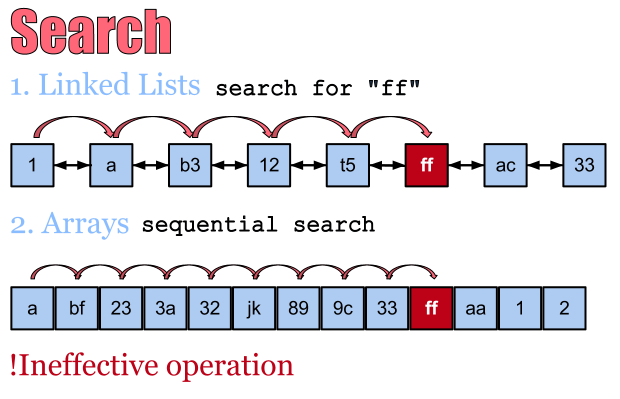](../images/1.-Search-over-Linked-Lists-and-Arrays.png)Sequential search over arrays seems much like searching in linked lists and it is a basically ineffective opration!

In terms of arrays, we could perform binary search and go directly in the middle of the array, then jump back or forward. That is because we can access array items directly using their index. However as we saw the linked lists unlike arrays can’t benefit of a direct access and we must go item by item.

Because of this natural problem of linked lists searching is slow and obviously we can’t make it better. The only way to improve searching over dynamic data structures is to use different data structure.

The tree is a data structure where each item, except of keeping some data, keeps a reference (pointer) to its children and its parent.

[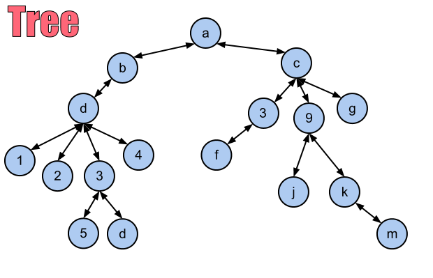](../images/2.-A-tree.png)A tree data structure. Each item points to its parent and its children. However the root’s parent it’s NIL.

Of course if the item doesn’t have children, they are NIL, then this is considered a leaf in the tree terminology. In the other hand if the item doesn’t have parent item it is considered the root.

[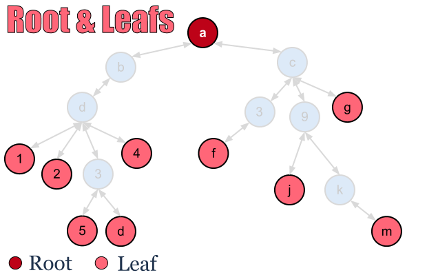](../images/3.-Root-and-Leafs.png)Root and Leafs

If there is no item in the tree the tree is considered empty. 

In these terms only the root has no parent, and each item can have as many children as possible. Here are some trees in form of a diagrams.

[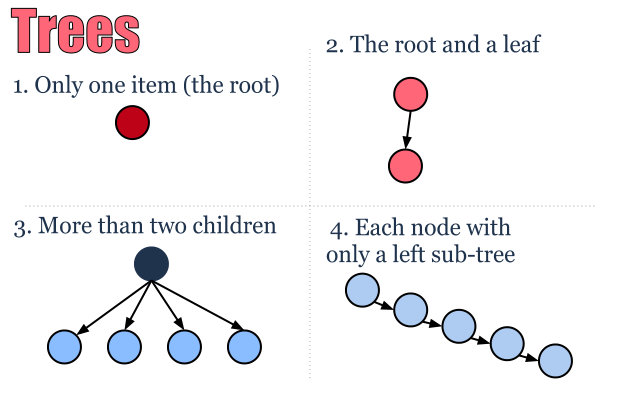](../images/4.-Trees.png)Possible trees

If we’re looking at the root of the tree we can assume there are two sub-trees – one left and one right. However if we isolate only one of these sub-trees we can again think of it as a tree and assume that it has one left and one right sub-trees and go recursively with this definition.

[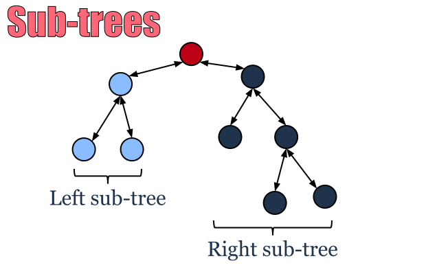](../images/5.-Sub-trees.png)Left and right sub-trees

## Overview

A binary tree is a tree where each item can have at most two children. 

[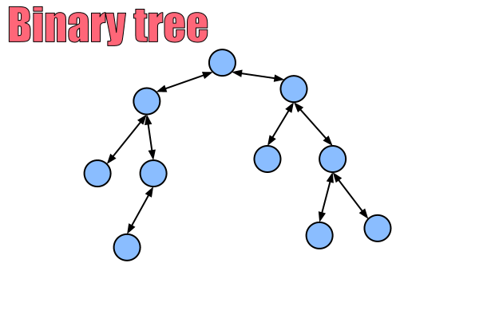](../images/6.-Binary-Tree.png)In the binary tree each node has at most two sub-trees – left and right!

Binary trees are especially important because they can contain ordered data in a specific manner. Building a binary tree isn’t difficult at all and it’s very similar to building a linked list.

However a binary tree isn’t more successful in searching than any other tree or data structure. If the items aren’t placed in a specific order we must go through the entire tree in order to find the searched item. This isn’t a great optimization, so we must put an order in it to improve the searching process.

## Binary Search Tree

The binary search tree is a specific kind of binary tree, where the each item keeps greater elements on the right, while the smaller items are on the left. 

[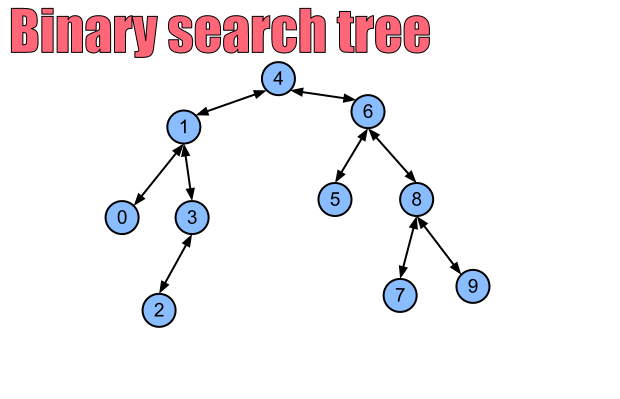](../images/7.-Binary-search-tree.png)Binary search tree – BST

Constructing a binary search tree is easy, because we can go for inserting each item only by comparing it with the root and decide where to go (left or right) based on its value. 

[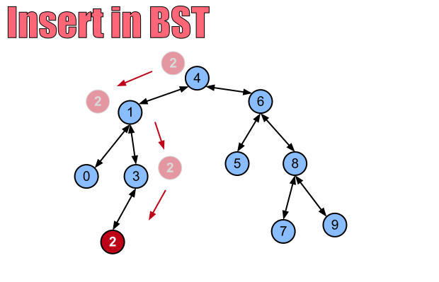](../images/8.-Insert-in-BST.png)Inserting in a binary search tree is fairly easy

## Implementation

The following code in [PHP](/category/php/) describes the basic principles of a binary search tree.

```php
class Node
{
	public $parent = null;
	public $left = null;
	public $right = null;
	public $data = null;
 
	public function __construct($data)
	{
		$this->data = $data;
	}
 
	public function __toString()
	{
		return $this->data;
	}
}
 
class BinaryTree
{
	protected $_root = null;
 
	protected function _insert(&$new, &$node)
	{
		if ($node == null) {
			$node = $new;
			return;
		}
 
		if ($new->data data) {
			if ($node->left == null) {
				$node->left = $new;
				$new->parent = $node;
			} else {
				$this->_insert($new, $node->left);
			}
		} else {
			if ($node->right == null) {
				$node->right = $new;
				$new->parent = $node;
			} else {
				$this->_insert($new, $node->right);
			}
		}		
	}
 
	protected function _search(&$target, &$node)
	{
		if ($target == $node) {
			return 1;
		} else if ($target->data > $node->data && isset($node->right)) {
			return $this->_search($target, $node->right);
		} else if ($target->data data && isset($node->left)) {
			return $this->_search($target, $node->left);
		}
 
		return 0;
	}
 
	public function insert($node)
	{
		$this->_insert($node, $this->_root);
	}
 
	public function search($item) 
	{
		return $this->_search($item, $this->_root);
	}
}
 
$a = new Node(3);
$b = new Node(2);
$c = new Node(4);
$d = new Node(7);
$e = new Node(6);
 
$t = new BinaryTree();
 
$t->insert($a);
$t->insert($b);
$t->insert($c);
$t->insert($d);
$t->insert($e);
 
echo $t->search($e);
```

## Search Complexity

Searching in binary search trees is supposed to be faster than searching into linked list. However the searching process in a BST can be very fast, but also can be as slow as on linked list. That is because depending on the input of items they can be placed only on the one side of the root.

[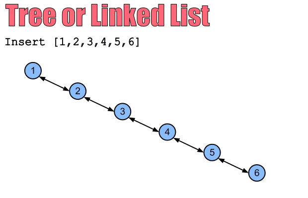](../images/9.-Tree-or-a-Linked-list.png)By inserting only greater items there are only right sub-trees – the tree isn’t different from a linked list and the searching is slow!

That makes the worst-case searching as slow as on linked list which is linear O(n). However if the tree is somehow balanced we can search very quickly with O(log(n)) time.

[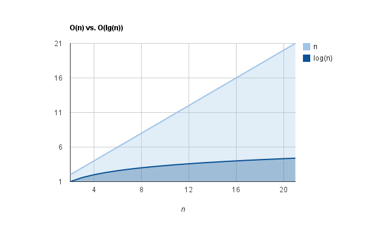](../images/BST-Chart.png)

## Further Optimization

We now see how ineffective binary search trees can be, so the only thing we must care is how to keep them balanced, so the search will be faster. The answer is to maintain (during insertion) a balanced binary search tree, which is another very handy data structure. 

A balanced binary search tree, or only balanced tree, is a data structure where the height of left and the right sub-trees can vary by one level at most. 

[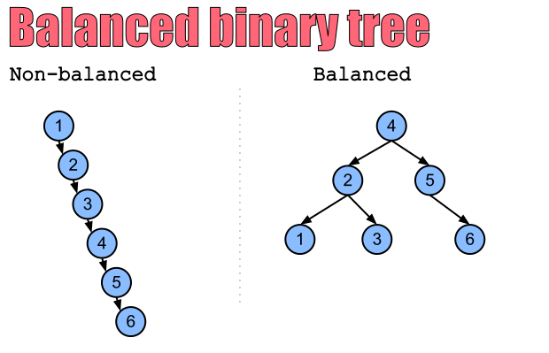](../images/10.-Balanced-or-not.png)Searching in a balanced tree is significantly faster than in some binary search trees!

## Application

Binary search trees are easy to build and maintain. The great thing is that if the data is well balanced they can be very useful for searching. The only problem is that these structures can be ineffective depending on the insertion order. However if we are somehow sure that the items aren’t ordered on the input, we may expect some optimized searching compared to a linked list. Compared to balanced binary search trees, BST require much less time to build and maintain (insert, delete).

Trees are very useful when working with graphs. Actually one of the very common tasks is walking through the entire tree, which can be done in several ways. First we can go to the left sub-tree, then the root and then the right sub-tree. Or right-root-left. Or root-left-right. 

However we can go in depth first often called depth-first-search or a breadth-first-search.

These two methods are designed to walk through the items in a specific order, which is very handy for some specific tasks – at least each tree is also a graph.