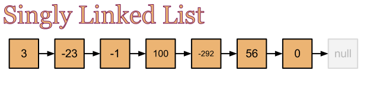
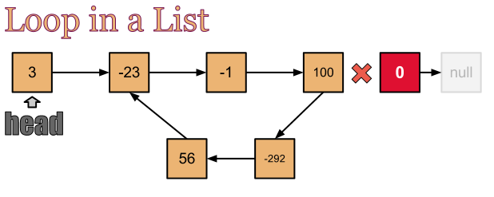
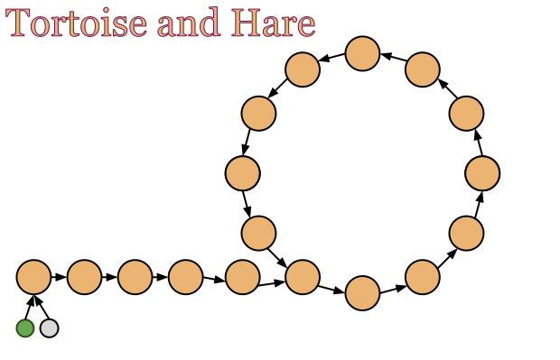
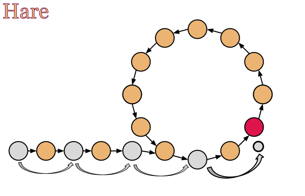
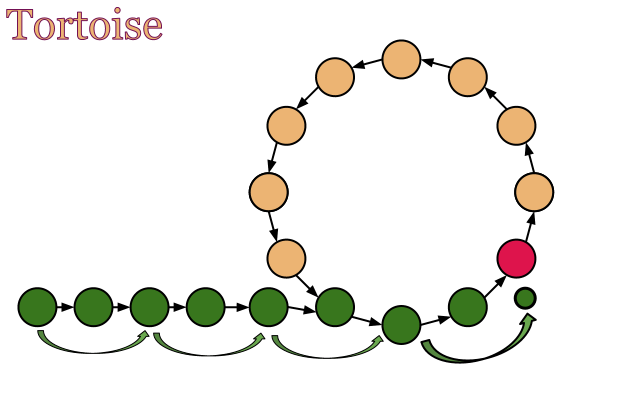
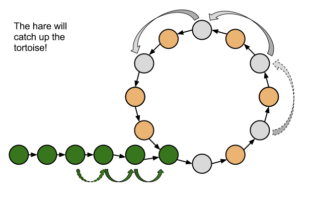

# Computer Algorithms: Detecting and Breaking a Loop in a Linked List

## Introduction

A singly linked list is a chain of nodes where each node points to its successor. The first node — the *head* — has no predecessor, and the last node points to `NIL`.

[](../images/1.-Singly-Linked-List.png)

If something goes wrong (a buggy insert, a careless splice) the list can end up with a **loop**: a node whose `next` pointer leads back to an earlier node. A loop turns naive traversal into an infinite walk, so before we can do anything else with the list we need to (1) decide whether a loop exists, and if so (2) figure out where it starts and break it.

[](../images/2.-Loop-in-a-Singly-Linked-List.png)

The classic solution is **Floyd's tortoise-and-hare** algorithm, which solves both problems in `O(n)` time and `O(1)` extra space.

## Overview

Send two pointers from the head: a *tortoise* that advances one node at a time and a *hare* that advances two.

[](../images/3.-Tortoise-and-Hare.png)

[](../images/4.-Hare.png)The hare is fast and jumps by a pair of items at once!

[](../images/5.-Tortoise.png)The tortoise is much slower than the hare!

Two outcomes are possible:

- **No loop.** The hare reaches `NIL` first — the list ends.
- **Loop exists.** Once both pointers are inside the cycle, the hare gains exactly one position on the tortoise per step, so it must catch up within at most `M` steps (where `M` is the loop length). The pointers meet *somewhere inside the loop* — but not necessarily at the loop's entry point.

[](../images/6.-Movements.png)Once both runners are inside the loop the hare closes the gap by one each step, so a meeting is guaranteed.

Locating the *entry point* of the loop takes a second phase. There's a classic identity behind it: if `H` is the distance from the head to the loop's start and the meeting point is `k` steps into the loop, then the distance from the meeting point back around to the loop's start equals `H` (mod `M`). So if we reset one pointer to the head and walk both pointers one step at a time, they meet exactly at the loop's entry.

## Implementation

### The node

```
Node:
    key
    next  ← NIL
```

### Appending a node

```
APPEND(list, item):
    if list.head = NIL then
        list.head ← item
        return
    cur ← list.head
    while cur.next ≠ NIL do
        cur ← cur.next
    cur.next ← item
```

### Detecting a loop

Returns the meeting point inside the loop, or `NIL` if there is no loop.

```
DETECT_LOOP(list):
    tortoise ← list.head
    hare     ← list.head
    while hare ≠ NIL and hare.next ≠ NIL do
        tortoise ← tortoise.next
        hare     ← hare.next.next
        if hare = tortoise then
            return hare           // meeting point inside the loop
    return NIL                    // hare hit the end → no loop
```

### Finding the loop's entry

Once we have a meeting point, reset the tortoise to the head and advance both pointers one step at a time. They meet at the entry to the loop.

```
LOOP_START(list, meet):
    tortoise ← list.head
    hare     ← meet
    while tortoise ≠ hare do
        tortoise ← tortoise.next
        hare     ← hare.next
    return tortoise               // entry point of the loop
```

### Breaking the loop

To break the loop, find the node *just before* the entry point (the last node of the loop) and clear its `next`.

```
BREAK_LOOP(list):
    meet ← DETECT_LOOP(list)
    if meet = NIL then
        return                    // nothing to break
    start ← LOOP_START(list, meet)
    cur ← start
    while cur.next ≠ start do
        cur ← cur.next
    cur.next ← NIL
```

## Complexity

Let `n` be the number of nodes in the list and `m` the loop length (`m ≤ n`).

| Step | Time | Space |
|---|---|---|
| `DETECT_LOOP` | `O(n)` | `O(1)` |
| `LOOP_START` | `O(n)` | `O(1)` |
| `BREAK_LOOP` (last node walk) | `O(m)` | `O(1)` |
| **Total** | **`O(n)`** | **`O(1)`** |

The constant-space property is what makes Floyd's algorithm interesting: an obvious alternative — store every visited node in a hash set and check for repeats — also runs in `O(n)` time but uses `O(n)` extra memory.

## Application

Cycle detection is a recurring sub-problem in graph algorithms (any directed graph where each node has out-degree one is structurally a linked list with a possible loop), in detecting infinite redirect chains, and in some number-theoretic algorithms — Pollard's rho for integer factorisation uses the same tortoise-and-hare idea on a sequence generated by a function instead of `next` pointers.
