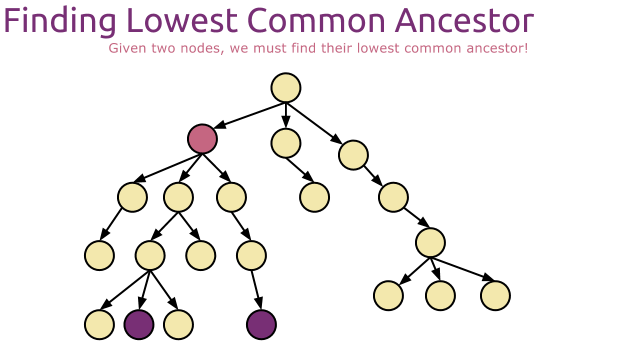
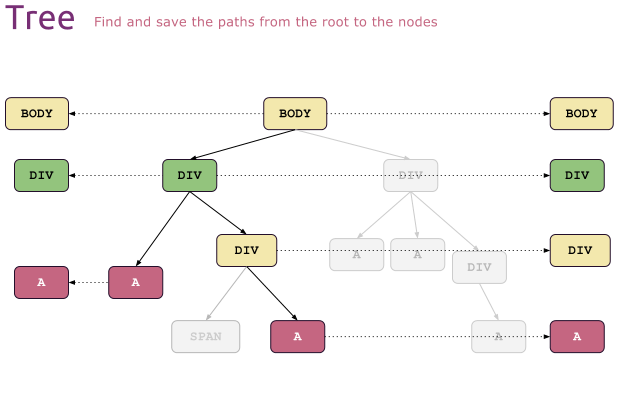
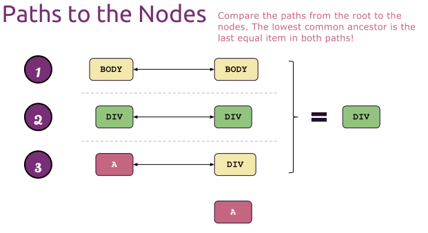
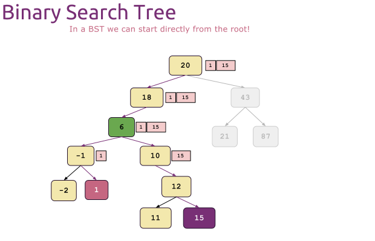

# Computer Algorithms: Finding the Lowest Common Ancestor

## Introduction

Given two nodes `u` and `v` in a rooted tree, their **lowest common ancestor** (LCA) is the deepest node that has both of them in its sub-tree. The root is always *some* common ancestor of every pair, so the problem is well-posed; the interesting part is locating the *deepest* one, which can sit far below the root.

[](../images/1.-Finding-the-Lowest-Common-Ancestor.png)Finding the Lowest Common Ancestor.

The fastest algorithm depends heavily on the kind of tree. We'll cover two cases that bracket the practical spectrum:

- **General rooted tree** — no ordering, arbitrary fan-out (e.g. a DOM tree). Solve in `O(n)` by collecting root-to-node paths.
- **Binary search tree** — the BST ordering gives an `O(h)` solution that walks straight from the root to the LCA without any extra storage.

## LCA in a general tree

Without an ordering rule we have no way to know in advance which sub-tree contains a given node, so the algorithm has two phases:

1. Find the path from the root to each target node.
2. Walk both paths in parallel from the root; the LCA is the **last node where the two paths agree**.

[](../images/2.-Lowest-Common-Ancestor.png)

[](../images/3.-Lowest-Common-Ancestor.png)Once we know the paths from the root down to the nodes, we can compare them in order to find the lowest common ancestor.

### Finding a root-to-node path

Standard depth-first search. Push the current node onto the path, recurse into each child, and pop on backtrack so the path always reflects the current DFS frontier.

```
FIND_PATH(node, target, path):
    APPEND(path, node)
    if node = target then
        return TRUE
    for each child in node.children do
        if FIND_PATH(child, target, path) then
            return TRUE
    POP(path)                 // this node is not on the path; backtrack
    return FALSE
```

### Comparing two paths

Once we have `path_u` and `path_v` from the root, walk them together and remember the last position where they agreed.

```
LCA_GENERAL(root, u, v):
    path_u ← [ ]
    path_v ← [ ]
    FIND_PATH(root, u, path_u)
    FIND_PATH(root, v, path_v)

    lca ← NIL
    i ← 0
    while i < length(path_u) and i < length(path_v)
          and path_u[i] = path_v[i] do
        lca ← path_u[i]
        i ← i + 1
    return lca
```

The loop stops as soon as the paths diverge — the last shared node is the LCA. Each `FIND_PATH` visits every node at most once, so this runs in `O(n)` time and `O(h)` extra memory for the two paths.

> *Memory-tight variant.* If every node has a `parent` pointer, you can skip the explicit path arrays: walk both nodes up to the same depth, then advance both one step at a time until they meet. Same `O(h)` time, but `O(1)` extra memory.

## LCA in a binary search tree

The BST ordering makes everything simpler. For any node `x`:

- if both `u.key` and `v.key` are smaller than `x.key`, the LCA lies in `x.left`;
- if both are larger, the LCA lies in `x.right`;
- otherwise (`u` and `v` straddle `x.key`, or one of them equals `x.key`), `x` itself is the LCA.

The first node we hit whose key is between `u.key` and `v.key` *is* the LCA.

[](../images/4.-Lowest-Common-in-a-BST.png)In a BST we compare both target keys with the current node (starting from the root). If the node's value is between them — this is the lowest common ancestor; otherwise we descend left or right.

```
LCA_BST(node, u, v):
    if node = NIL then
        return NIL
    if u.key < node.key and v.key < node.key then
        return LCA_BST(node.left,  u, v)
    if u.key > node.key and v.key > node.key then
        return LCA_BST(node.right, u, v)
    return node                  // keys straddle node.key (or one matches)
```

No paths, no auxiliary memory — each step descends one level, so the work is `O(h)`: `O(log n)` on a balanced tree, `O(n)` on a degenerate one.

## Complexity

| Tree type | Time | Extra space | Notes |
|---|---|---|---|
| General (path-array) | `O(n)` | `O(h)` | Two DFS traversals, two paths held in memory. |
| General (parent-pointer) | `O(h)` | `O(1)` | Requires `parent` links on every node. |
| Binary search tree | `O(h)` | `O(1)` | Uses ordering; `O(log n)` if balanced. |

`h` is the height of the tree and `n` is its size; for a balanced tree `h = O(log n)`.

## Application

The motivating use case is the DOM. When two elements need to share an event handler — especially before they're attached to the document — registering the listener on their LCA scopes the handler exactly to the sub-tree that contains them, instead of bubbling all the way up to `document` and processing events for every unrelated element along the way.

LCA also shows up in version control (finding the merge base of two commits in a Git history is an LCA on a DAG), in phylogenetics (the most recent common ancestor of two species), and as a primitive in tree-distance algorithms — `dist(u, v) = depth(u) + depth(v) − 2·depth(LCA(u, v))`.
