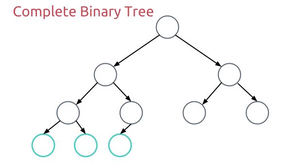
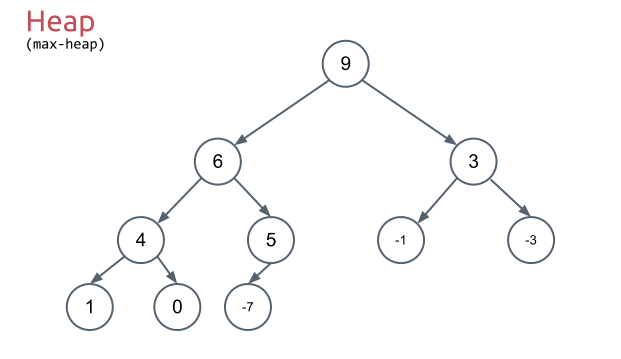
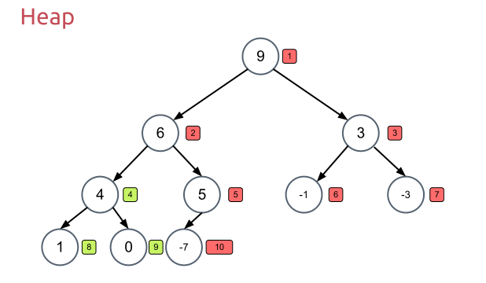
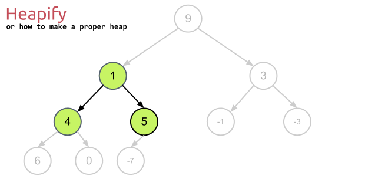
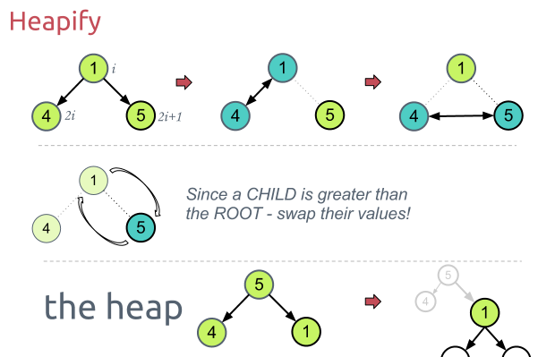
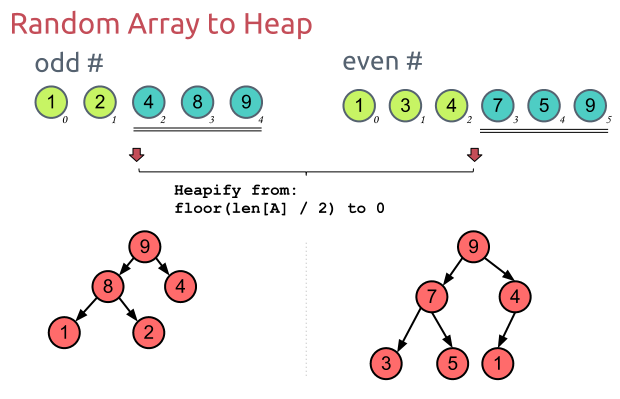

# Computer Algorithms: Heap

## Introduction

A heap is a tree-based data structure that is especially useful when we repeatedly need access to the largest or smallest item. It is the structure behind heapsort, but it is also useful on its own for priority queues and selection problems.

## Overview

A heap is a complete binary tree, where all the parents are greater than their children in a max-heap. If all the parents are smaller than their children, the structure is a min-heap. A complete binary tree is a binary tree where all levels are full except possibly the last one, where all items are placed from left to right.

[](../images/1.-Complete-Binary-Tree.png)A complete binary tree is a structure where all the levels are completely full, except the last level, where all the items are placed on the left!

Combined with the fact that each node contains a greater key than its children, a max-heap may look like the tree on the following diagram.

[](../images/2.-Heap.png)In a max-heap each node contains a greater value than its children. Respectively in a min-heap each node contains a smaller value than its parent!

The thing is that if we put indices next to each node of this tree, starting from the root (index 1) and continuing from left to right on each level, we’ll get the following tree.

[](../images/3.-Heap-Indexes.png)Putting indices right to each node reveals the secret of the heap. The i-th node has left child exactly with the index 2*i, and right child with index 2*i+1! This is a great opportunity to put this tree into an array!

For a node with index `i`, the left child has index `2*i`, while the right child has index `2*i + 1`. This particular order gives us the possibility to store each heap in an array.

[](../images/4.-Heap-as-an-Array.png)The heap tree can be easily represented as an array!

Since in a heap the greatest element is in the root of the tree for a max-heap, and the smallest element is in the root for a min-heap, we need to answer two questions.

- How to build a heap out of an ordinary array?
- After extracting the root, how can we rebuild the heap in order to keep it a heap again?

## Heapify

Heapify fixes a node and its children in order to restore the heap property. Let’s take a look at an ordinary binary tree with only three nodes.

[](../images/5.-Heapify.png)Fixing a node and its children in order to form a valid Heap is often called heapify!

We see that the three green nodes destroy the structure of our heap, because the root (1) is smaller than its children (4) and (5). Thus we need to fix this problem and what we’re going to do is to swap the root with its biggest child.

[](../images/6.-Heapify-Part-1.png)We first need to know which is the greatest out of the three items, than in case it is not the root, swap its value with the root!

As you can see on the picture above the i-th item is first compared to its left child. The greater of these two items is compared to the right child. Note that we don’t swap them while looking for the greatest value. Once we find the greatest of these three values we swap it with the root in case it’s not the root value.

Although now these three elements form a heap, swapping the root with one of its children may destroy the heap constructed out of this child. That is why we continue the same procedure with it.

## Building a Heap

To build a heap from an arbitrary array we perform heapify starting from `floor(len[A] / 2)` down to the first item in the array.

[](../images/7.-Random-Array-to-Heap.png)Building a random array into a heap isn’t that difficult since we know that half of the complete tree items lay in it’s lowest level! Thus we start from floor(len[A] / 2)!

Why? Well, the items after `floor(len[A] / 2)` are leaves. They don’t have children, thus we don’t need to check them. If we start from an item on the right of `floor(len[A] / 2)`, there won’t be items with indices `2*i` and `2*i + 1`.

## Code

Throughout this section we use 1-based indices to match the diagrams above: the root sits at `A[1]`, and node `i`'s children are at `A[2*i]` and `A[2*i + 1]`.

```
HEAPIFY(A, i, heap_size):
    l = 2 * i
    r = 2 * i + 1
    largest = i

    if l <= heap_size and A[l] > A[largest] then
        largest = l
    if r <= heap_size and A[r] > A[largest] then
        largest = r

    if largest != i then
        SWAP(A[i], A[largest])
        HEAPIFY(A, largest, heap_size)
```

Each call descends at most one level, so `HEAPIFY` runs in `O(log n)` on a heap of size `n`.

```
BUILD_HEAP(A, heap_size):
    for i = floor(heap_size / 2) down to 1 do
        HEAPIFY(A, i, heap_size)
```

Building a heap runs in `O(n)`. It is tempting to multiply `O(log n)` heapify work by `n` items, but most heapify calls start near the leaves and move only a small distance.

## Application

Heaps are commonly used to implement priority queues. After we build a heap in `O(n)`, we can extract the greatest value in a max-heap, or the smallest value in a min-heap, then rebuild the heap. This lets us repeatedly take the highest-priority task without fully sorting the array.

For the sorting algorithm that uses this data structure, see [Heapsort](../02_sorting/heapsort.md).
