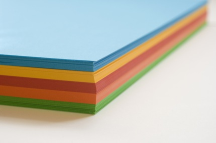
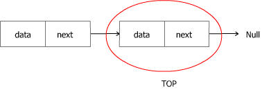

# Friday Algorithms: A Data Structure: JavaScript Stack

## Algorithms and Data Structures

[](../images/stack.jpg)

Instead of writing about “pure” algorithms this time I’ve decided to write about data structures and to start with a stack implementation in JavaScript. However algorithms and data structures live together since the very beginning of the computer sciences. Another reason to write about data structures is that many algorithms need a specific data structure to be implemented. Most of the search algorithms are data structure dependent. You know that searching into a tree is different from searching into a linked list.

I’d like to write more about searching in my future algorithm posts, but first we need some data structure examples. The first one is, as I mentioned – [stack](http://en.wikipedia.org/wiki/Stack_%28data_structure%29).

Implemented in JavaScript this is really a simple example, which don’t need much to be understood. But in first place what is a stack?

You can thing of the “computer science” stack as a stack of sheets of paper, as it’s shown on the picture. You’ve three basic operations. You can add new element to the stack by putting it on the top of the stack, so the previous top of the stack becomes the second element in the stack. Another operation is to “pop” from the stack – remove the “first” element in the stack – the top most element, and to return it. And finally print the stack. This is difficult to define as an operation, but let say you’ve to show somehow every element from the stack.

Here’s a little diagram:

[](../images/stack.png)

## Source Code

At the end some source code:

```javascript
var node = function()
{
    var data;
    var next = null;
}
 
var stack = function()
{
    this.top = null;
 
    this.push = function(data) {
        if (this.top == null) {
            this.top = new node();
            this.top.data = data;
        } else {
            var temp = new node();
            temp.data = data;
            temp.next = this.top;
            this.top = temp;
        }
    }
 
    this.pop = function() {
        var temp = this.top;
        var data = this.top.data;
        this.top = this.top.next;
        temp = null;
        return data;
    }
 
    this.print = function() {
        var node = this.top;
        while (node != null) {
            console.log(node.data);
            node = node.next;
        }
    }
}
 
var s = new stack();
 
s.push(1);
s.push(2);
s.push(3);
 
s.print();
 
var a = s.pop();
 
s.print();
```