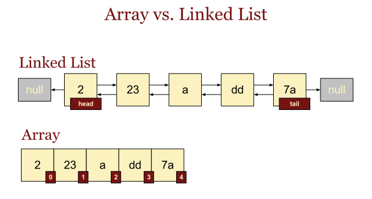
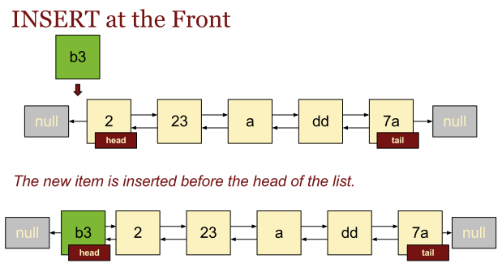
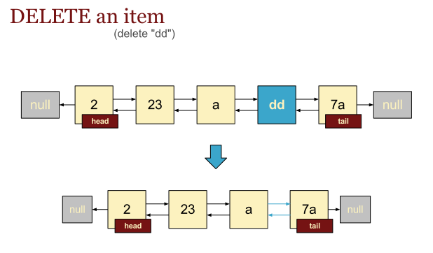
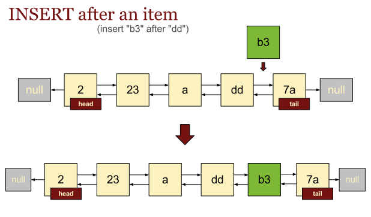
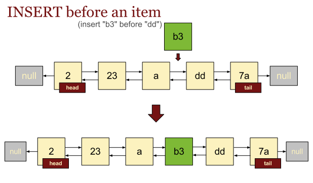
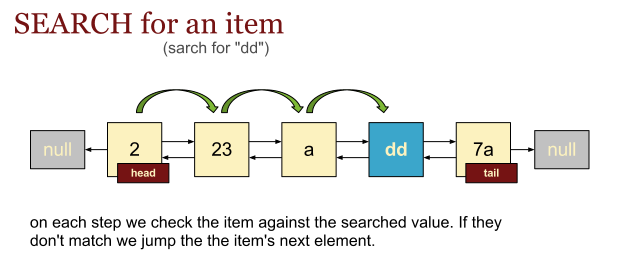
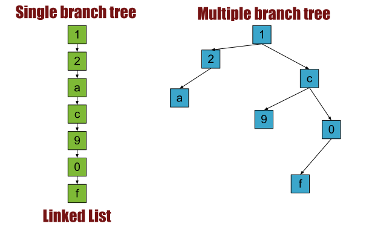

# Computer Algorithms: Linked List

## Introduction

The linked list is a data structure in which the items are ordered in a linear way. Although modern programming languages support very flexible and rich libraries that works with arrays, which use arrays to represent lists, the principles of building a linked list remain very important. The way linked lists are implemented is a ground level in order to build more complex data structures such as trees. 

It’s true that almost every operation we can perform on a linked list can be done with an array. It’s also true that some operations can be faster on arrays compared to linked lists. 

However understanding how to implement the basic operations of a linked list such as INSERT, DELETE, INSERT_AFTER, PRINT and so on is crucial in order to implement data structures as rooted trees, B-trees, red-black trees, etc.

## Overview

Unlike arrays where we don’t have pointers to the next and the previous item, the linked list is designed to support such pointers. In some implementations there is only one pointer pointing to the successor of the item. This kind of data structures are called singly linked lists. In this case the the last element doesn’t have a successor, so the pointer to its next element usualy is NULL. However the most implemented version of a linked list supports two pointers. These are the so called doubly linked lists.

[](../images/0.-Arrays-vs.-linked-list.png)Arrays items are defined by their indices, while the linked list item contains a pointer to its predecessor and his successor!

Let’s take a look at some examples. Here’s an array:

```php
A[2, 'hello', 'world', 13, 31]
```

We know that A[0] contains the number 2, while A[1] contains the word (string) “hello”. This is the very basic array representation where the indices are consecutive and start from 0.

In that case we know that if we’re looking at the item with index i, its next element has an index i+1, while his predecessor’s index is i-1. Thus we can easily iterate over items. However if we have an array with only 5 elements A[5] doesn’t exists, and in most of the cases is NULL. In other words array items are defined by their indices, and can be accessed directly with their index.

In the other hand most of the programming languages support associative arrays also called hash maps.

An associative array in PHP can be something like this.

```php
$a = array(
	'hello' => 'world',
	31	=> 12,
	'b7'	=> 144,
);
```

Now because the indices are not consecutive integers we don’t know the successor and the predecessor of the current item. Yes, there is some internal pointer that can give us the link to the previous and the next item, but explicitly we can’t refer them.

Of course some libraries may have functions that can point us to the next item, such a function is [next()](http://php.net/manual/en/function.next.php) in [PHP](/category/php/).

As we see arrays can replace the typical pointer-like representation of a linked list, but as I said already this data structure is crucial in order to understand more complex data structures.

Typically the linked list is implemented with two classes. The first one describing the item and the other one containing the main operations of the list such as search, insert, delete, etc.

The first class, typically called Item is a normal class containing various info about an item. In terms of persons, for instance, this class can contain the first and last names of the person, his address, phone etc. However it’s very important that this class contains pointers to its previous and its next objects.

In our terms each object of class Person will contain a pointer to a next object of the same class Person.

So we must first design the structure of an item. The following thing to do is to define a linked list as an abstraction over a real world list, just like the stack and the queue.

## Implementation

A doubly linked list is built from one passive struct (the node) and a small set of routines that splice nodes in and out by rewiring pointers. The list itself only carries handles to its first and last nodes.

### The node

```
Node:
    key
    next  ← NIL
    prev  ← NIL
```

### The list

```
List:
    head  ← NIL
    tail  ← NIL
```

## Operations

The basic set is INSERT at the head, DELETE a given node, INSERT_AFTER relative to a reference node, and SEARCH by key. The diagrams below sketch each one. Variants such as `insertBefore`, `deleteBefore`, `deleteAfter`, or `insertSorted` are straightforward symmetries of these and are omitted.

## Insert

Inserting at the head wires the new node in front of the current head and re-anchors `L.head`. If the list was empty, the new node is also the tail.

[](../images/1.-Insert-at-the-front-of-a-Linked-List.png)Inserting at the front of the list

```
INSERT(L, x):
    x.next ← L.head
    x.prev ← NIL

    if L.head ≠ NIL then
        L.head.prev ← x
    else
        L.tail ← x           // first node — also becomes the tail

    L.head ← x
```

## Delete

`DELETE` assumes a direct reference to the node `x` to remove. It splices `x` out by rewiring its two neighbours, taking care to update `L.head` or `L.tail` when `x` sits at either end.

[](../images/4.-Delete-an-item.png)Deleting an item from the inside of the list!

```
DELETE(L, x):
    if x.prev ≠ NIL then
        x.prev.next ← x.next
    else
        L.head ← x.next       // x was the head

    if x.next ≠ NIL then
        x.next.prev ← x.prev
    else
        L.tail ← x.prev       // x was the tail
```

The original PHP version walks the list looking for `x` before splicing it out; that scan is wasted work given that we already hold a pointer to the node, and removing it makes `DELETE` run in `O(1)`.

## Insert before & insert after

`INSERT_AFTER` takes a reference node `x` already in the list and a fresh node `y` to insert immediately after it. The new node inherits `x`'s right neighbour as its successor; if `x` was the tail, `y` takes over that role.

[](../images/2.-Insert-after-a-given-item-of-a-Linked-List.png)Insert after splits the list after the pointed item and inserts the new object there!

```
INSERT_AFTER(L, x, y):
    y.prev ← x
    y.next ← x.next

    if x.next ≠ NIL then
        x.next.prev ← y
    else
        L.tail ← y            // x was the tail

    x.next ← y
```

[](../images/3.-Insert-before-a-given-item-of-a-Linked-List.png)Insert before and insert after are very similar operations!

`INSERT_BEFORE` is symmetric — swap `next` and `prev`, and update `L.head` instead of `L.tail` when the reference node is the head.

## Search

A linear scan from the head, comparing each node's key against the target. Returns the matching node, or `NIL` if no node carries that key.

[](../images/5.-Search-for-an-item.png)

```
SEARCH(L, k):
    cur ← L.head
    while cur ≠ NIL do
        if cur.key = k then
            return cur
        cur ← cur.next
    return NIL
```

The operations above are only a subset of what a list can support; the principles are what carry over to the more complex pointer-based data structures that follow.

## Application

It’s true that linked list are a very basic data structure. Someone may wonder why we should code and implement linked list since we can do the same (with almost every modern programming language/library) with arrays. The answer is that data structures as trees are difficult to implement with arrays, so it’s easy to code them using pointers. Thus linked lists is a ground level for understanding them. Indeed each linked list is a tree with only one branch as shown on the image below.

[](../images/6.-Linked-List-Trees.png)Each linked list is a single branch tree!
