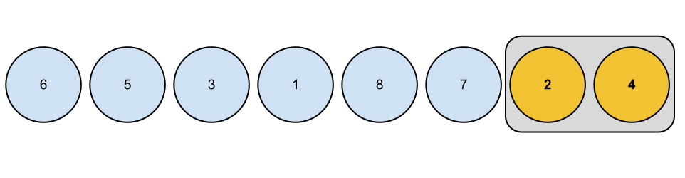
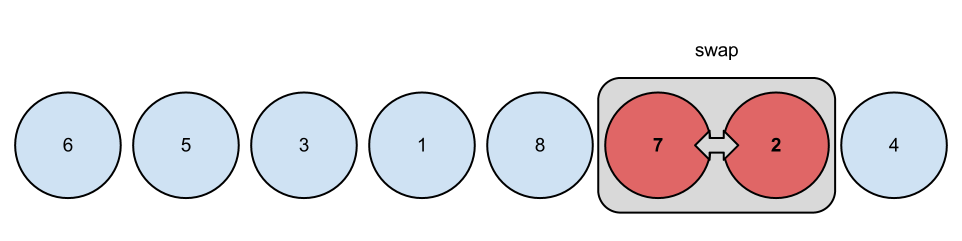
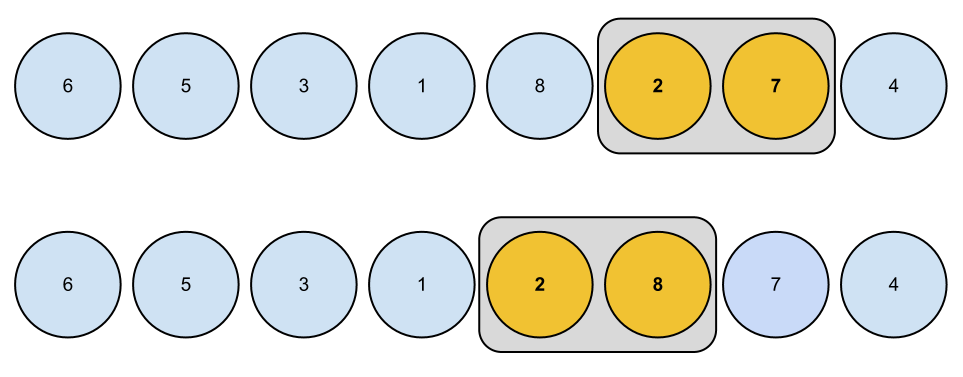
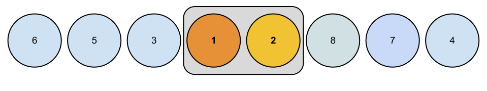
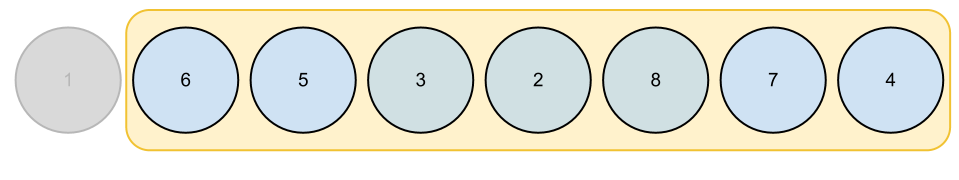
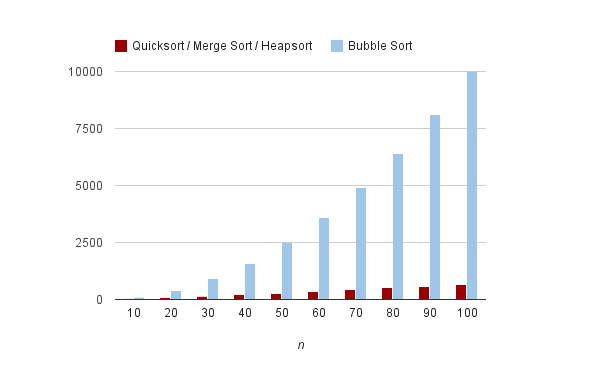
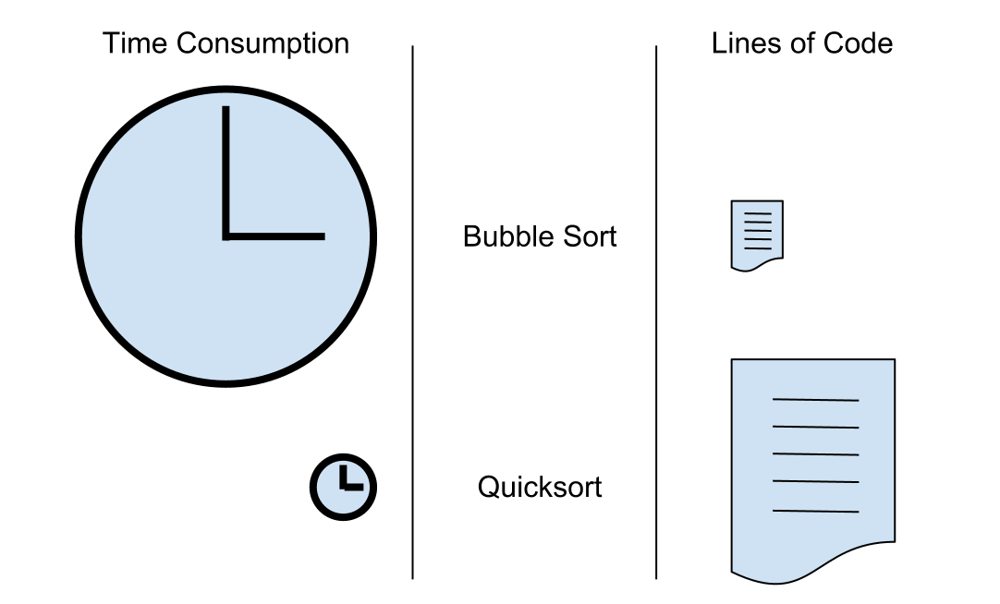

# Computer Algorithms: Bubble Sort

## Overview

It’s weird that bubble sort is the most famous sorting algorithm in practice since it is one of the worst approaches for data sorting. Why is bubble sort so famous? Perhaps because of its exotic name or because it is so easy to implement. First let’s take a look on its nature.

Bubble sort consists of comparing each pair of adjacent items. Then one of those two items is considered smaller (lighter) and if the lighter element is on the right side of its neighbour, they swap places. Thus the lightest element bubbles to the surface and at the end of each iteration it appears on the top. I’ll try to explain this simple principle with some pictures.

## 1. Each two adjacent elements are compared

[](../images/BubbleSortStep1CompareTwoElements1.png)In bubble sort we've to compare each two adjacent elements

Here “2” appears to be less than “4”, so it is considered lighter and it continues to bubble to the surface (the front of the array).

## 2. Swap with heavier elements

[](../images/BubbleSortStep2AnElementStartstoBubble.png)If heavier elements appear on the way we should swap them

On his way to the surface the currently lightest item meets a heavier element. Then they swap places.

## 3. Move forward and swap with each heavier item

[](../images/BubbleSortStep3ALighterElementStartstoBubble.png)Swapping is slow and that is the main reason not to use bubble sort

The problem with bubble sort is that you may have to swap a lot of elements.

## 4. If there is a lighter element, then this item begins to bubble to the surface

[](../images/BubbleSortStep4ALighterElementStartstoBubble.png)We can be sure that on each step the algorithm bubbles the lightest element so far

If the currently lightest element meets another item that is lighter, then the newest currently lightest element starts to bubble to the top.

## 5. Finally the lightest element is on its place

[](../images/BubbleSortStep5Themostlightelementisonitsplace.png)Finally the list begins to look sorted

At the end of each iteration we can be sure that the lightest element is on the right place – at the beginning of the list.

The problem is that this algorithm needs a tremendous number of comaprisons and as we know already this can be slow.

We can easily see how ineffective bubble sort is. Now the question remains – why is it so famous? Maybe indeed the answer lies in the simplicity of its implementation. Let’s see how to implement bubble sort.

## Implementation

Implementing bubble sort is easy. The question is how easy? Well, obviously after understanding the principles of this algorithm every developer, even a beginner, can implement it. Here’s a PHP implementation of bubble sort.

```php
$input = array(6, 5, 3, 1, 8, 7, 2, 4);
 
function bubble_sort($arr)
{
	$length = count($arr);
 
	for ($i = 0; $i  $i; $j--) {
			if ($arr[$j] 2) which can’t be worse. It’s weird that the most well known sorting algorithm is the slowest one.

[](../images/BubbleSortComparedToOthers.png)Bubble sort compared to quicksort, merge sort and heapsort in the average case

Even for small values of n, the number of comparisons and swaps can be tremendous.

[](../images/BubbleSortStats-2.png)Bubble sort is three times slower than quicksort even for n = 100, but it's easier to impelemnt

Another problem is that most of the languages (libraries) have built-in sorting functions, that they don’t make use of bubble sort and are faster for sure. So why a developer should implement bubble sort at all?

## Application: 3 Cool Reasons To Use Bubble Sort

We saw that bubble sort is slow and ineffective, yet it is used in practice. Why? Is there any reason to use this slow, ineffective algorithm with weird name? Yes and here are some of them that might be helpful for any developer.

## 1. It is easy to implement

Definitely bubble sort is easier to implement than other “complex” sorting algorithms as quicksort. Bubble sort is easy to remember and easy to code and that’s great instead of learning and remembering tons of code.

## 2. Because the library can’t help

Let’s say you work with JavaScript. Great, there you get array.sort() which can help for this: [3, 1, 2].sort(). But what would happen if you’d rather like to sort more “complex” structures like … some DOM nodes. Here we have three LI nodes and we want to sort them in some order. Obviously you can’t compare them with the “<" operator, so we've to come up with some custom solution.

```html4strict
[Click here to sort the list](#)
 
- node 3
- node 1
- node 2
```

Here sort() can’t help us and we’ve to code our own function. However we have only few elements (three in our case). Why not using bubble sort?

## 3. The list is almost sorted

One of the problems with bubble sort is that it consists of too much swapping, but what if we know that the list is almost sorted?

```javascript
// almost sorted
[1, 2, 4, 3, 5]
```

We have to swap only 3 with 4. 

Note that the naive implementation of bubble sort remains `O(n^2)` even on sorted input because it still performs the same nested passes. Bubble sort has a best-case complexity of `O(n)` only when implemented with an early-exit flag that stops after a pass with no swaps.
