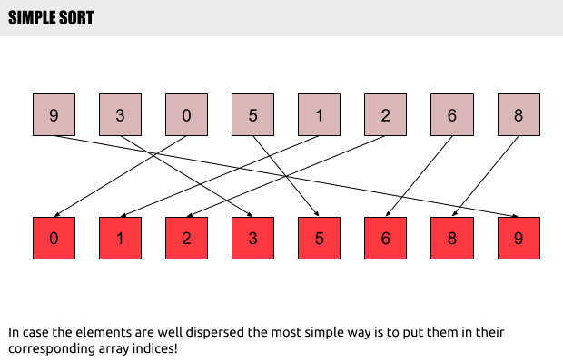
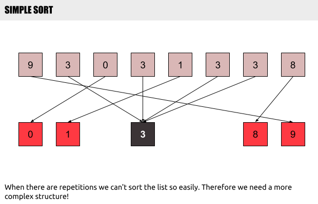
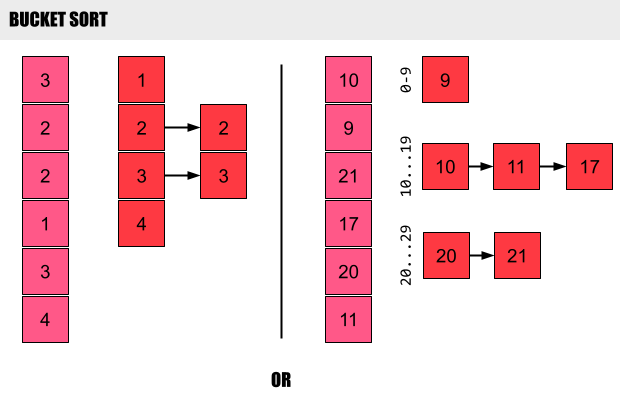

# Computer Algorithms: Bucket Sort

## Introduction

What’s the fastest way to sort the following sequence [9, 3, 0, 5, 4, 1, 2, 6, 8, 7]? Well, the question is a bit tricky since the input is somehow “predefined”. First of all we have only integers, and fortunately they are all different. That’s great and we know that in practice it’s almost impossible to count on such lucky coincidence. However here we can sort the sequence very quickly.

First of all we can pass through all these integers and by using an auxiliary array we can just put them at their corresponding index. We know in advance that that is going to work really well, because they are all different.

There is only one major problem in this solution. That’s because we assume all the integers are different. If not – we can just put all them in one single corresponding index.

That is why we can use bucket sort.

## Overview

Bucket sort it’s the perfect sorting algorithm for the sequence above. We must know in advance that the integers are fairly well distributed over an interval (i, j). Then we can divide this interval in N equal sub-intervals (or buckets). We’ll put each number in its corresponding bucket. Finally for every bucket that contains more than one number we’ll sort the items inside that bucket.

The thing is that we know that the integers are well distributed, thus we expect that there won’t be many buckets with more than one number inside.

That is why the sequence [1, 2, 3, 2, 1, 2, 3, 1] won’t be sorted faster than [4, 3, 1, 2, 9, 5, 4, 8].

## Pseudo Code

1. Let n be the length of the input list L;
2. For each element i from L
   2.1. If B[i] is not empty
      2.1.1. Put A[i] into B[i] using insertion sort;
      2.1.2. Else B[i] := A[i] 
3. Concatenate B[i .. n] into one sorted list;

## Complexity

The complexity of bucket sort isn’t constant depending on the input. However, when the input is well distributed and the number of buckets is chosen well, the expected complexity of the algorithm is `O(n + k)`, where `n` is the length of the input sequence, while `k` is the number of buckets. 

The problem is that its worst-case performance is `O(n^2)` when too many items land in the same bucket.

## Application

As with other non-comparison sorting algorithms, such as [radix sort](./radix-sort.md) and [counting sort](./counting-sort.md), bucket sort depends so much on the input. The main thing we should be aware of is the way the input data is dispersed over an interval.

Another crucial thing is the number of buckets that can dramatically improve or worse the performance of the algorithm. 

This makes bucket sort ideal in cases we know in advance that the input is well dispersed.
