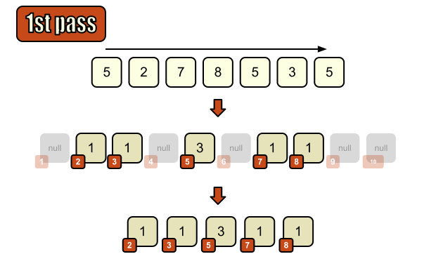
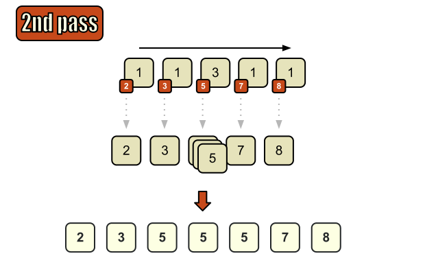
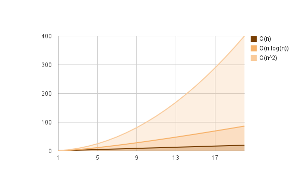
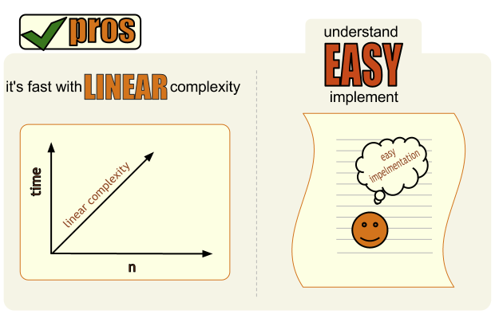
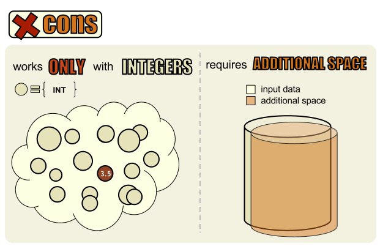

# Computer Algorithms: Counting Sort

## Introduction

Algorithms always depend on the input. General purpose sorting algorithms such as insertion sort, bubble sort, quicksort, and merge sort can be efficient in some cases and inefficient in others. When the input is a set of integers in a known, reasonably dense range, we can sometimes use a non-comparison sorting algorithm.

Counting sort is one such algorithm. It can sort suitable integer input in `O(n + k)` time, where `n` is the number of input items and `k` is the size of the key range.

## Overview

Let’s say we have an array of integers which is not sorted. Because the values are integers, we can count how many times each value appears.

First for each value of the input array we put the value of “1” on the key-th place of the temporary array as explained on the following diagram.

[](../images/RadixSortBasicIdea.png)Counting sort first pass

If there are repeating values in the input array we increment the corresponding value in the temporary array. After initializing the temporary array with one pass, we can produce the sorted output by walking the counts in key order.

[](../images/RadixSortBasicIdea2ndpass.png)Counting sort second pass

## Implementation

Implementing counting sort is very easy in fact, which is great. The thing is that old-school programming languages weren’t so flexible and we needed to initialize the entire temporary array. That leads to another problem – we must know the interval of values from the input. Fortunately nowadays programming languages and libraries are more flexible so we can initialize our temporary array even if we don’t know the interval of input values, as on the example bellow. PHP is somewhere in the middle – it’s flexible enough to build-up arrays in the memory without knowing their size in advance, but we still must ksort them.

```php
$list = array(4, 3, 5, 9, 7, 2, 4, 1, 6, 5);
 
function radix_sort($input)
{
    $temp = $output = array();
	$len = count($input);
 
    for ($i = 0; $i  0) 
			? ++$temp[$input[$i]]
			: 1;
    }
 
    ksort($temp);
 
    foreach ($temp as $key => $val) {
		if ($val == 1) {
			$output[] = $key; 
		} else {
			while ($val--) {
				$output[] = $key;
			}
        }
    }
 
    return $output;
}
 
// 1, 2, 3, 4, 4, 5, 5, 6, 7, 9
print_r(radix_sort($list));
```

The problem is that PHP needs ksort – which is completely foolish as we’re trying to sort an array using “another” sorting method, but to overcome this you must know the interval of values in advance and initialize a temporary array with 0s, as on the example bellow.

```php
define(MIN, 1);
define(MAX, 9);
$list = array(4, 3, 5, 9, 7, 2, 4, 1, 6, 5);
 
function radix_sort(&$input)
{
    $temp = array();
	$len = count($input);
 
	// initialize with 0s
    $temp = array_fill(MIN, MAX-MIN+1, 0);
 
    foreach ($input as $key => $val) {
    	$temp[$val]++;
    }
 
    $input = array();
    foreach ($temp as $key => $val) {
	if ($val == 1) {
		$input[] = $key;
	} else {
		while ($val--) {
			$input[] = $key;
		}
	}
    }
}
 
// 4, 3, 5, 9, 7, 2, 4, 1, 6, 5
var_dump($list);
 
radix_sort(&$list);
 
// 1, 2, 3, 4, 5, 5, 6, 7, 8, 9
var_dump($list);
```

Here the input is modified during the sorting process and it’s used as result.

## Complexity

Counting sort runs in `O(n + k)` time when the range of input values is known, where `n` is the number of items and `k` is the size of the key range. That is a great benefit in performance compared to `O(n log n)` or even worse with `O(n^2)`, but only when `k` is not too large compared with `n`.

[](../images/RadixSortComplexity.png)Linear function compared to `O(n log n)` and `O(n^2)`

## Why using counting sort

## 1. It’s fast for dense integer ranges

Counting sort is very fast compared to comparison-based sorting algorithms when the input keys are integers in a reasonably dense, known range.

[](../images/Prosofradixsort.png) 

## 2. It’s easy to understand and implement

Even a beginner can understand and implement counting sort, which is great. You need no more than few loops to implement it.

## Why NOT using counting sort

## 1. Works only with suitable integer keys

If you’re not sure about the input better do not use counting sort. We may think that our input consists only of integers and we can go for counting sort, but what if in the future someone passes floats or strings to our routine.

[](../images/Consofradixsort.png) 

## 2. Requires additional space

Counting sort needs additional space for the counts and output. If the key range is large and sparse, that space can become impractical.

## Final Words

Counting sort is restricted by the input’s domain, but there are many cases where only integers are sorted. This is when we get some data from the database based on primary keys – typically primary keys in database tables are integers as well. So practically there are lots of cases of sorting integers, and counting sort can be very useful when the key range is dense enough.
