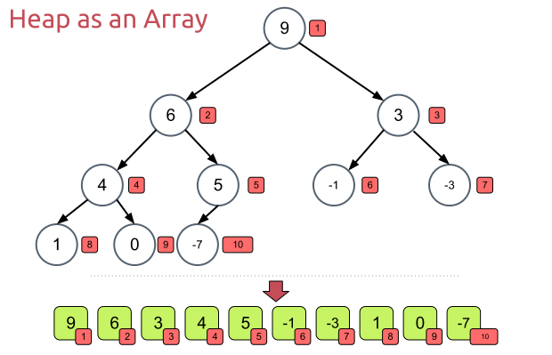

# Computer Algorithms: Heapsort

## Introduction

Heapsort is one of the general sorting algorithms that performs in `O(n log n)` time in the worst case, just like [merge sort](./merge-sort.md). It sorts in place, like quicksort, but unlike quicksort its worst-case running time remains `O(n log n)`.

Although quicksort’s worst-case sorting time is `O(n^2)`, it is often considered faster than heapsort in practice because of lower constants and good cache behavior. At the same time developers tend to consider heapsort more difficult to implement than other `O(n log n)` sorting algorithms.

Heapsort uses a special data structure, called a heap. For the data-structure details, see [Heap](../01_data_structures/heap.md).

## Overview

In a max-heap, the greatest element is in the root of the tree. Heapsort uses that property to repeatedly extract the maximum item and place it at the end of the array.

[](../images/4.-Heap-as-an-Array.png)The heap tree can be easily represented as an array!

The algorithm reduces to three routines.

- `HEAPIFY` fixes a single node `i` whose two subtrees are already heaps.
- `BUILD_HEAP` turns an arbitrary array into a heap.
- `HEAPSORT` repeatedly extracts the root to produce a sorted array.

Throughout this section we use 1-based indices to match the diagrams from the heap chapter: the root sits at `A[1]`, and node `i`'s children are at `A[2*i]` and `A[2*i + 1]`.

## Heapify

`HEAPIFY` assumes the subtrees rooted at `2*i` and `2*i + 1` are already heaps and that only `A[i]` may be out of place. It picks the largest of the three nodes and, if it isn't `i`, swaps and recurses into the affected subtree.

```
HEAPIFY(A, i, heap_size):
    l = 2 * i
    r = 2 * i + 1
    largest = i

    if l <= heap_size and A[l] > A[largest] then
        largest = l
    if r <= heap_size and A[r] > A[largest] then
        largest = r

    if largest != i then
        SWAP(A[i], A[largest])
        HEAPIFY(A, largest, heap_size)
```

Each call descends at most one level, so `HEAPIFY` runs in `O(log n)` on a heap of size `n`.

## Building the Heap

Items in the second half of the array are leaves. They have no children inside the heap, so they are already trivial heaps of size 1. We only need to heapify the internal nodes, those at indices `floor(heap_size / 2)` down to `1`, in reverse order. By the time `HEAPIFY` is called on a node, both of its children already root valid heaps, which is exactly what `HEAPIFY` requires.

```
BUILD_HEAP(A, heap_size):
    for i = floor(heap_size / 2) down to 1 do
        HEAPIFY(A, i, heap_size)
```

Building a heap runs in `O(n)`. Although a single `HEAPIFY` can run in `O(log n)`, most calls start close to the leaves and move only a small distance.

## Sorting

With a heap in place, sorting proceeds by repeatedly extracting the maximum: swap the root with the last item of the heap, shrink the heap by one, and re-heapify the new root. The just-extracted maximum is now in its final sorted position at the tail of the array.

```
HEAPSORT(A):
    heap_size = length(A)
    BUILD_HEAP(A, heap_size)

    while heap_size > 1 do
        SWAP(A[1], A[heap_size])
        heap_size = heap_size - 1
        HEAPIFY(A, 1, heap_size)
```

Only the root has been disturbed by the swap, so a single `HEAPIFY` from the root is enough. There is no need to rebuild the entire heap on each iteration.

## Complexity

Building the heap takes `O(n)`. After that, heapsort performs `n - 1` extractions, each followed by a root heapify that costs `O(log n)` in the worst case. This makes heapsort run in `O(n log n)` time.

Heapsort sorts in place, so it needs only `O(1)` auxiliary space beyond the input array.

## Application

As a full sorting algorithm, heapsort is useful when we need an in-place algorithm with predictable `O(n log n)` worst-case performance.

The heap idea is also useful when we need only the first `k` largest or smallest items out of a set of `n` items. We can build a heap in `O(n)`, then extract only `k` items instead of sorting the whole array.
