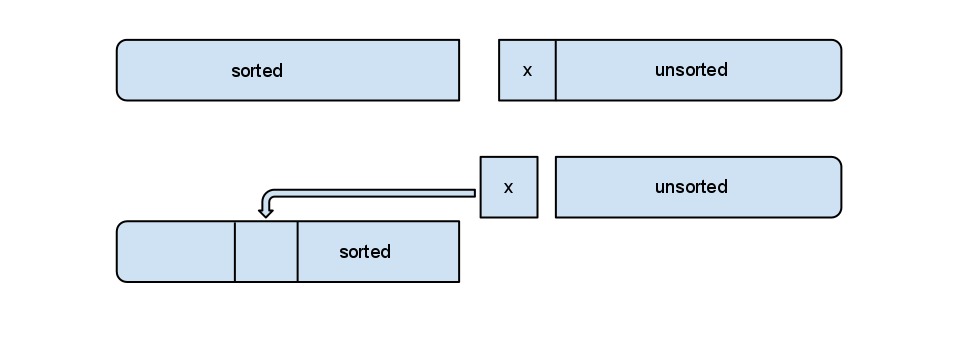
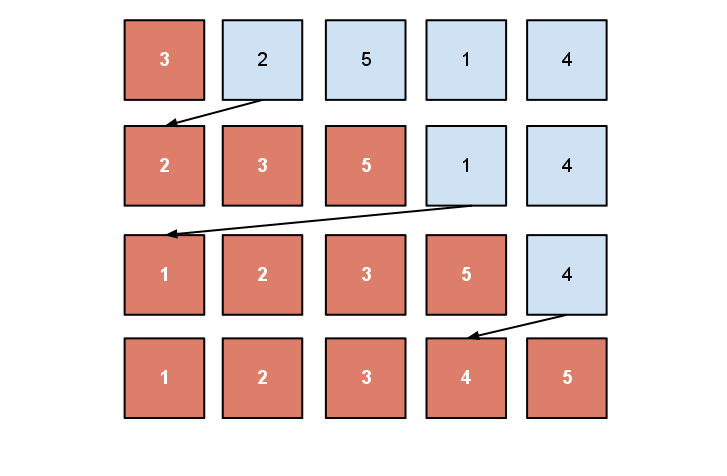
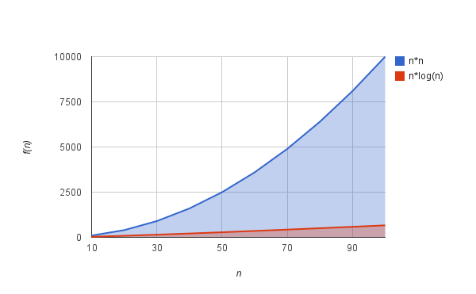

# Computer Algorithms: Insertion Sort

## Overview

Sorted data can dramatically change the speed of our program, therefore sorting algorithms are something quite special in computer science. For instance searching in a sorted list is faster than searching in an unordered list.

There are two main approaches in sorting – by comparing the elements and without comparing them. A typical algorithm from the first group is insertion sort. This algorithm is very simple and very intuitive to implement, but unfortunately it is not so effective compared to other sorting algorithms as [quicksort](/2010/06/18/friday-algorithms-iterative-quicksort/) and merge sort. Indeed insertion sort is useful for small sets of data with no more than about 20 items.

Insertion sort it is very intuitive method of sorting items and we often use it when we play card games. In this case the player often gets an unordered set of playing cards and intuitively starts to sort it. First by taking a card, making some comparisons and then putting the card on the right position.

So let’s say we have an array of data. In the first step the array is unordered, but we can say that it consists of two sub-sets: sorted and unordered, where on the first step the only item in the sorted sub-set is its first item. If the length of the array is n the algorithm is considered completed in n-1 steps. On each step our sorted subset is growing with one item. The thing is that we take the first item from the unordered sub-set and with some comparisons we put it into its place in the sorted sub-set, like on the diagram bellow.

[](../images/InsertionSortPrinciple.png)Main principle of insertion sort.

The insertion itself is the tricky part. We can insert the item once we find an item with a smaller value or if we have reached the front of the array like on the diagram bellow.

[](../images/InsertionSort.png)Example of insertion sort

## Implementation

Here’s a quick implementation of insertion sort in PHP. The good thing is that it is easy to implement, but there are bad news too – insertion sort is slow and it is ineffective for large data sets.

```php
$data = array(4, 2, 4, 1, 2, 6, 8, 19, 3);
 
function insertion_sort(&$arr)
{
	$len = count($arr);
 
	for ($i = 1; $i = 0) && ($arr[$j-1] > $tmp)) {
			$arr[$j] = $arr[$j-1];
			$j--;
		}
		$arr[$j] = $tmp;
	}
}
```

We can improve this code a little by using a sentinel, just like the sequential search, in order to remove one of the comparisons.

```php
$data = array(4, 2, 4, 1, 2, 6, 8, 19, 3);
 
function insertion_sort_sentinel(&$arr)
{
	$len = count($arr);
	array_unshift(&$arr, -1);
 
	for ($i = 1; $i  $tmp) {
			$arr[$j] = $arr[$j-1];
			$j--;
		}
		$arr[$j] = $tmp;
	}
	array_shift(&$arr); // remove the sentinel
}
```

Just because we use searching the right position in an ordered array we can use binary search in order to improve even more the algorithm above. Unfortunately this doesn’t improve so much the general efficiency of this algorithm.

## Complexity

As I said this algorithm is not so effective. Its complexity is O(n2) which is far worse than the O(n*log(n)) of quicksort, as you can see on the diagram bellow. 

[](../images/InsertionSortComplexityChart.png)n*n vs. n*log(n)

## Application

This algorithm is useful for small sets of data and even if it doesn’t look like the most effective sorting algorithm, insertion sort can be useful for some reasons. First of all it is easy to implement, but it also does not require additional memory and it can be fast if the data is almost nearly sorted, which is great.