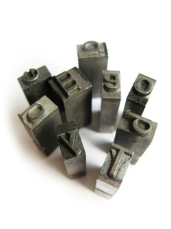
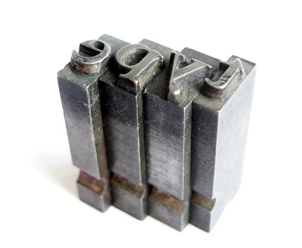

# Friday Algorithms: JavaScript Bubble Sort

## Bubble Sort

[](../images/unsorted.jpg)

This is one of the most slowest algorithms for sorting, but it’s extremely well known because of its easy to implement nature. However as I wrote past Fridays there are lots of sorting algorithms which are really fast, like the [quicksort](./iterative-quicksort.md) or [mergesort](./javascript-merge-sort.md). In the case of bubble sort the nature of the algorithm is described in its name. The smaller element goes to the top (beginning) of the array as a bubble goes to the top of the water.

There is a cool animation showing how bubble sort works in compare to the quick sort and you can practically see how slow is bubble sort because of all the comparing.

[QuickSort vs. BubbleSort](http://www.youtube.com/watch?v=vxENKlcs2Tw)

## Pseudo Code

Actually what I’d like to show you is how you can move from pseudo code to code in practice. Here’s the pseudo code from [Wikipedia](http://en.wikipedia.org/wiki/Bubble_sort).

```javascript
procedure bubbleSort( A : list of sortable items ) defined as:
  do
    swapped := false
    for each i in 0 to length(A) - 2 inclusive do:
      if A[i] > A[i+1] then
        swap( A[i], A[i+1] )
        swapped := true
      end if
    end for
  while swapped
end procedure
```

## JavaScript Source

```javascript
var a = [34, 203, 3, 746, 200, 984, 198, 764, 9];
 
function bubbleSort(a)
{
    var swapped;
    do {
        swapped = false;
        for (var i=0; i  a[i+1]) {
                var temp = a[i];
                a[i] = a[i+1];
                a[i+1] = temp;
                swapped = true;
            }
        }
    } while (swapped);
}
 
bubbleSort(a);
console.log(a);
```

As a result you’ve a sorted array!

[](../images/sorted.jpg)
