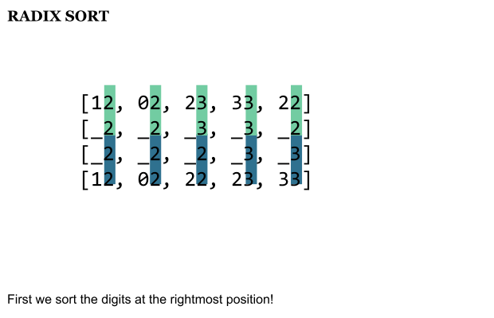
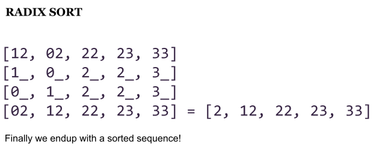

# Computer Algorithms: Radix Sort

## Introduction

The first question when we see the phrase “sorting in linear time” should be: where’s the catch? Indeed there’s a catch, and the thing is that we can’t sort just anything in linear time.

Since we speak about integers, we can think of faster sorting algorithms than usual comparison-based sorting. [Counting sort](./counting-sort.md) can be very fast in some cases, but also very slow in others, so it should be used carefully. Another non-comparison sorting algorithm is radix sort.

Radix sort avoids the main disadvantage of counting sort on sparse ranges. Instead of allocating a count for every possible integer value, radix sort sorts by digit or character position using a stable sorting step.

## Overview

The idea behind radix sort is simple. We must look at our integer sequence as a string sequence. OK, to become clearer let me give you an example. Our sequence is `[12, 2, 23, 33, 22]`. First we take the leftmost digit of each number. Thus we must compare `[_2, 2, _3, _3, _2]`. Clearly we can assume that since the second number `2` is only a one digit number we can fill it up with a leading `0`, to become `02` or `_2` in our example: `[_2, _2, _3, _3, _2]`. Now we sort this sequence with a stable sort algorithm.

## What is a Stable Sort Algorithm

A stable sort algorithm is an algorithm that sorts a list while preserving the relative order of elements with equal keys. In terms of PHP this means that:

```php
array(0 => 12, 1=> 13, 2 => 12);
```

Will be sorted as follows:

```php
array(0 => 12, 2 => 12, 1 => 13);
```

Thus the third element becomes second following the first element. Note that the third and the first element are equal, but the third appears later in the sequence so it remains later in the sorted sequence.

In the radix sort example, we need a stable sort algorithm, because we need to worry about only one digit position at a time.

So what happens in our example after we sort the sequence?



As we can see we’re far from a sorted sequence, but what if we proceed with the next position – the decimal digit?

Then we end up with this:



Now we have a sorted sequence, so let’s summarize the algorithm in a short pseudo code.

## Pseudo Code

The simple approach behind radix sort can be described as pseudo code, assuming that we’re sorting decimal integers.

1. For each digit position from least significant to most significant
2. Sort the numbers by this digit using a stable sort algorithm

The thing is that here we talk about decimal, but actually this algorithm can be applied equally on any numeric system. That is why it’s called “radix” sort.

Thus we can sort binary numbers, hexadecimals, and other positional representations.

It’s important to note that this algorithm can be also used to sort strings alphabetically.

```
[ABC, BBC, ABA, AC]
[__C, __C, __A, __C] => [ABA, ABC, BBC, AC]
[_B_, _B_, _B_, _A_] => [AC, ABA, ABC, BBC]
[___, A__, A__, B__] => [AC, ABA, ABC, BBC]
```

That is correct because we can treat the alphabet as another positional system.

## Complexity

Radix sort runs in `O(d(n + b))`, where `n` is the number of items, `d` is the number of digit positions, and `b` is the radix or base used by the stable sorting step. For a fixed base and a bounded number of digits, this is linear in the number of input items.

However, if the number of digit positions grows with `n`, the runtime grows too. For example, if we sort `n` numbers with `n` digit positions, the complexity becomes `O(n^2)`.

We must also remember that implementing radix sort and a supporting stable sort algorithm needs extra space.

## Application

Sorting integers can be faster than sorting just anything, so any time we need to implement a sorting algorithm we must carefully investigate the input data. And that’s also the big disadvantage of this algorithm – we must know the input in advance, which is rarely the case.
