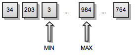
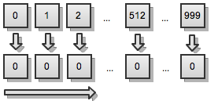
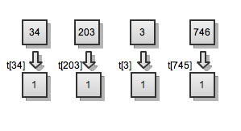
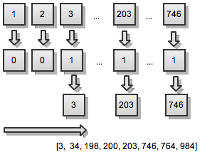

# Friday Algorithms: Sorting a Set of Integers – Far Quicker than Quicksort!

Yes! It’s really really fast, and it’s far quicker than the [quicksort](/2010/06/18/friday-algorithms-iterative-quicksort/) algorithm, which is considered as the fastest sorting algorithm in practice. However how it’s possible to be faster than the quicksort, which is the fastest algorithm?! Is that true? Actually it’s true, but only in few cases. It works with integers, you’ve to know the first and the last element from that set and you’ve to be sure that every element is unique

Imagine you’ve a set of numbers all of them greater than 1 and lesser than 1000. Of course you’re not suppose to have all of the integers between 1 and 1000, but only few of them – think of 500 numbers between 1 and 1000! Here’s important to note – that this is only an example, you can have far more than only few numbers between 1 and 1000 – what about the numbers between 1 and 1,000,000 – this is a big set, isn’t it.

The question is – if there are so many constraints, why should I use that algorithm instead of quicksort, or another sorting algorithm, that works with everything. The answer is clear – yes, you’d prefer quicksort if you’ve to sort some arbitrary data, but when it comes to integers, and you’ve, let’s say, 1,000,000 integers, my advice is – use this algorithm!

## Sorting the Set

## 1. First Pass

First we have an unsorted array, but we know the minimum and maximum of the set.

[](../images/unsorted.png)

On the first pass initialize an empty array with as many elements, as they are between the first and the last element of the set – for a set between 1 and 1000 – that will be an array with 1000 elements – each of which will be a zero in the beginning.

[](../images/temp-array.png)

Than loop trough the set and for every element in the set – you should put a 1 on it’s place

[](../images/array-first-pass.png)

Now we have an array of 0 and 1.

## 2. Second Pass

After the first pass, you’d guess what you’ve to do – loop trough the second array and print the keys of the elements different from 0 – those that are 1.

[](../images/sorted.png)

Now the array is sorted!

## Source Code

```javascript
var a = [34, 203, 3, 746, 200, 984, 198, 764];
 
function setSort(arr)
{
    var t = [], len = arr.length;
    for (var i = 0; i < 1000; i++) {
        t[i] = 0;
    }
 
    for (i = 0; i < len; i++) {
        t[arr[i]] = 1;
    }
 
    for (i = 0; i < 1000; i++) {
        if (1 == t[i]) {
            console.log(i);
        }
    }
}
 
setSort(a);
```

Now that you’ve seen that algorithm, perhaps you’d guess that it’s no so difficult to change from integers to any other set, and once again I should say that in many cases this is the best algorithm for sorting! Very often quicksort is preferred, but not always there isn’t something faster!