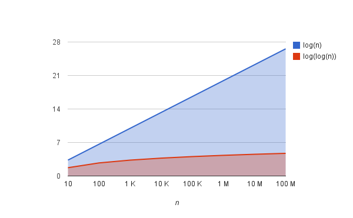

# Computer Algorithms: Interpolation Search

## Overview

I wrote about [binary search](/2011/12/26/computer-algorithms-binary-search/) in my previous post, which is indeed one very fast searching algorithm, but in some cases we can achieve even faster results. Such an algorithm is the “interpolation search” – perhaps the most interesting of all searching algorithms. However we shouldn’t forget that the data must follow some limitations. In first place the array must be sorted. Also we must know the bounds of the interval.

Why is that? Well, this algorithm tries to follow the way we search a name in a phone book, or a word in the dictionary. We, humans, know in advance that in case the name we’re searching starts with a “B”, like “Bond” for instance, we should start searching near the beginning of the phone book. Thus if we’re searching the word “algorithm” in the dictionary, you know that it should be placed somewhere at the beginning. This is because we know the order of the letters, we know the interval (a-z), and somehow we intuitively know that the words are dispersed equally. These facts are enough to realize that the binary search can be a bad choice. Indeed the binary search algorithm divides the list in two equal sub-lists, which is useless if we know in advance that the searched item is somewhere in the beginning or the end of the list. Yes, we can use also [jump search](/2011/12/12/computer-algorithms-jump-search/) if the item is at the beginning, but not if it is at the end, in that case this algorithm is not so effective.

So the interpolation search is based on some simple facts. The binary search divides the interval on two equal sub-lists, as shown on the image bellow.

[](../images/InterpolationSearchfig.1.png)The binary search algorithm divides the list in two equal sub-lists!

What will happen if we don’t use the constant ½, but another more accurate constant “C”, that can lead us closer to the searched item.

[](../images/InterpolationSearchfig.2.png)The interpolation search algorithm tries to improve the binary search!

The question is how to find this value? Well, we know bounds of the interval and looking closer to the image above we can define the following formula.

```php
C = (x-L)/(R-L)
```

Now we can be sure that we’re closer to the searched value.

## Implementation

Here’s an implementation of interpolation search in PHP.

```php
$list = array(201, 209, 232, 233, 332, 399, 400);
$x = 332;
 
function interpolation_search($list, $x)
{
	$l = 0;
	$r = count($list) - 1;
 
	while ($l  1) {
			return -1;
		}
 
		$mid = round($l + $k*($r - $l));
 
		if ($x  $list[$mid]) {
			$l = $mid + 1;
		} else {
			// success!
			return $mid;
		}
 
		// not found
		return -1;
	}
}
 
echo interpolation_search($list, $x);
```

## Complexity

The complexity of this algorithm is log2(log2(n)) + 1. While I wont cover its proof, I’ll say that this is very slowly growing function as you can see on the following chart.

[](../images/logntologlogn.png)

Indeed when the values are equally dispersed into the interval this search algorithm can be extremely useful – way faster than the binary search. As you can see log2(log2(100 M)) ≈ 4.73 !!!

## Application

As I said already this algorithm is extremely interesting and very appropriate in many use cases. Here’s an example where interpolation search can be used. Let’s say there’s an array with user data, sorted by their year of birth. We know in advance that all users are born in the 80’s. In this case sequential or even binary search can be slower than interpolation search.

```php
$list = array(
	0 => array('year' => 1980, 'name' => 'John Smith', 'username' => 'John'),
	1 => array('year' => 1980, ...),
	...
	10394 => array('year' => 1981, 'name' => 'Tomas M.', ...),
	...
	348489 => array('year' => '1985', 'name' => 'James Bond', ...),
	...
	2808008 => array('year' => '1990', 'name' => 'W.A. Mozart', ...)
);
```

Now if we search for somebody born in 1981 a good approach is to use interpolation search.