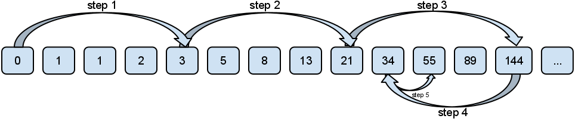
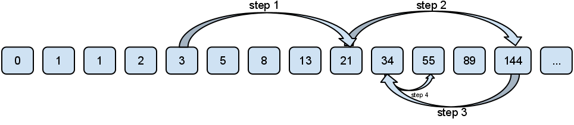
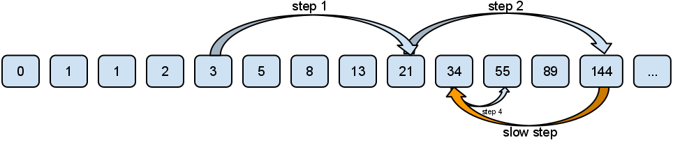

# Computer Algorithms: Jump Search

## Overview

In [my previous article](/2011/12/02/computer-algorithms-linear-search-in-sorted-lists/) I discussed how the sequential (linear) search can be used on an ordered lists, but then we were limited by the specific features of the given task. Obviously the [sequential search](/2011/11/24/computer-algorithms-sequential-search/) on an ordered list is ineffective, because we consecutively check every one of its elements. Is there any way we can optimize this approach? Well, because we know that the list is sorted we can check some of its items, but not all of them. Thus when an item is checked, if it is less than the desired value, we can skip some of the following items of the list by jumping ahead and then check again. Now if the checked element is greater than the desired value, we can be sure that the desired value is hiding somewhere between the previously checked element and the currently checked element. If not, again we can jump ahead. Of course a good approach is to use a fixed step. Let’s say the list length is n and the step’s length is k. Basically we check list(0), then list(k-1), list(2k-1) etc. Once we find the interval where the value might be (m*k-1 < x <= (m+1)*k – 1), we can perform a sequential search between the last two checked positions. By choosing this approach we avoid a lot the weaknesses of the sequential search algorithm. Many comparisons from the sequential search here are eliminated.

## How to choose the step’s length

We know that it is a good practice to use a fixed size step. Actually when the step is 1, the algorithm is the traditional sequential search. The question is what should be the length of the step and is there any relation between the length of the list (n) and the length of the step (k)? Indeed there is such a relation and often you can see sources directly saying that the best length k = √n. Why is that?

Well, in the worst case, we do n/k jumps and if the last checked value is greater than the desired one, we do at most k-1 comparisons more. This means n/k + k – 1 comparisons. Now the question is for what values of k this function reaches its minimum. For those of you who remember maths classes this can be found with the formula -n/(k^2) + 1 = 0. Now it’s clear that for k = √n the minimum of the function is reached.

Of course you don’t need to prove this every time you use this algorithm. Instead you can directly assign √n to be the step length. However it is good to be familiar with this approach when trying to optimize an algorithm.

Let’s cosider the following list: (0, 1, 1, 2, 3, 5, 8, 13, 21, 34, 55, 89, 144, 233, 377, 610). Its length is 16. Jump search will find the value of 55 with the following steps.

[](../images/jump-search-fig-1.png)Jump search skips some of the items of the list in order to improve performance!

## Implementation

Let’s see an example of jump search, written in [PHP](/category/php/).

```php
$list = array();
 
for ($i = 0; $i = $len) {
			return FALSE;
		}
	}
 
	while ($list[$prev] [](../images/jump-search-fig-2.png)The basic implementation of jump search can be slightly optimized!

## Complexity

Obviously the complexity of the algorithm is O(√n), but once we know the interval where the value is we can improve it by applying jump search again. Indeed let’s say the list length is 1,000,000. The jump interval should be: √1000000=1000. As you can see again, you can use jump search with a new step √1000≈31. Every time we find the desired interval we can apply the jump search algorithm with a smaller step. Of course finally the step will be 1. In this case the complexity of the algorithm is no longer O(√n). Now its complexity is approaching logarithmic value. The problem is that the implementation of this approach is considered to be more difficult than the binary search, where the complexity is also O(log(n)).

## Application

As almost every algorithm the jump search is very convinient for a certain kind of tasks. Yes, the binary search is easy to implement and its complexity is O(log(n)), but in case of a very large list the direct jump to the middle can be a bad idea. Then we should make a large step back if the searched value is placed at the beginning of the list.

Perhaps every one of us has performed some sort of a primitive jump search in his life without even knowing it. Do you remember cassette recorders? We used the “fast forward” key and periodically checked whether the tape was on our favorite song. Once we stopped at the middle of the song we used the “rewind” button to find exactly the beginning of the song.

This clumsy example can give us the answer of where jump search can be better than binary search. The advantage of jump search is that you need to jump back only once (in case of the basic implementation).

[](../images/jump-search-fig-3.png)Jump search is very useful when jumping back is significantly slower than jumping forward!

If jumping back takes you significantly more time than jumping forward then you should use this algorithm.