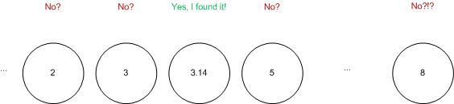
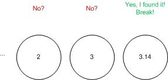
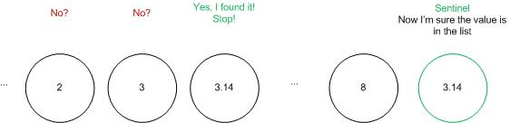

# Computer Algorithms: Sequential Search

## Overview

This is the easiest to implement and the most frequently used search algorithm in practice. Unfortunately the sequential search is also the most ineffective searching algorithm. However, it is so commonly used that it is appropriate to consider several ways to optimize it. In general the sequential search, also called linear search, is the method of consecutively check every value in a list until we find the desired one.

## Basic Implementation

The most natural approach is to loop through the list until we find the desired value. Here’s an implementation on PHP using FOR loop, something that can be easily written into any other computer language.

This is really the most ineffective implementation. There are two big mistakes in this code. First of all we calculate the length of the list on every iteration of the array, and secondly after we find the desired element, we don’t break the loop, but continue to loop through the array.

Yes, if the element is repeated without the “break” we can find its last occurrence, but if not the loop will iterate over the end of the array with no practical value.

## Optimization of the forward sequential search

… and javascript:

Even with this little optimization the algorithm remains ineffective. As we can see, on every iteration we have two conditional expressions. First we check whether we’ve reached the end of the list, and then we check whether the current element equals to the searched element. So the question is can we reduce the number of the conditional expressions?

## Searching in reverse order

Yes, we can reduce the number of comparison instructions from the forward approach of the linear search algorithm by using reverse order searching. Although it seems to be pretty much the same by reversing the order of the search we can discard one of the conditional expressions.

Note that we need to adjust index because of $index—expression.

Indeed here we have only one conditional expression, but the problem is that this implementation is correct ONLY when the element exists in the list, which is not always true. If the element doesn’t appears into the list, then this code can lead to an infinite loop. OK, but how can we stop the loop even when the list doesn’t contain the desired value? The answer is, by adding the searched value to the list.

## Sentinel

The above problem can be solved by inserting the desired item as a sentinel value. Thus we’re sure that the list contains the value, so the loop will stop for sure even if at the beginning the value didn’t appear to be part of the list.

This approach can be used to overcome the problem of the reverse linear search approach from the previous section.

## Complexity

As I said at the beginning of this post this is one of the most ineffective searching algorithms. Of course the best case is when the searched value is at the very beginning of the list. Thus on the first comparison we can find it. On the other hand the worst case is when the element is located at the very end of the list. Assuming that we don’t know where the element is and the possibility to be anywhere in the list is absolutely equal, then the complexity of this algorithm is O(n).

## Different cases

We must remember, however, that the algorithm’s complexity can vary depending on whether the element occurs once.

## Is it so ineffective?

Sequential search can be very slow compared to binary search on an ordered list. But actually this is not quite true. Sequential search can be faster than binary search for small arrays, but it is assumed that for n < 8 the sequential search is faster.

## Application

The linear search is really very simple to implement and most web developers go to the forward implementation, which is the most ineffective one. On the other hand this algorithm is quite useful when we search in an unordered list. Yes, searching in an ordered list is something that can dramatically change the search algorithm. Actually searching and sorting algorithms are often used together.

A typical case is pulling something from a database, usually in form of a list and then search for some value in it. Unfortunately in most of the cases the database orders the returned result set and yet most of the developers perform a consecutive search over the list. Yet again when the list is ordered it is better to use binary search instead of sequential search.

Let’s say we have a CSV file containing the usernames and the names of our users.

Username,Name
jamesbond007,James Bond
jsmith,John Smith
...

Now we fetch these values into an array.

// work case
$arr = array(
    array('name' =&gt; 'James Bond', 'username' =&gt; 'jamesbond007'),
    array('name' =&gt; 'John Smith', 'username' =&gt; 'jsmith')
);

Now using sequential search …

// using a sentinel
$x = 'jsmith';
$arr[] = array('username' =&gt; $x, 'name' =&gt; '');
$index = 0;

while ($arr[$index++]['username'] != $x);

if ($index &lt; count($arr)) {
    echo "Hello, {$arr[$index-1]['name']}";
} else {
    echo "Hi, guest!";
}