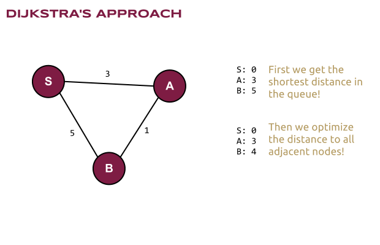
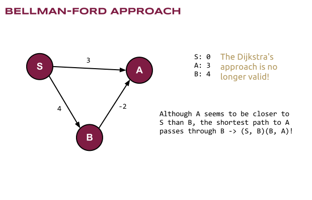
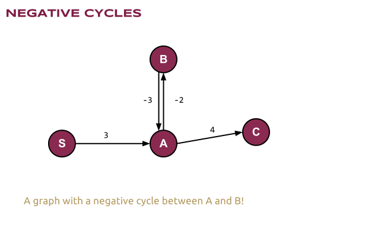

# Computer Algorithms: Bellman-Ford Shortest Path in a Graph

## Introduction

As we saw in the previous post, [the algorithm of Dijkstra](/2012/10/15/computer-algorithms-dijkstra-shortest-path-in-a-graph/) is very useful when it comes to find all the shortest paths in a weighted graph. However it has one major problem! Obviously it doesn’t work correctly when dealing with negative lengths of the edges.

We know that the algorithm works perfectly when it comes to positive edges, and that is absolutely normal because we try to optimize the inequality of the triangle.

[](../images/1.-Dijkstras-Approach.png)Since all the edges are positive we get the closest one!

Since Dijkstra’s algorithm make use of a priority queue normally we get first the shortest adjacent edge to the starting point. In our very basic example we’ll get first the edge with the length of 3 -> (S, A).

However when it comes to negative edges we can’t use any more priority queues, so we need a different, yet working solution.

## Overview

The solution was published by [Richard E. Bellman](http://en.wikipedia.org/wiki/Richard_Bellman) and [Lester Ford, Jr.](http://en.wikipedia.org/wiki/L._R._Ford,_Jr.) in 1958 in their publication “On a Routing Problem” and it is quite simple to explain and understand. Since we can prioritize the edges by its lengths the only thing we should do is to calculate all the paths. And to be sure that our algorithm will find all the paths correctly we repeat that N-1 times, where N is the number of vertices (|V| = N)!

[](../images/2.-Bellman-Ford-Approach.png)The algorithm of Bellman-Ford doesn’t use priority queues! Indeed they are useless since the closest node in the queue can have shorter path passing through another node!

In this very basic image we can see how Bellman-Ford solves the problem. First we get the distances from S to A and B, which are respectively 3 and 4, but there is a shorter path to A, which passes through B and it is (S, B) + (B, A) = 4 – 2 = 2.

## Code

Here’s the code on [PHP](/category/php/). Note that this time we use an adjacency matrix and an additional array of distances. It’s important (for directed graphs, and our graph this time is directed) to put the positive value of A[j][i] if A[i][j] is negative. Note the case for A[1][2]!

```php
define('INFINITY', 10000000);
 
$matrix = array(
    0 => array( 0,  3,  4),
    1 => array( 0,  0,  2),
    2 => array( 0,  -2, 0),
);
 
$len = count($matrix);
 
$dist = array();
 
function BellmanFord(&$matrix, &$dist, $start)
{
    global $len;
 
    foreach (array_keys($matrix) as $vertex) {
        $dist[$vertex] = INFINITY;
        if ($vertex == $start) {
            $dist[$vertex] = 0;
        }
    }
 
    for ($k = 0; $k  $dist[$j] + $matrix[$j][$i]) {
                    $dist[$i] = $dist[$j] + $matrix[$j][$i];
                }
            }
        }
    }
}
 
BellmanFord($matrix, $dist, 0);
 
// [0, 2, 4]
print_r($dist);
```

## Complexity

The complexity is clearly O(n3) which follows directly from the code above.

## Application

Actually this algorithm is very useful and it not only works with negative weights, but also can help us find negative cycles in the graph.

[](../images/3.-Negative-Cycles.png)A negative cycle can be found with Bellman-Ford’s algorithm!

This is done with the simple check after the main loop.

```php
for ($i = 0; $i  $dist[$j] + $matrix[$j][$i]) {
                echo 'The graph contains a negative cycle!';
            }
        }
    }
```

And here’s the full code.

```php
$matrix = array(
    0 => array( 0,  3,  4),
    1 => array( 0,  0,  2),
    2 => array( 0,  -2, 0),
);
 
$len = count($matrix);
 
$dist = array();
 
function BellmanFord(&$matrix, &$dist, $start)
{
    global $len;
 
    foreach (array_keys($matrix) as $vertex) {
        $dist[$vertex] = INFINITY;
        if ($vertex == $start) {
            $dist[$vertex] = 0;
        }
    }
 
    for ($k = 0; $k  $dist[$j] + $matrix[$j][$i]) {
                    $dist[$i] = $dist[$j] + $matrix[$j][$i];
                }
            }
        }
    }
 
    for ($i = 0; $i  $dist[$j] + $matrix[$j][$i]) {
                echo 'The graph contains a negative cycle!';
            }
        }
    }
}
 
BellmanFord($matrix, $dist, 0);
 
// [0, 2, 4]
print_r($dist);
```