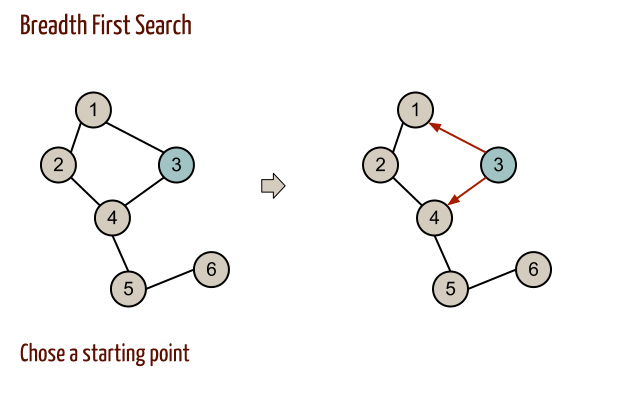
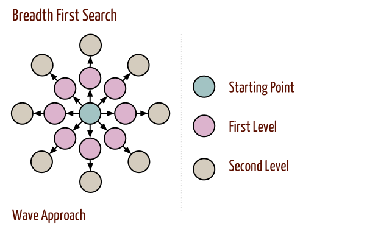
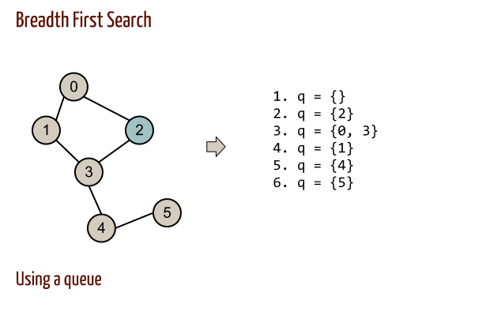

# Computer Algorithms: Graph Breadth First Search

## Introduction

Since we already know [how to represent graphs](/2012/08/31/computer-algorithms-graphs-and-their-representation/), we can go further for some very simple approaches of walking through them. Passing by all the vertices of a graph is a fundamental technique for most of the graph algorithms, such as finding shortest/longest paths, etc.

First thing to note is that graphs are not trees, in most of the cases, so walking through them can’t start from a root, as we do with trees. What we must do first is to decide from where to start – in other words – choosing a starting vertex. 

[](../images/1.-BFS-Choosing-a-Starting-Point.png)It’s clear that depending on the starting point we can get different passes through the graph. Thus choosing a starting point can be very important for our algorithm!

After that we need to know how to proceed. There are two approaches mostly known as “breadth first” and “depth first” search. While depth first search start from a vertex and goes as far as possible, then walks back and passes through vertices that haven’t been visited yet, breath first search is an approach of passing through all the neighbors of the node first, and then go to the next level.

## Overview

We can thing of breadth first search as a “wave” walk through the graph. In other words we go level by level, as shown on the picture below.

[](../images/2.-BFS-Wave.png)For this very specific graph on the picture we can see how breadth first search walks through the graph level by level!

Initially we mark all vertices as unvisited. A common approach is to create an empty queue where we put the vertices level by level, starting with the initial vertex.

[](../images/3.-BFS-Using-a-Queue.png)Using a queue is a typical approach for breadth first search! However this requires more space!

## Code

This simple approach is fairly easy to implement. Here’s the [PHP](/category/php/) implementation in few lines of code.

```php
 array(0, 1, 1, 0, 0, 0),
    1 => array(1, 0, 0, 1, 0, 0),
    2 => array(1, 0, 0, 1, 0, 0),
    3 => array(0, 1, 1, 0, 1, 0),
    4 => array(0, 0, 0, 1, 0, 1),
    5 => array(0, 0, 0, 0, 1, 0),
);
 
function init(&$visited, &$graph) 
{
    foreach ($graph as $key => $vertex) {
        $visited[$key] = 0;
    }
}
 
function breadth_first(&$graph, $start, $visited)
{
    // create an empty queue
    $q = array();
 
    // initially enqueue only the starting vertex
    array_push($q, $start);
    $visited[$start] = 1;
    echo $start . "\n";
 
    while (count($q)) {
        $t = array_shift($q);
 
        foreach ($graph[$t] as $key => $vertex) {
            if (!$visited[$key] && $vertex == 1) {
                $visited[$key] = 1;
                array_push($q, $key);
                echo $key . "\t";
            }
        }
        echo "\n";
    }
}
 
$visited = array();
init($visited, $g);
breadth_first($g, 2, $visited);
```

## Complexity

The complexity of this algorithm clearly is O(n2).

## Application

As I said breadth first and depth first searches are used in many practical cases, as finding shortest/minimal paths etc. That is why understanding these basic principles of walking through a graph is crucial for other, more complex, graph algorithms.