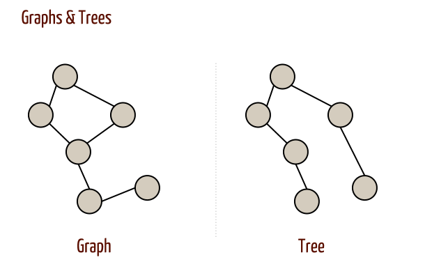
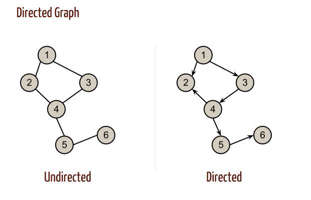
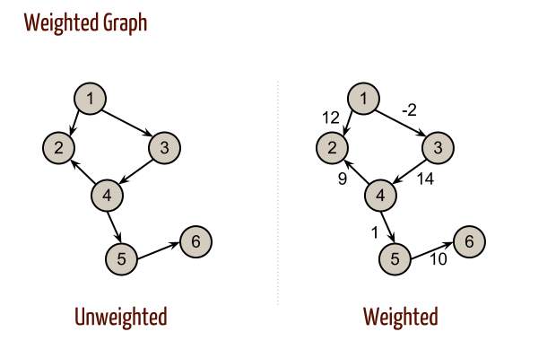
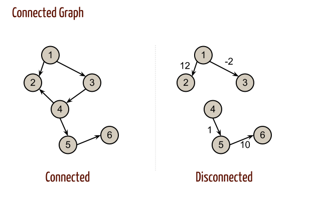
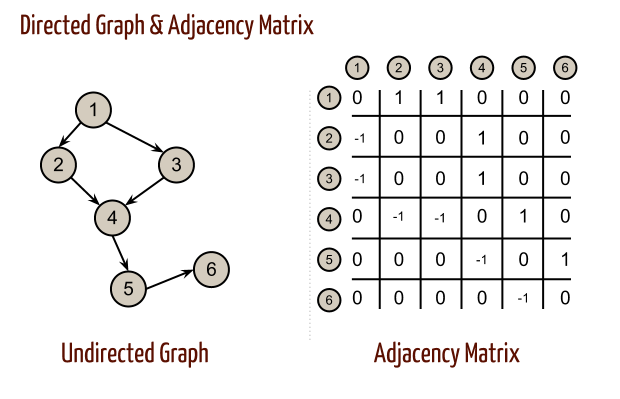
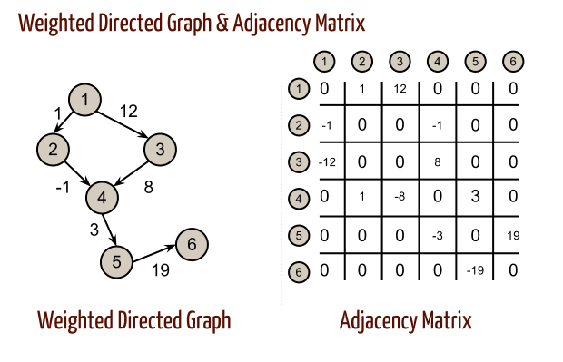
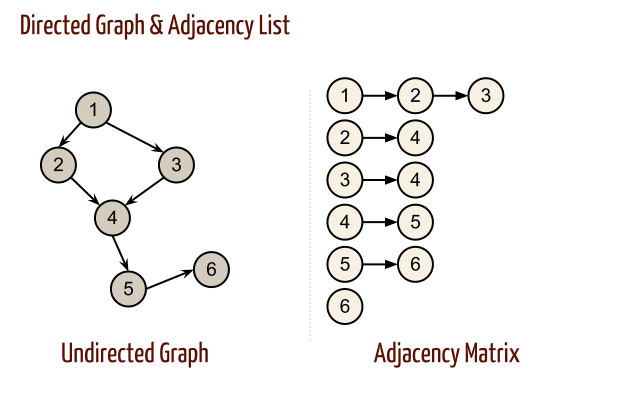

# Computer Algorithms: Graphs and their Representation

## Introduction

Although this post is supposed to be about algorithms I’ll cover more on graphs and their computer representation. I consider this very important, because there are lots of problems solved by using graphs and it is important to understand different types of representation.

First of all let’s try to explain what is a graph?

A graph is a specific data structure known in the computer science, that is often used to give a model of different kind of problems where a set of objects relate to each other in some way . For instance, trees are mainly used in order to represent a well-structured hierarchy, but that isn’t enough when modeling objects of the same type. Their relation isn’t always hierarchical! A typical example of graph is a geo map, where we have cities and the roads connecting them. In fact most of the problems solved with graphs relate to finding the shortest or longest path.

Although this is one very typical example actually a huge set of problems is can be solved by using graphs.

 

As shown on the image above the graph is a “more complex” data structure than the ordinary tree. Thus a graph supports cycles, while the tree doesn’t. In the other hand the nodes of a tree are defined by their parents and children, while in a graph that isn’t true.

In this case each graph is defined by its edges and its vertices. In most of the cases, in order to model and solve our problem, we can assume that the vertices are consecutive numbers starting from (1, or 0 in case of 0 based arrays, as we will see later).

As we see each tree is a graph, but not every graph is a tree.

In first place we must now that graphs can be divided in several categories.

They can be undirected and directed. An undirected graph means that in case there is an edge between the nodes i and j we shell assume that there is a path from i to j, as well as from j to i. In the case of directed graph, we’ll assume that if (i,j) exists there only path from node i to node j and there’s no path between j and i.

 

In this example we assume that all the edges are the same, which in practice isn’t always true. Taking a look back to the example of cities and roads, we know that the roads between different cities are different. In many cases their length in kilometers or miles are defining the algorithm (for instance longest/shortest path). To model this we can use weighted graphs, where each edge is associated with a weight. Note that, in the example below, the weight can be even a negative number. Of course in the example of cities and road that can’t be true, because we can’t have negative distance, but in some cases (let’s say where the path saves us some money) we can have negative values.

 

To complete the whole image, let’s give another example which will make the difference between graphs and trees even bigger. Graphs can be connected and disconnected. This means that the graph is constructed out of two or more sub-graphs without a path between these components. You can think of a disconnected graph as for the roads of the UK and France, since they aren’t connected by land.

 

## Overview

We know what a graph is in general. However we need an appropriate way to represent them in our programs.

There are many type of representation, which can be very useful in some cases and very useless in others. Two of the mostly used types of representation are the adjacency matrix and the adjacency list.

## Adjacency Matrix

In the first case we store a matrix (two-dimensional array) with size NxN, where N is the number of vertices. This means that for each edge between the vertices i and j we have the value of 1 (A[i][j] = 1), and 0 otherwise.

 

In case of directed graph, we can use 1 for the edge (i,j) and -1 for (j,i) in case the edge is directed from i to j.

 

For a weighted directed graph we can put the weights instead of 1s.

 

## Adjacency Lists

Another useful representation of graphs are the adjacency lists. In this case for each vertex we store a linked lists consisting of all of his successors.

 

Although these two ways are the mostly used, there are also some other type of representations. Such a useful representation is storing only the connectivity between two vertices i and j only if there’s a path between them. Of course this can help us answer the question “is there a path between i and j” in O(1), but unfortunately we lose the information about the graph and we can’t build it again out of this representation.

## Complexity

Most of the basic operations in a graph are:

- Adding an edge;
- Deleting an edge;
- Answering the question “is there an edge between i and j”;
- Finding the successors of a given vertex;
- Finding (if exists) a path between two vertices;

Thus depending on the representation these operations can have different complexities. In case that we’re using adjacency matrix we have:

- Adding an edge – O(1);
- Deleting an edge – O(1);
- Answering the question “is there an edge between i and j” – O(1);
- Finding the successors of a given vertex – O(n);
- Finding (if exists) a path between two vertices – O(n2);

While for an adjacency list we can have:

- Adding an edge – O(log(n));
- Deleting an edge – O(log(n));
- Answering the question “is there an edge between i and j” – O(log(n));
- Finding the successors of a given vertex – O(k), where “k” is the length of the lists containing the successors of i;
- Finding (if exists) a path between two vertices – O(n+m) – where m <= n;

We now see that depending of the representation of the graph we can have different complexities for the same operations. This is very important while trying to solve a problem and can be crucial while chosing the algorithm.