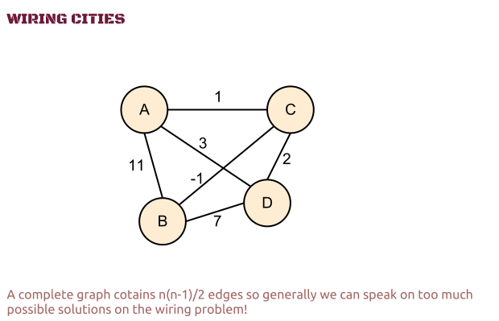
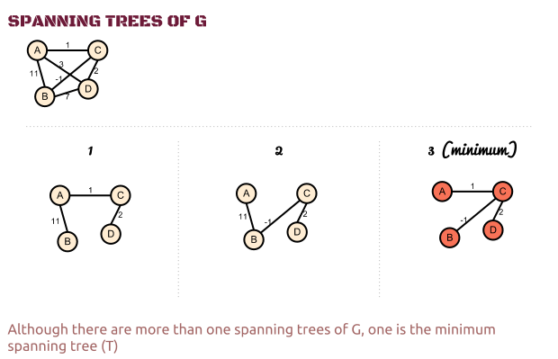
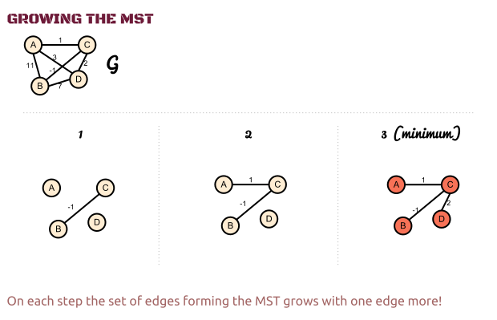
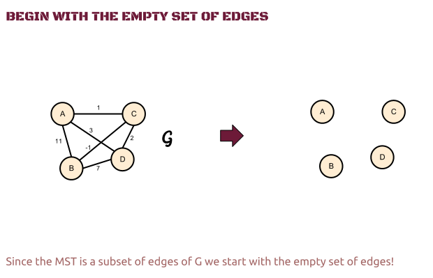
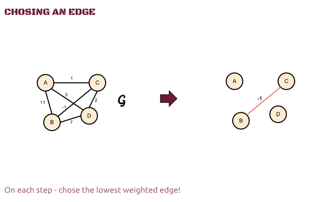
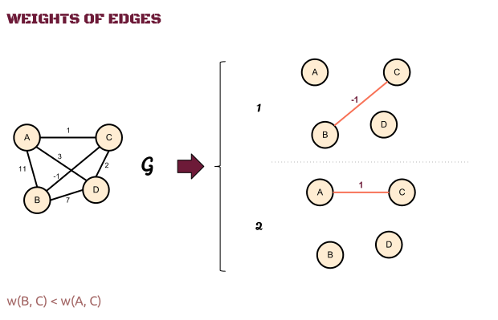

# Computer Algorithms: Minimum Spanning Tree

## Introduction

Here’s a classical task on graphs. We have a group of cities and we must wire them to provide them all with electricity. Out of all possible connections we can make, which one is using minimum amount of wire. 

To wire N cities, it’s clear that, you need to use at least N-1 wires connecting a pair of cities. The problem is that sometimes you have more than one choice to do it. Even for small number of cities there must be more than one solution as shown on the image bellow. 

[](../images/1.-General-Wiring-Problem.png) 

Here we can wire these four nodes in several ways, but the question is, which one is the best one. By the way defining the term “best one” is also tricky. Most often this means which uses least wire, but it can be anything else depending on the circumstances.

As we talk on weighted graphs we can generally speak of a minimum weight solution through all the vertices of the graph. 

By the way there might be more the one equally optimal (minimal) solutions. 

## Overview

Obviously we must choose those edges that are enough to connect all the vertices of the graph and whose sum of weights is minimal. Since we can’t have cycles in our final solution it must form a tree. Thus we’re speaking on a minimum weight spanning tree, as the tree spans over the whole graph.

Does each connected and weighted graph have a minimum spanning tree? The answer is yes! By removing the cycles from the graph G we get a spanning tree, since it’s connected. From all possible spanning trees one or more are minimal. 

[](../images/2.-General-Wiring-Problem.png) 

If w(u, v) is the weight of the edge (u, v),  we can speak of weight of any spanning tree T – w(T) which is the sum of all the edges forming that tree. 

Thus the weight of the minimum spanning tree is less than the weight of whatever other spanning tree of G.

After we’re sure that there is at least one minimum spanning tree for all connected and weighted graphs we only need to find it somehow.

We can go with an incremental approach. At the end we’ll have the minimum spanning tree (MST), but before that on each step of our algorithm we’ll have a sub-set of this final tree, which will grow and grow until it becomes the real MST. This subset of edges we’ll keep in one additional set A.

[](../images/3.-Growing-the-MST.png) 

So far we know that on each step we have a subset of the final MST, but first we need to answer a couple of questions. 

## How do we start?

Well, we’ll start with the empty set of edges. Clearly the empty set is a subset of any other set, thus it will be also a subset of the MST.

[](../images/4.-Start-with-the-empty-set.png) 

## How do we grow the tree?

Another question we must answer is how to grow the tree. Since we have a MST sub-set (A) on each step how do we add an edge to this set in order to get another (bigger than the previous one) subset of edges, which will be again a subset of the minimum spanning tree?

Clearly we must make a decision which edge to add to the growing subset and this is the tricky part of this algorithm. 

## Chose the lowest weight edge!

To find the minimum spanning tree on each step we must get the lowest weighted edge that connects our subset (A) with the rest of the vertices.

[](../images/5.-Chose-the-lowest-weighted-edge.png) 

However can we be sure that by choosing the less weighted edge we’ll get the MST? Well, let’s assume that isn’t right in order to prove that wrong!

OK so on some step of our growing sub-tree we don’t get the lightest edge (u, v), because we somehow doubt this rule, and we get another edge – let’s say (x, y). Mind that w(x, y) >= w(u, v). 

[](../images/6.-Weights-of-edges.png) 

Thus our final MST will contain somewhere in its set of edges the edge (x, y), but the weight of MST w(T) is minimal, and if we get another spanning tree that contains the exact same edges as T but instead of (x, y) contains (u, v) we’ll get a smaller weight!

That isn’t possible! Thus we proved that on each step we must get the less weighted edge. 

This particular approach is called “greedy”, because on each step we get the best possible choice. However greedy algorithms don’t always get the right or optimal solution. Fortunately for MST this isn’t true so we can be greedy as much as we can!

OK let’s make a summary of our algorithm in the following pseudo code.

## Pseudo Code

```php
1. We start with an  empty set (A) subset of the final MST;
2. Until A does not form T:
      a. Get the less weighted edge u from G;	
      b. Add u to A;
3. Return A
```

## Application

Actually this algorithm is used firstly by Borůvka which started to wire Moravia in 1926. Even without knowing that the “greedy” approach will lead him to the right solution he optimally covered Moravia with electricity. 

However this algorithm is too general and there are two main algorithms – the Prim’s algorithm and the Kruskal’s algorithm that we shall see in future posts. 

The thing is that on each step we must get the less weighted edge and both algorithms use different approaches to do that.