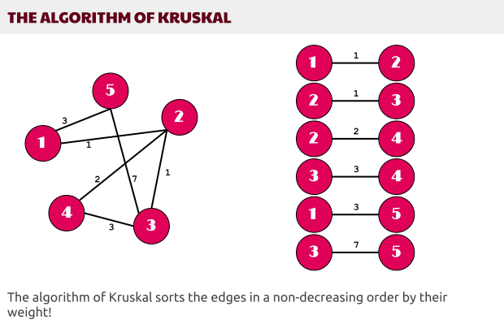
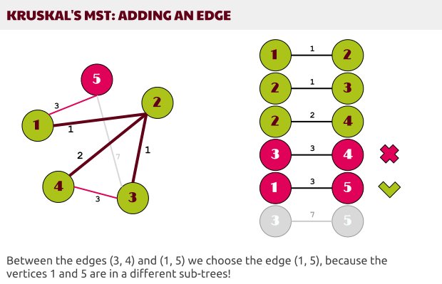
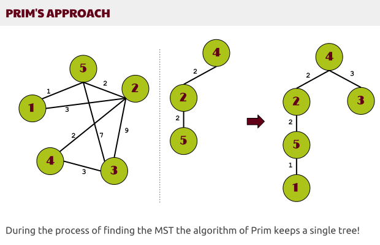
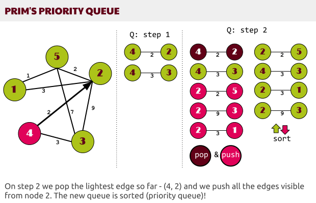

# Computer Algorithms: Prim’s Minimum Spanning Tree

## Introduction

Along with the [Kruskal’s minimum spanning tree algorithm](/2012/11/12/computer-algorithms-kruskals-minimum-spanning-tree/), there’s another general algorithm that solves the problem. The algorithm of Prim.

As we already know the algorithm of Kruskal works in a pretty natural and logical way. Since we’re trying to build a MST, which is naturally build by the minimal edges of the graph (G), we sort them in a non-descending order and we start building the tree. 

[](../images/1.-The-algorithm-of-Kruskal.png) 

During the whole process of building the final minimum spanning tree Kruskal’s algorithm keeps a forest of trees. The number of trees in that forest decreases on each step and finally we get the minimum weight spanning tree. 

A key point in the Kruskal’s approach is the way we get the “next” edge from G that should be added to one of the trees of the forest (or to connect two trees from the forest). The only thing we should be aware of is to choose an edge that’s connecting two vertices – u and v and these two shouldn’t be in the same tree. That’s all.

[](../images/2.-The-Kruskals-Tricky-Part.png) 

An important feature of the Kruskal’s algorithm is that it builds the MST just by sorting the edges by their weight and doesn’t care about a particular starting vertex.

In the same time there’s another algorithm that builds a MST – the algorithm of Prim designed by [Robert Prim](http://en.wikipedia.org/wiki/Robert_C._Prim) in 1957.

## Overview

The idea behind the Prim’s algorithm is rather different from Kruskal’s approach. During the process of building the MST this algorithm keeps a single tree, which is finally sub-tree of the final minimum weight spanning tree.

[](../images/3.-Prims-approach.png) 

On each step we chose an edge which we add to the growing tree that finally forms the MST. 

It is somehow unnatural approach! We start from a given vertex and initially we don’t choose the lightest edge. Thus during the whole process the tree grows, but outside the tree (T) there might be edges that are lighter than those in the tree (i.e. the edge (5, 1) from the tree above is lighter than (2, 5) but (2, 5) is added to the growing tree before the edge (5, 1)).

Compared to the Kruskal’s algorithm this time everything seems to be really unnatural. How we should be sure the final tree (T) will be a minimum spanning tree since we don’t get the lightest edge on each step? 

Actually we are sure that the final tree is a MST because of another obvious feature of the minimum spanning trees. They should “connect” all the vertices of G, thus somehow at least one edge reaching each vertex will appear in the MST. Thus we shouldn’t care where do we start, the only important thing is to choose the lightest edge that’s visible so far. 

This algorithm looks much like [Dijkstra’s shortest path in a graph](/2012/10/15/computer-algorithms-dijkstra-shortest-path-in-a-graph/), because we start from a vertex, we push all the edges starting from this node to a priority queue and we chose the lightest edge. Going to the next node connected by this edge we append to the queue all the edges that aren’t in the queue. 

[](../images/4.-Prims-Priority-Queue.png) 

That way the queue grows and we get always the lightest edge – thus forming a priority queue. 

Now let’s summarize the algorithm of Prim

## Pseudo Code

As an initial input we have the graph (G) and a starting vertex (s).

1.  Make a queue (Q) with all the vertices of G (V);
2.  For each member of Q set the priority to INFINITY;
3.  Only for the starting vertex (s) set the priority to 0;
4.  The parent of (s) should be NULL;
5.  While Q isn’t empty
6.     Get the minimum from Q – let’s say (u); (priority queue);
7.     For each adjacent vertex to (v) to (u)
8.        If (v) is in Q and weight of (u, v) 

Indeed it looks much like the Dijkstra’s algorithm.

## Code

Here’s a [PHP](/category/php/) implementation of the algorithm of Prim, which directly follows the pseudo code.

```php
// Prim's algorithm
 
define('INFINITY', 100000000);
 
// the graph
$G = array(
    0 => array( 0,  4,  0,  0,  0,  0,  0,  0,  8),
    1 => array( 4,  0,  8,  0,  0,  0,  0,  0,  11),
    2 => array( 0,  8,  0,  7,  0,  4,  2,  0,  0),
    3 => array( 0,  0,  7,  0,  9,  14,  0,  0,  0),
    4 => array( 0,  0,  0,  9,  0,  10,  0,  0,  0),
    5 => array( 0,  0,  4,  14,  10,  0,  0,  2,  0),
    6 => array( 0,  0,  2,  0,  0,  0,  0,  6,  7),
    7 => array( 0,  0,  0,  0,  0,  2,  6,  0,  1),
    8 => array( 8,  11,  0,  0,  0,  0,  7,  1,  0),
);
 
function prim(&$graph, $start)
{
    $q = array(); // queue
    $p = array(); // parent
 
    foreach (array_keys($graph) as $k) {
        $q[$k] = INFINITY;
    }
 
    $q[$start] = 0;
    $p[$start] = NULL;
 
    asort($q);
 
    while ($q) {
        // get the minimum value
        $keys = array_keys($q);
        $u = $keys[0];
 
        foreach ($graph[$u] as $v => $weight) {
            if ($weight > 0 && in_array($v, $keys) && $weight < $q[$v]) {
                $p[$v] = $u;
                $q[$v] = $weight;
            }
        }
 
        unset($q[$u]);
        asort($q);
    }
 
    return $p;
}
 
prim($G, 5);
```

## History

It’s curious to say that the algorithm developed by Robert Prim isn’t developed by him. It’s considered that a Czech mathematician [Vojtech Jarnik](http://www-history.mcs.st-andrews.ac.uk/Biographies/Jarnik.html) discovered back in 1930. However now we know this algorithm as the algorithm of Prim, which independently discovered it in 1957 as I said above, and finally [Edsger Dijkstra](http://en.wikipedia.org/wiki/Edsger_W._Dijkstra) described it in 1959. That’s why his algorithm on finding the single-source shortest paths in a graph looks so much to this algorithm. Perhaps by finding this algorithm on minimum spanning tree Dijkstra discovered how we can find the shortest paths to all vertices using a priority queue. Indeed the paths to all other vertices use the edges of the minimum spanning tree. 

Just because Jarnik found and described this algorithm 27 years earlier than Robert Prim, today it’s more convenient to call this algorithm the Prim-Jarnik algorithm.