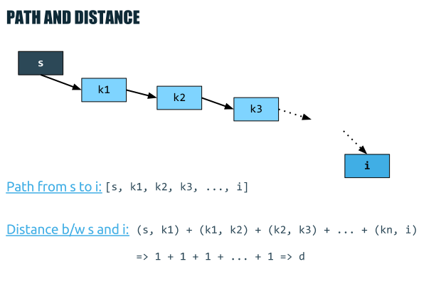
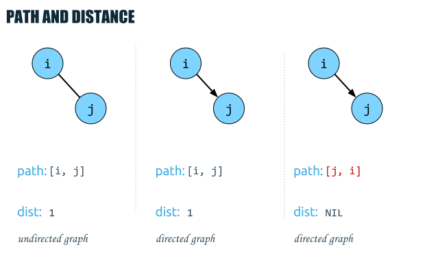
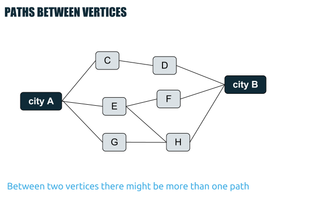
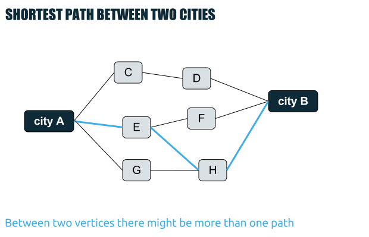
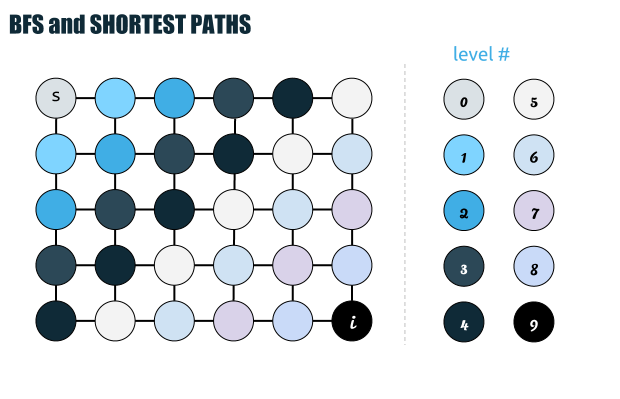
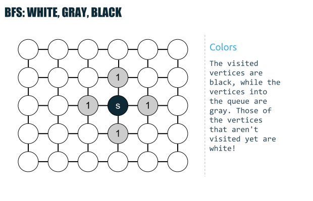
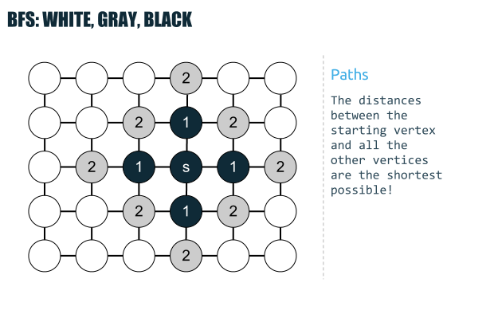
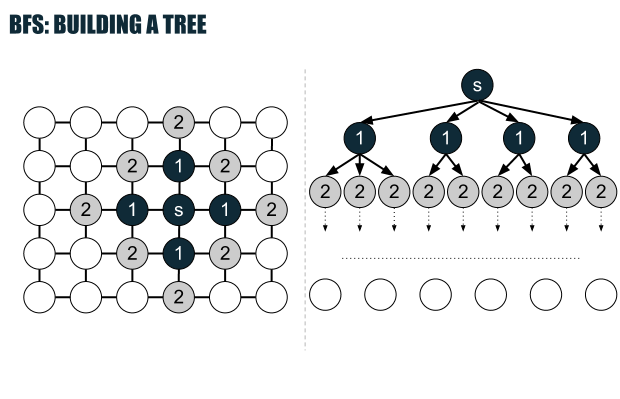
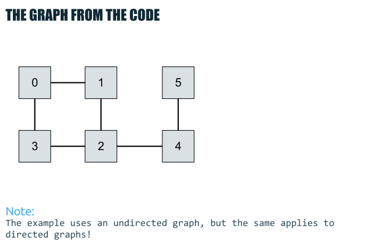

# Computer Algorithms: Shortest Path in a Graph

## Introduction

Since with graphs we can represent real-life problems it’s almost clear why we would need an efficient algorithm that calculates the shortest path between two vertices. Getting back to our example of a road map we can use such an algorithm in order to find the shortest path between two cities. This example, of course, is very basic indeed, but it can give us a clear example of where shortest path can be applied.

In the other hand, we can model an enormous field of real-life problems using graphs – not only road maps. As we already know, whenever we have relations between different abstract objects we can refer an efficient graph algorithm.

OK, so we need a shortest path algorithm, but before we proceed with the exact algorithm first we’ll need to answer some questions and give some definitions.

## Overview

First we need a definition of the terms distance and path between two nodes. A path is considered to be the sequence of vertices (or edges if you wish) between two vertices i and j. Of course we assume that there might be no path between any to vertices in the graph! Also we assume that this definition relates both for directed and undirected graphs. After we have the definition of a path we can proceed by defining a “distance”, which is said to be the number of edges in the path between i and j.

[](../images/1.-Path-and-Distance.png)First we need to define what’s a path and a distance between two vertices in order to continue searching for the shortest path!

Using this terms, if there’s an edge between i and j, the path between them is [i, j], while the distance is 1. Of course, for an undirected graph (i, j) equals to (j, i) and the path [i, j] equals the path [j, i], but that isn’t true for directed graphs where the path [i, j] differs in general from [j, i].

[](../images/2.-Rule-of-the-Triangle.png)Although path (shortest path) is applicable for both directed and undirectd graphs, they depend in both cases of the graph type!

Here we talk about the path between two adjacent vertices, but we can go with the more general case of a path between two vertices that aren’t adjacent. 

Now, getting back to the road map example, there might be many paths between city A and city B. 

[](../images/3.-Paths-Between-Cities.png)If we talk about paths between cities its pretty natural to talk about more than one “valid” path!

What we actually need to find is the shortest one. This can be very important, because we often want to get from A to B as quickly as possible using the shortest path.

[](../images/4.-Shortest-Path-Between-Cities.png)The shortest path between two vertices is the path with lower distance compared to all other paths between the same points!

So first, what is a shortest path between i and j. Well, besides the strict definition, I’ll give a simplified one that might be clearer. The shortest path between i and j is such a path, which has the lowest distance compared to all other paths between i and j. 

In our algorithm we will use breadth-first search. Why? That is because by using BFS by starting at a given point we expand our search consecutively starting with the closest vertices.

[](../images/5.-Shortest-Path-Canvas.png)Breadth-first search can help us find the shortest paths between a given vertex (s) and all other reachable vertices!

Is breadth-first search enough and will it give us the correct answer – the shortest path between i and j. Actually breadth-first search will gives us even more – the shortest paths to each reachable vertex from a given starting point – the staring vertex.

Why this is correct? Well, because of the nature of the breadth-first search algorithm. As we already know BFS uses a queue in order to store the front of the expansion. Usually as an abstraction BFS colors the vertices in white, gray and black, where the white vertices are those that aren’t visited yet, the gray are in the queue and the black vertices are already visited.

[](../images/6.-White-Gray-Black.png)By putting a color to visited/unvisited and currently inspected vertices we can get a clearer impression on how breadth-first search works!

However how can be sure that BFS will give us the shortest paths to each vertex? To answer this question and to be sure that BFS will work for us we must take a closer look at the queue. Clearly by starting at a given point the algorithm is correct – the distance is 0.

Now the second step is to put into the queue all the vertices adjacent to s (where s is the starting point). Clearly this will give us the shortest paths to all adjacent vertices of s.

Continuing by induction we can assume that at level k we have all the shortest paths from s to all the vertices at the level k. It is clear the path between s and the vertices at level k is k, since we assume that each edge adds 1 to the path from s to i. Now by adding all the vertices adjacent (and not visited yet) to the paths of level k we get paths with length k+1 which is again the shortest paths from s to level k+1. 

[](../images/7.-Shortest-Paths.png)Finding the shortest paths using BFS can be proved by induction!

Actually we can talk about a tree built out of the graph by staring at s (which is the root of the tree).

[](../images/8.-Spanning-tree.png)BFS walks through the graph by constructing a virtual tree!

## Code

OK, now we know that BFS will find us the shortest paths from s to all the reachable vertices from s. Here’s a simple PHP implementation, that makes use of the Standard PHP Library data structures. Of course, everyone can code and use his own implementation of lists in order to keep the information of the adjacency lists.

The important thing to note is that we keep an additional information in each vertex – the distance between it and s, which is initially infinite. First we go with the modification of BFS in order to find all the distances between s and the other vertices.

Here’s our graph:

[](../images/9.-Graph.png)The graph for the example!

```php
class vertex
{
    public $key = null;
    public $color = 'white';
    public $distance = -1;  // infinite
 
    public function __construct($key) 
    {
        $this->key = $key;
    }
}
 
$v0 = new vertex(0);
$v1 = new vertex(1);
$v2 = new vertex(2);
$v3 = new vertex(3);
$v4 = new vertex(4);
$v5 = new vertex(5);
 
$list0 = new SplDoublyLinkedList();
$list0->push($v1);
$list0->push($v3);
$list0->rewind();
 
$list1 = new SplDoublyLinkedList();
$list1->push($v0);
$list1->push($v2);
$list1->rewind();
 
$list2 = new SplDoublyLinkedList();
$list2->push($v1);
$list2->push($v3);
$list2->push($v4);
$list2->rewind();
 
$list3 = new SplDoublyLinkedList();
$list3->push($v1);
$list3->push($v2);
$list3->rewind();
 
$list4 = new SplDoublyLinkedList();
$list4->push($v2);
$list4->push($v5);
$list4->rewind();
 
$list5 = new SplDoublyLinkedList();
$list5->push($v4);
$list5->rewind();
 
$adjacencyList = array(
    $list0,
    $list1,
    $list2,
    $list3,
    $list4,
    $list5,
);
 
function calcDistances(vertex $start, &$adjLists)
{
    // define an empty queue
    $q = array();
 
    // push the starting vertex into the queue
    array_push($q, $start);
 
    // color it gray
    $start->color = 'gray';
 
    // mark the distance to it 0
    $start->distance = 0;
 
    while ($q) {
        // 1. pop from the queue
        $t = array_pop($q);
 
        // 2. foreach poped item find it's adjacent white vertices
        $l = $adjLists[$t->key];
        while ($l->valid()) {
            // 3. mark them gray, increment their length with one from their parent
            if ($l->current()->color == 'white') {
                $l->current()->color = 'gray';
                $l->current()->distance = $t->distance + 1;
                // 4. push them to the queue
                array_push($q, $l->current());
            }
 
            $l->next();
        }
    }
}
 
calcDistances($v0, $adjacencyList);
 
print_r($adjacencyList);
```

Now we can modify the algorithm even more and we add the path property of each vertex. Now each vertex will keep the path from s.

```php
class vertex
{
    public $key         = null;
    public $color       = 'white';
    public $distance    = -1;  // infinite
    public $path        = null;
 
    public function __construct($key) 
    {
        $this->key  = $key;
    }
}
 
$v0 = new vertex(0);
$v1 = new vertex(1);
$v2 = new vertex(2);
$v3 = new vertex(3);
$v4 = new vertex(4);
$v5 = new vertex(5);
 
$list0 = new SplDoublyLinkedList();
$list0->push($v1);
$list0->push($v3);
$list0->rewind();
 
$list1 = new SplDoublyLinkedList();
$list1->push($v0);
$list1->push($v2);
$list1->rewind();
 
$list2 = new SplDoublyLinkedList();
$list2->push($v1);
$list2->push($v3);
$list2->push($v4);
$list2->rewind();
 
$list3 = new SplDoublyLinkedList();
$list3->push($v1);
$list3->push($v2);
$list3->rewind();
 
$list4 = new SplDoublyLinkedList();
$list4->push($v2);
$list4->push($v5);
$list4->rewind();
 
$list5 = new SplDoublyLinkedList();
$list5->push($v4);
$list5->rewind();
 
$adjacencyList = array(
    $list0,
    $list1,
    $list2,
    $list3,
    $list4,
    $list5,
);
 
function calcShortestPaths(vertex $start, &$adjLists)
{
    // define an empty queue
    $q = array();
 
    // push the starting vertex into the queue
    array_push($q, $start);
 
    // color it gray
    $start->color = 'gray';
 
    // mark the distance to it 0
    $start->distance = 0;
 
    // the path to the starting vertex
    $start->path = new SplDoublyLinkedList();
    $start->path->push($start->key);
 
    while ($q) {
        // 1. pop from the queue
        $t = array_pop($q);
 
        // 2. foreach poped item find it's adjacent white vertices
        $l = $adjLists[$t->key];
        while ($l->valid()) {
            // 3. mark them gray, increment their length with one from their parent
            if ($l->current()->color == 'white') {
                $l->current()->color = 'gray';
                $l->current()->distance = $t->distance + 1;
                $l->current()->path = clone $t->path;
                $l->current()->path->push($l->current()->key);
 
                // 4. push them to the queue
                array_push($q, $l->current());
            }
 
            $l->next();
        }
    }
}
 
calcShortestPaths($v0, $adjacencyList);
 
print_r($adjacencyList);
```

## Complexity

Clearly the complexity of enqueue and dequeue is O(V), while searching for adjacent vertices is O(E), thus the complexity of this algorithm is O(V + E)!

## Application

Finding the shortest path between two nodes is obviousely a very handy algorithm. Applied almost everywhere graphs exists this algorithm is widely used. However there’s one very reasonable question. We’re searching for the shortest path between two vertices and we end with the shortest paths between a starting node an all other vertices? Why we need this “useless” information? Acutally the question should be: is there a faster and more efficient algorithm compared to this one. Well, we’ll see that!