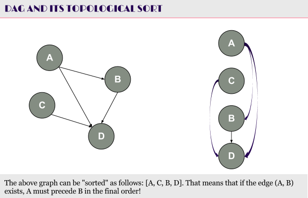
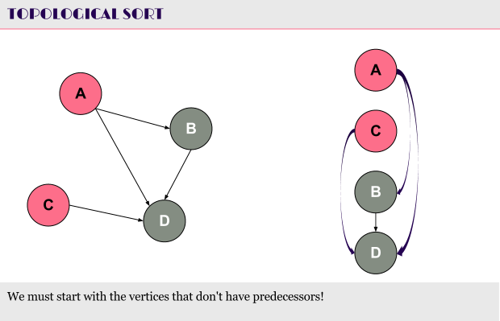
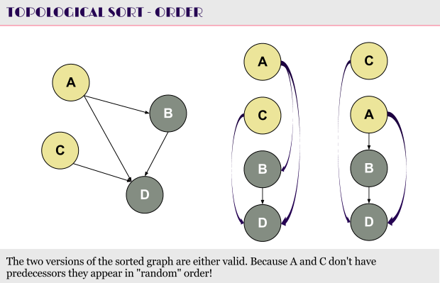
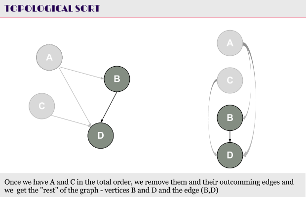
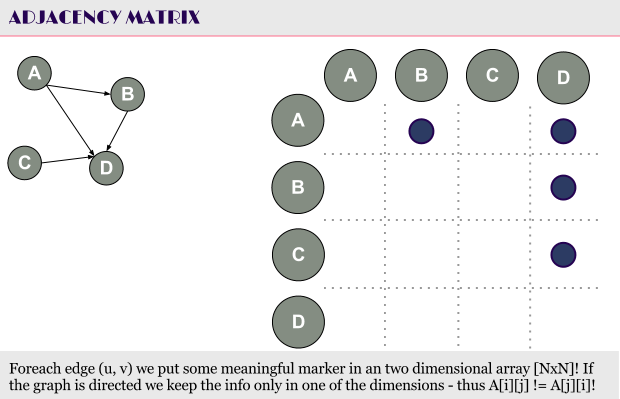
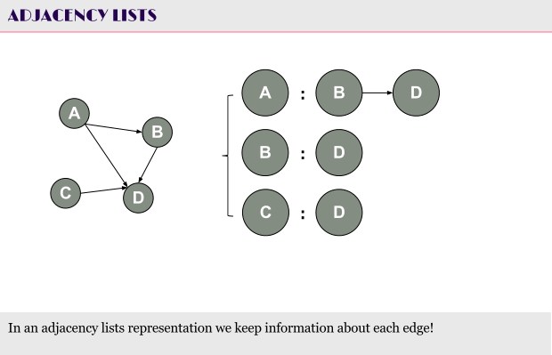
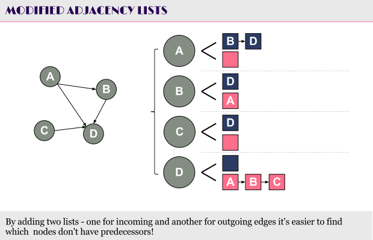

# Computer Algorithms: Topological Sort Revisited

## Introduction

We already know what’s topological sort of a directed acyclic graph. So why do we need a revision of this algorithm? First of all I never mentioned its complexity, thus to understand why we do need a revision let’s get again on the algorithm.

We have a directed acyclic graph (DAG). There are no cycles so we must go for some kind of order putting all the vertices of the graph in such an order, that if there’s a directed edge (u, v), u must precede v in that order. 

 

The process of putting all the vertices of the DAG in such an order is called topological sorting. It’s commonly used in task scheduling or while finding the shortest paths in a DAG.

The algorithm itself is pretty simple to understand and code. We must start from the vertex (vertices) that don’t have predecessors. 

 

We put them in our sorted list in random order. Since they don’t depend on each other we can assume they are equally sorted already. Indeed thinking of a task schedule if there are tasks that don’t have predecessors (they don’t depend on other tasks before them) and that don’t depend on each other we can put them in random order (and execute them in random order).

 

Once we have the vertices with no predecessors we must remove the edges starting from them. Then – go again with the vertices with no predecessors. 

 

It’s as simple as that, so why do we need a revision of this algorithm? Well, basically because of its efficiency. 

## Overview

As we know most of the graph algorithms depend on the way the graph is represented in our application. We consider as the two main representations the adjacency matrix … 

 

… and adjacency lists.

 

Let’s first take a look of some of the main approaches to get the topologically sorted list at the end of the algorithm. 

What can we do in order to find the vertices with no predecessors? We can only scan the entire list of vertices. 

## Adjacency Matrix

In case we’re using adjacency matrix we need|V|^2 space to store the graph. To find the vertices with no predecessors we have to scan the entire graph, which will cost us O(|V|^2) time.  And we’ll have to do that |V| times. This will be |V|^3 time consuming algorithm and for dense graphs this will be quite an ineffective algorithm.

## Adjacency Lists

What about the adjacency list? There we need |E| space to store a directed graph. How fast can we find a node with no predecessor? Practically we’ll need O(|E|) time.  Thus in the worst case we have again O(|V|^2) time consuming programs.

So what can be done in order to optimize this algorithm?

Practically we can start by picking up a random vertex and “go back” until we get a node with no predecessors. This approach can be very effective yet also very ineffective. First of all if we have to scan all the way back to a node with no predecessors this will cost us |V| time, but if we stuck on a node that don’t have a preceding node then we’ll have a constant speed.

This means that we can modify the algorithm a bit in order to improve a lot the algorithm. We just need to store both incoming and outgoing edges and slightly modify the adjacency lists.

 

What’s the algorithm now?

First we easily find the nodes with no predecessors. Then, using a queue, we can keep the nodes with no predecessors and on each dequeue we can remove the edges from the node to all other nodes.

## Pseudo Code

1. Represent the graph with two lists on each vertex (incoming edges and outgoing edges)
2. Make an empty queue Q;
3. Make an empty topologically sorted list T;
4. Push all items with no predecessors in Q;
5. While Q is not empty
   a. Dequeue from Q into u;
   b. Push u in T;
   c. Remove all outgoing edges from u;
6. Return T;

This approach will give us a better performance than the “brute force” approach. The running time complexity is O(|V| + |E|). The problem is that we need additional space and an operational queue, but this approach is a perfect example of how by using additional space you can get a better performing algorithm.