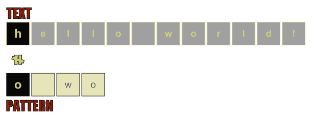
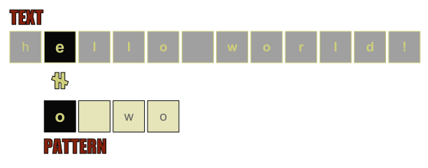
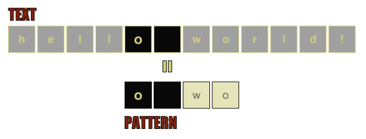
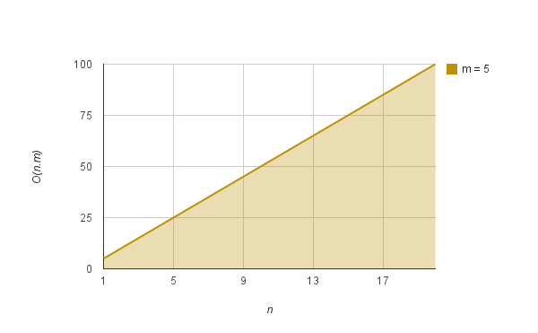
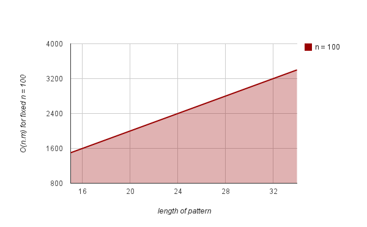

# Computer Algorithms: Brute Force String Matching

## Introduction

String matching is something crucial for database development and text processing software. Fortunately every modern programming language and library is full of functions for string processing that help us in our everyday work. However is great to understand their principles.

String algorithms can be mainly divided into several categories. One of these categories is string matching.

When we come to string matching the most basic approach is what is known as brute force, which means just to check every single character from the text to match against the pattern. In general we have a text and a pattern (most commonly shorter than the text). What we need to do is to answer the question whether this pattern appears into the text.

## Overview

The principles of brute force string matching are quite simple. We must check for a match between the first characters of the pattern with the first character of the text as on the picture bellow.

[](../images/FirstStepBruteforcestringmatching.png)We start by comparing the first characters of the text and the pattern! 

If they don’t match we move forward the second character of the text. Now we compare the first character of the pattern with the second character of the text. If they don’t match again we move forward until we get a match or until we reach the end of the text. 

[](../images/SecondStepBruteforcestringmatching.png)Because the first character of the text and the pattern don't match, we move forward the second character of the text. Now we compare the second character of the text with the first character of the pattern!

In case they match we move forward the second character of the pattern comparing it with the “next” character of the text, as on the picture bellow.

[](../images/ThirdStepBruteforcestringmatching.png)If case a character from the text match against the first character of the pattern we move forward to the second character of the pattern and the next character of the text!

Just because we have found a match between the first character from the pattern with some character of the text, doesn’t mean that the pattern appears in the text. We must move forward to see whether the full pattern is contained into the text. 

[](../images/MatchBruteforcestringmatching.png)The pattern is matched!

## Implementation

Implementation of brute force string matching is easy and here we can see a short PHP example. The bad news is that naturally this algorithm is quite slow.

```php
function sub_string($pattern, $subject) 
{
	$n = strlen($subject);
	$m = strlen($pattern);
 
	for ($i = 0; i n is the length of the text, while m is the length of the pattern.

[](../images/BruteForceStringMatchingComplexityChart1.png)For fixed pattern length of m = 5, we can see that even for relatively short text the time grows quickly!

In case we fix the length of the text and test against variable length of the pattern, again we get rapidly growing function.

[](../images/BruteForceStringMatchingComplexityChart2.png) 

## Application

Brute force string matching can be very ineffective, but it can also be very handy in some cases. Just like the [sequential search](/2011/11/24/computer-algorithms-sequential-search/).

## It can be very useful …

- Doesn’t require pre-processing of the text – Indeed if we search the text only once we don’t need to pre-process it. Most of the algorithms for string matching need to build an index of the text in order to search quickly. This is great when you’ve to search more than once into a text, but if you do only once, perhaps (for short texts) brute force matching is great!
- Doesn’t require additional space – Because brute force matching doesn’t need pre-processing it also doesn’t require more space, which is one cool feature of this algorithm
- Can be quite effective for short texts and patterns

## It can be ineffective …

- If we search more than once the text – As I said in the previous section if you perform the search more than once it’s perhaps better to use another string matching algorithm that builds an index and it’s faster.
- It’s slow – In general brute force algorithms are slow and brute force matching isn’t an exception.

## Final Words

String matching is something very special in software development and it is used in various cases, so every developer must be familiar with this topic.