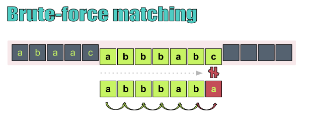
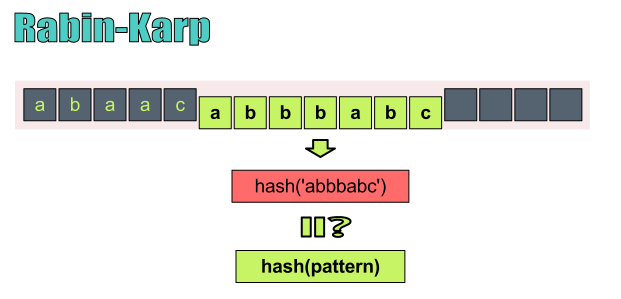
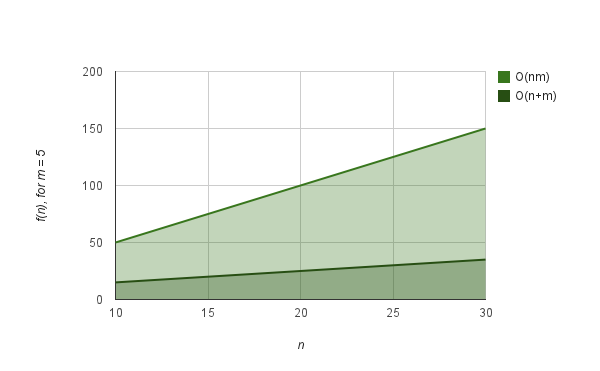
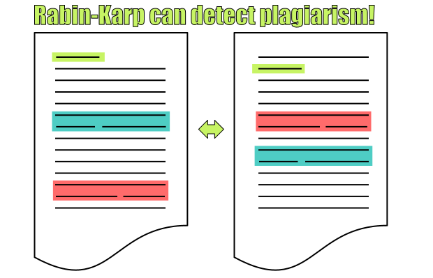

# Computer Algorithms: Rabin-Karp String Searching

## Introduction

[Brute force string matching](/2012/03/27/computer-algorithms-brute-force-string-matching/) is the a very basic sub-string matching algorithm, but it’s good for some reasons. For example it doesn’t require preprocessing of the text or the pattern. The problem is that it’s very slow. That is why in many cases brute force matching can’t be very useful. For pattern matching we need something faster, but to understand other sub-string matching algorithms let’s take a look once again on brute force matching. 

In brute force sub-string matching we checked every single character from the text with the first character of the pattern. Once we have a match between them we shift the comparison between the second character of the pattern with the next character of the text, as shown on the picture below.

[](../images/Rabin-Karp-Brute-Froce-Principles.png)Brute force string matching is slow because it compares every single character from the pattern and the text!

This algorithm is slow for mainly two reasons. First we have to check every single character from the text. On the other hand even if we find a match between a text character and the first character of the pattern we continue to check step by step (character by character) every single symbol of the pattern in order to find whether it is in the text. So is there any other approach to find whether the text contains the pattern?

In fact there is a “faster” approach. In this case in order to avoid the comparison between the pattern and the text character by character, we’ll try to compare them at once, so we need a good hash function. With its help we can hash the pattern and check against hashed sub-strings of the text. We must be sure that the hash function is returning “small” hash codes for larger sub-strings. Another problem is that for larger patterns we can’t expect to have short hashes. But besides this the approach should be quite effective compared to the brute force string matching. 

That approach is known as Rabin-Karp algorithm.

## Overview

[Michael O. Rabin](http://en.wikipedia.org/wiki/Michael_O._Rabin) and [Richard M. Karp](http://en.wikipedia.org/wiki/Richard_M._Karp) came up with the idea of hashing the pattern and to check it against a hashed sub-string from the text in 1987. In general the idea seems quite simple, the only thing is that we need a hash function that gives different hashes for different sub-strings. Such hash function, for instance, may use the ASCII codes for every character, but we must be careful for multi-lingual support.

[](../images/Rabin-Karp-Basic-Principles.png)Rabin-Karp hashes the pattern and the sub-string in order to compare them quickly!

The hash function may vary depending on many things, so it may consist of ASCII char to number converting, but it can be also anything else. The only thing we need is to convert a string (pattern) into some hash that is faster to compare. Let’s say we have the string “hello world”, and let’s assume that its hash is hash(‘hello world’) = 12345. So if hash(‘he’) = 1 we can say that the pattern “he” is contained in the text “hello world”. Thus on every step we take from the text a sub-string with the length of m, where m is the pattern length. Thus we hash this sub-string and we can directly compare it to the hashed pattern, as on the picture above.

## Implementation

So far we saw some diagrams explaining the Rabin-Karp algorithm, but let’s take a look on its implementation. Here in this very basic example where a simple hash table is used in order to convert the characters into integers. The code is PHP and it’s used only to illustrate the principles of this algorithm.

```php
function hash_string($str, $len)
{
	$hash = '';
 
	$hash_table = array(
		'h' => 1,
		'e' => 2,
		'l' => 3,
		'o' => 4,
		'w' => 5,
		'r' => 6,
		'd' => 7,
	);
 
	for ($i = 0; $i n, of course, is the length of the text, while m is the length of the pattern. So where it is compared to brute-force matching? Well, brute force matching complexity is O(nm), so as it seems there’s no much gain in performance. However it’s considered that Rabin-Karp’s complexity is O(n+m) in practice, and that makes it a bit faster, as shown on the chart below.

[](../images/Rabin-Karp-Complexity.png)Rabin-Karp's complexity is O(nm), but in practice it's O(n+m)!

Note that the Rabin-Karp algorithm also needs O(m) preprocessing time.

## Application

As we saw Rabin-Karp is not so faster than brute force matching. So where we should use it?

## 3 Reasons Why Rabin-Karp is Cool

1. Good for plagiarism, because it can deal with multiple pattern matching!

[](../images/Application-of-Rabin-Karp.png)Rabin-Karp can detect plagiarism efficiently!

2. Not faster than brute force matching in theory, but in practice its complexity is O(n+m)!

3. With a good hashing function it can be quite effective and it’s easy to implement!

## 2 Reasons Why Rabin-Karp is Not Cool

1. There are lots of string matching algorithms that are faster than O(n+m)

2. It’s practically as slow as brute force matching and it requires additional space

## Final Words

Rabin-Karp is a great algorithm for one simple reason – it can be used to match against multiple pattern. This makes it perfect to detect plagiarism even for larger phrases.