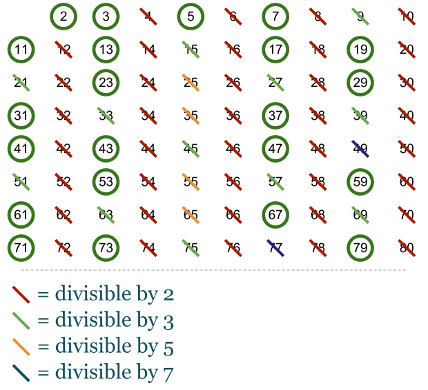

# Computer Algorithms: Determine if a Number is Prime

## Introduction

Each natural number that is divisible only by 1 and itself is prime. Prime numbers appear to be more interesting to humans than other numbers. Why is that and why prime numbers are more important than the numbers that are divisible by 2, for instance? Perhaps the answer is that prime numbers are largely used in cryptography, although they were interesting for the ancient Egyptians and Greeks (Euclid has proved that the prime numbers are infinite circa 300 BC). The problem is that there is not a formula that can tell us which is the next prime number, although there are algorithms that check whether a given natural number is prime. It’s very important these algorithms to be very effective, especially for big numbers.

## Overview

As I said each natural number that is divisible only by 1 and itself is prime. That means that 2 is the first prime number and 1 is not considered prime. It’s easy to say that 2, 3, 5 and 7 are prime numbers, but what about 983? Well, yes 983 is prime, but how do we check that? If we want to know whether n is prime the very basic approach is to check every single number between 2 and n. It’s kind of a brute force.

## Implementation

The basic implementation in PHP for the very basic (brute force) approach is as follows.

Unfortunately this is one very ineffective algorithm. We don’t have to check every single number between 1 and n, it’s enough to check only the numbers between 1 and n/2-1. If we find such a divisor that will be enough to say that n isn’t prime.

Although that code above optimizes a lot our first prime checker, it’s clear that for large numbers it won’t be very effective. Indeed checking against the interval [2, n/2 -1] isn’t the optimal solution. A better approach is to check against [2, sqrt(n)]. This is correct, because if n isn’t prime it can be represented as p*q = n. Of course if p > sqrt(n), which we assume can’t be true, that will mean that q < sqrt(n).

Beside that these implementations shows how we can find prime number, they are a very good example of how an algorithm can be optimized a lot with some small changes.

## Sieve of Eratosthenes

Although the sieve of Eratosthenes isn’t the exact same approach (to check whether a number is prime) it can give us a list of prime numbers quite easily. To remove numbers that aren’t prime, we start with 2 and we remove every single item from the list that is divisible by two. Then we check for the rest items of the list, as shown on the picture below.

The PHP implementation of the Eratosthenes sieve isn’t difficult.

## Application

As I said prime numbers are widely used in cryptography, so they are always of a greater interest in computer science. In fact every number can be represented by the product of two prime numbers and that fact is used in cryptography as well. That’s because if we know that number, which is usually very very big, it is still very difficult to find out what are its prime multipliers. Unfortunately the algorithms in this article are very basic and can be handy only if we work with small numbers or if our machines are tremendously powerful. Fortunately in practice there are more complex algorithms for finding prime numbers. Such are the sieves of Euler, Atkin and Sundaram.
