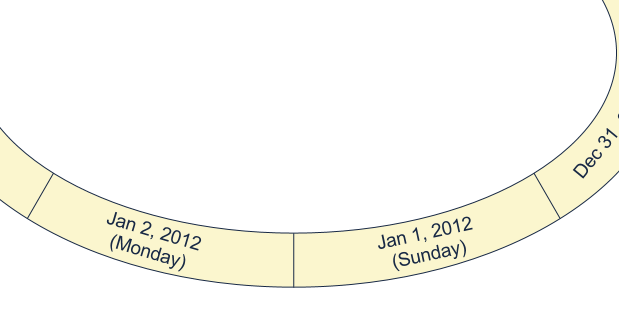
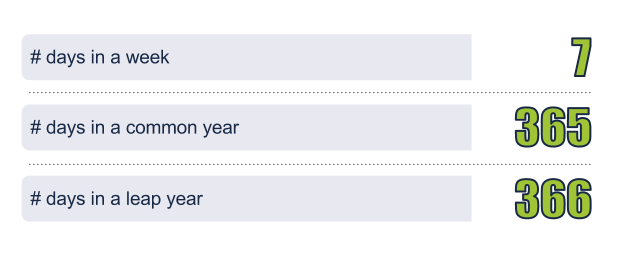
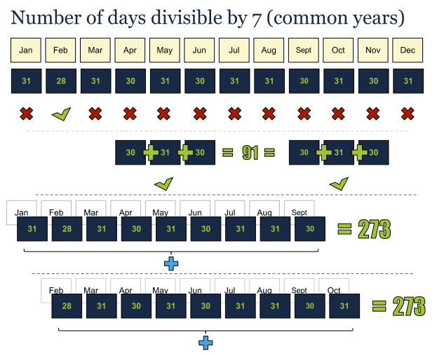
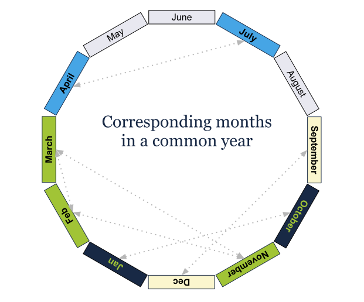
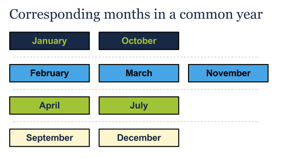
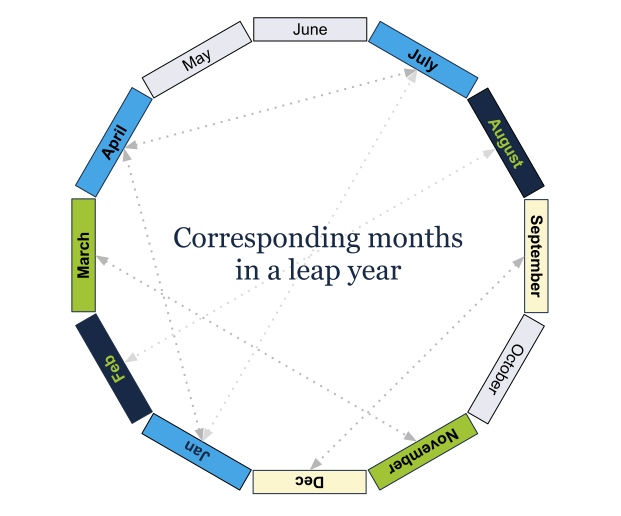
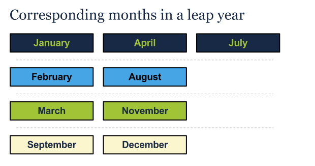

# Computer Algorithms: How to Determine the Day of the Week

## Introduction

Do you know what day of the week was the day you were born? Monday or maybe Saturday? Well, perhaps you know that. Everybody know the day he’s born on, but do you know what day was the 31st January 1883? No? Well, there must be some method to determine any day in any century.

We know that 2012 started at Sunday. After we know that it’s easy to determine what day is the 2nd of January. It should be Monday. But things get a little more complex if we try to guess some date distant from January the 1st. Indeed 1st of Jan was on Sunday, but what day is 9th of May the same year. This is far more difficult to say. Of course we can go with a brute force approach and count from 1/Jan till 9/May, but that is quite slow and error prone.

[](../images/FollowingDays.png)If 1st of January is Sunday the most logical thing to happen is 2nd of January to be Monday

So what we’ll do if we have to code a program that answers this question. The most easier way is to use a library. Almost every major library has built-in functions that can answer what day is on a given date. Such are date() in PHP or getDate() in JavaScript. But the question remains. How these library functions know the answer and how can we code such library function if our library doesn’t support such functionality?

There must be some algorithm to help us.

## Overview

Because months has different number of days, and most of them aren’t divisible by 7 without a remainder, months begin on different days. Thus if January begins on Sunday, the month of February the same year will begin on Wednesday. Of course in common years February has 28 days, which fortunately is divisible by 7 and thus February and March both begin on the same day, which is great, but isn’t true for leap years.

## What Do We Know About the Calendar

First thing to know is that each week has exactly 7 days. We know also that a common year has 365 days, while a leap year has one day more – 366. Most of the months has 30 or 31 days, but February has only 28 days in common years and 29 in leap years.

Because 365 mod 7 = 1 in a common year each year begins exactly on the next day of the preceding year. Thus if 2011 started on Saturday, 2012 starts on Sunday. And yet again that is because 2011 is not a leap year.

[](../images/SomeStatistics.png)A week always has 7 days, while a year has different number of days depending on the fact whether it's a leap or not!

What else do we know? Because a week has exactly seven days only February (with its 28 days in a common year) is divisible by 7 (28 mod 7 = 0) and has exactly four weeks in it. Thus in a common year February and March start on a same day. Unfortunately that is not true about the other months.

All these things we know about the calendar are great, so we can make some conclusions. Although eleven of the months have either 30 or 31 days they don’t start on a same day, but some of the months do appear to start on a same day just because the number of days between them is divisible by 7 without a remainder.

Let’s take a look on some examples. For instance September has 30 days, as November, while October, which is in between them has 31 days. Thus 30+30+31 makes 91. Fortunately 91 mod 7 = 0. So for each year September and December start on the same day (as they are after February they don’t depend on leap years). The same thing occurs to April and July and the good news is that in leap years even January starts on the same day as April and July.

[](../images/PeriodsofDaysDivisibleby7.png)Not only the number of days in February is divisible by 7. The sum of days of April, May and June is also divisible by 7!

Now we know that there are some relations between months. Thus if we know somehow that 13th of April is Monday, we’ll be sure that 13th of July is also Monday. Let’s see now a summary of these observations.

[](../images/CorrespondingMonthsinaCommonYear.png)In a common year some months correspond!

We can also refer the following diagram.

[](../images/TableofCorrespondingMonthsinaCommonYear.png)It's clearer to see the corresponding months in a table view!

For leap years there are other corresponding months. Let’s take a look at the following image.

[](../images/CorrespondingMonthsinaLeapYear.png)Corresponding months in a leap year differs from corresponding months in a common year!

Another way to get the same information is the following table.

[](../images/TableofCorrespondingMonthsinaLeapYear.png)Table view is easier to remember!

We know also that leap years happen to occur once per four years. However if there is a common year like the year 2001, which will be the next year that is common and starts and corresponds exactly on 2001? Because of leap years we can have a year starting on one of the seven days of the week and to be either leap or common. This means just 14 combinations.

Following these observations we can refer the following table.

```php
1700–1799     4
1800–1899     2
1900–1999     0
2000–2099     6
2100–2199     4
2200–2299     2
2300–2399     0
2400–2499     6
2500–2599     4
2600–2699     2
```

You can clearly see the pattern “6 4 2 0”

Here’s the month table.

```php
Month		Common  	Leap
January 	0  		6
February	3 		2
March		3		3
April		6		6
May		1		1
June		4		4
July		6		6
August  	2		2
September	5		5
October 	0		0
November	3		3
December	5		5
```

Columns 2 and 3 differs only for January and February.

Clearly the day table is as follows.

```php
Sunday  	0
Monday  	1
Tuesday 	2
Wednesday	3
Thursday	4
Friday  	5
Saturday	6
```

Now let’s go back to the algorithm.

Using these tables and applying a simple formula we can calculate what day was on some given date. Here are the steps of this algorithm.

- Get the number for the corresponding century from the centuries table;
- Get the last two digits from the year;
- Divide the number from step 2 by 4 and get it without the remainder;
- Get the month number from the month table;
- Sum the numbers from steps 1 to 4;
- Divide it by 7 and take the remainder;
- Find the result of step 6 in the days table;

## Implementation

First let’s take a look on a simple practical example of the example above and then the code. Let’s answer the question from the first paragraph of this post.

What day was on January 31st, 1883?

- Take a look at the centuries table: for 1800 – 1899 this is 2.
- Get the last two digits from the year: 83.
- Divide 83 by 4 without a remainder: 83/4 = 20
- Get the month number from the month table: Jan = 0.
- Sum the numbers from steps 1 to 4: 2 + 83 + 20 + 0 = 105.
- Divide it by 7 and take the remainder: 105 mod 7 = 0
- Find the result of step 6 in the days table: Sunday = 0.

The following code in PHP do implements the algorithm above.

```php
function get_century_code($century)
{
	// XVIII
	if (1700  0,		// January
		2 => 3,		// February
		3 => 3,		// March
		4 => 6,		// April
		5 => 1,		// May
		6 => 4,		// June
		7 => 6,		// July
		8 => 2,		// August
		9 => 5,		// September
		10 => 0,	// October
		11 => 3,	// November
		12 => 5,	// December
	);
 
	$days = array(
		0 => 'Sunday',
		1 => 'Monday',
		2 => 'Tuesday',
		3 => 'Wednesday',
		4 => 'Thursday',
		5 => 'Friday',
		6 => 'Saturday',
	);
 
	// calculate the date
	$dateParts = explode('-', $date);
	$century = substr($dateParts[2], 0, 2);
	$year = substr($dateParts[2], 2);
 
	// 1. Get the number for the corresponding century from the centuries table
	$a = get_century_code($dateParts[2]);
 
	// 2. Get the last two digits from the year
	$b = $year;
 
	// 3. Divide the number from step 2 by 4 and get it without the remainder
	$c = floor($year / 4);
 
	// 4. Get the month number from the month table
	$d = $months[$dateParts[1]];
 
	// 5. Sum the numbers from steps 1 to 4
	$e = $a + $b + $c + $d;
 
	// 6. Divide it by 7 and take the remainder
	$f = $e % 7;
 
	// 7. Find the result of step 6 in the days table
	return $days[$f];
}
 
// Sunday
echo get_day_from_date('31-1-1883');
```

## Application

This algorithm can be applied in many different cases although most of the libraries has built-in functions that can do that. The only problem besides that is that there are much more efficient algorithms that don’t need additional space (tables) of data. However this algorithm isn’t difficult to implement and it gives a good outlook of some facts in the calendar.