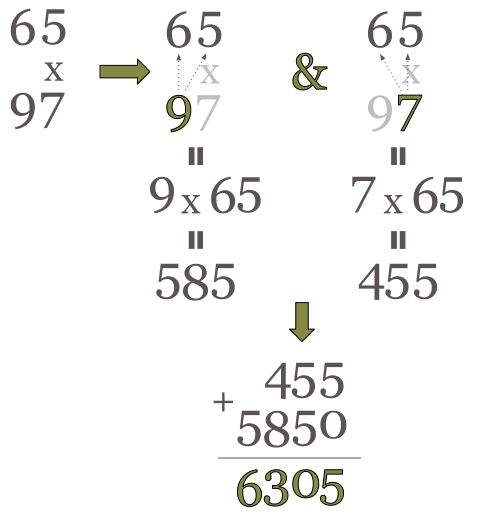
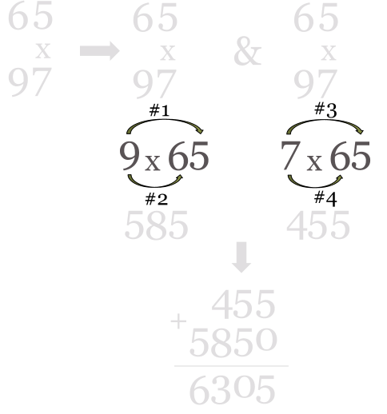
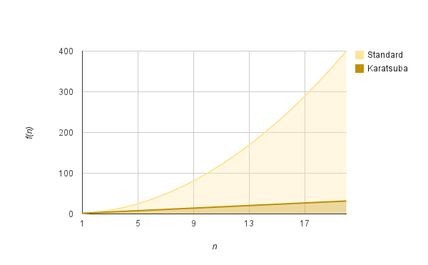

# Computer Algorithms: Karatsuba Fast Multiplication

## Introduction

Typically multiplying two n-digit numbers require n2 multiplications. That is actually how we, humans, multiply numbers. Let’s take a look of an example in case we’ve to multiply two 2-digit numbers.

```php
12 x 15 = ?
```

OK, we know that the answer is 180 and there are lots of intuitive methods that help us get the right answer. Indeed 12 x 15 it’s just a bit more difficult to calculate than 10 x 15, because multiplying by 10 it really easy – we just add one 0 at the end of the number. Thus 15 x 10 equals 150. But now again on 12 x 15 – we know that this equals 10 x 15 (which is 150) and 2 x 15, which is also very easy to calculate and it is 30. The result of 12×15 will be 150 + 30, which fortunately isn’t difficult to get and equals to 180.

That was easy but in some cases the calculations are a bit more difficult and we need a structured algorithm to get the right answer. What about 65 x 97? That is not so easy as 12 x 15, right?

The algorithm we know from the primary school, described on the diagram below, is well structured and help us multiply two numbers.

[](../images/1.-Typical-Multiplication.png)

We see that even for two-digit numbers this is quite difficult – we have 4 multiplications and some additions.

[](../images/2.-Number-of-Multiplications.png)We need 4 multiplications in order to calculate the product of two 2-digit numbers!

However so far we know how to multiply numbers, the only problem is that our task becomes very difficult as the numbers grow. If multiplying 65 by 97 was somehow easy, what about

```php
374773294776321
x
222384759707982
```

It seems almost impossible.

## History

[Andrey Kolmogorov](http://en.wikipedia.org/wiki/Andrey_Kolmogorov) is one of the brightest russian mathematicians of the 20th century. In 1960, during a seminar, Kolmogorov stated that two n-digit numbers can’t be multiplied with less than n2 multiplications!

Only a week later a 23-year young student called [Anatolii Alexeevitch Karatsuba](http://en.wikipedia.org/wiki/Anatolii_Alexeevitch_Karatsuba) proved that the multiplication of two n-digit numbers can be computed with n ^ lg(3) multiplications with an ingenious divide and conquer approach.

## Overview

Basically Karatsuba stated that if we have to multiply two n-digit numbers x and y, this can be done with the following operations, assuming that B is the base of and m < n.

First both numbers x and y can be represented as x1,x2 and y1,y2 with the following formula.

```php
x = x1 * B^m + x2 
y = y1 * B^m + y2
```

Obviously now xy will become as the following product.

```php
xy = (x1 * B^m + x2)(y1 * B^m + y2) =>
 
a = x1 * y1
b = x1 * y2 + x2 * y1
c = x2 * y2
```

Finally xy will become:

```php
xy = a * B^2m + b * B^m + c
```

However a, b and c can be computed at least with four multiplication, which isn’t a big optimization. That is why Karatsuba came up with the brilliant idea to calculate b with the following formula:

```php
b = (x1 + x2)(y1 + y2) - a - c
```

That make use of only three multiplications to get xy.

Let’s see this formula by example.

```php
47 x 78
 
x = 47
x = 4 * 10 + 7
 
x1 = 4
x2 = 7
 
y = 78
y = 7 * 10 + 8
 
y1 = 7
y2 = 8
 
a = x1 * y1 = 4 * 7 = 28
c = x2 * y2 = 7 * 8 = 56
b = (x1 + x2)(y1 + y2) - a - c = 11 * 15 - 28 - 56
```

Now the thing is that 11 * 15 it’s again a multiplication between 2-digit numbers, but fortunately we can apply the same rules two them. This makes the algorithm of Karatsuba a perfect example of the “divide and conquer” algorithm.

## Implementation

## Standard Multiplication

Typically the standard implementation of multiplication of n-digit numbers require n2 multiplications as you can see from the following [PHP](/category/php/) implementation.

```php
$x = array(1,2,3,4);
$y = array(5,6,7,8);
 
function multiply($x, $y)
{	
	$len_x = count($x);
	$len_y = count($y);
	$half_x = ceil($len_x / 2);
	$half_y = ceil($len_y / 2);
	$base = 10;
 
	// bottom of the recursion
	if ($len_x == 1 && $len_y == 1) {
		return $x[0] * $y[0];
	}
 
	$x_chunks = array_chunk($x, $half_x);
	$y_chunks = array_chunk($y, $half_y);
 
	// predefine aliases
	$x1 = $x_chunks[0];
	$x2 = $x_chunks[1];
	$y1 = $y_chunks[0];
	$y2 = $y_chunks[1];
 
	return  multiply($x1, $y1) * pow($base, $half_x * 2) 					// a
		 	+ (multiply($x1, $y2) + multiply($x2, $y1)) * pow($base, $half_x) 	// b
		 	+ multiply($x2, $y2);							// c
}
 
// 7 006 652
echo multiply($x, $y);
```

## Karatsuba Multiplication

Karatsuba replaces two of the multiplications – this of x1 * y2 + x2 * y1 with only one – (x1 + x2)(y1 + y2) and this makes the algorithm faster.

```php
$x = array(1,2,3,4);
$y = array(5,6,7,8);
 
function karatsuba($x, $y) 
{
	$len_x = count($x);
	$len_y = count($y);
 
	// bottom of the recursion
	if ($len_x == 1 && $len_y == 1) {
		return $x[0] * $y[0];
	} 
	if ($len_x == 1 || $len_y == 1) {
		$t1 = implode('', $x);
		$t2 = implode('', $y);
		return (int)$t1 * $t2;
	}
 
	$a = array_chunk($x, ceil($len_x/2));
	$b = array_chunk($y, ceil($len_y/2));
 
	$deg = floor($len_x/2);
 
	$x1 = $a[0];	// 1
	$x2 = $a[1];	// 2
	$y1 = $b[0];	// 1
	$y2 = $b[1];	// 2
 
	return  ($a = karatsuba($x1, $y1)) * pow(10, 2 * $deg)
			+ ($c = karatsuba($x2, $y2))
			+ (karatsuba(sum($x1, $x2), sum($y1, $y2)) - $a - $c) * pow(10, $deg);
}
 
// 7 006 652
echo karatsuba($x, $y);
```

## Complexity

Assuming that we replace two of the multiplications with only one makes the program faster. The question is how fast. Karatsuba improves the multiplication process by replacing the initial complexity of O(n2) by O(nlg3), which as you can see on the diagram below is much faster for big n.

[](../images/Karatsuba-Complexity.png)O(n^2) grows much faster than O(n^lg3)

## Application

It’s obvious where the Karatsuba algorithm can be used. It is very efficient when it comes to integer multiplication, but that isn’t its only advantage. It is often used for polynomial multiplications.