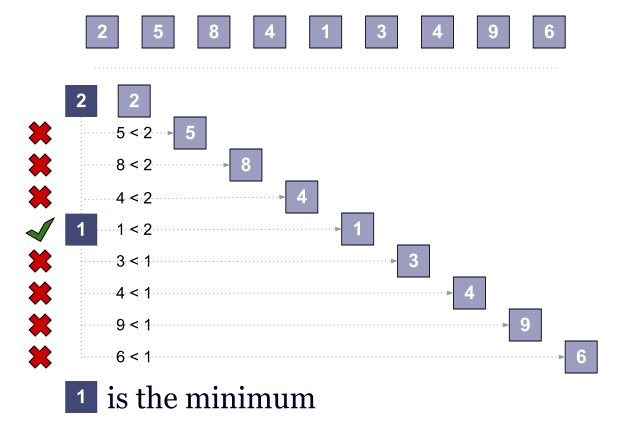
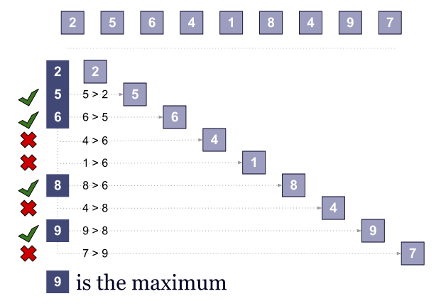
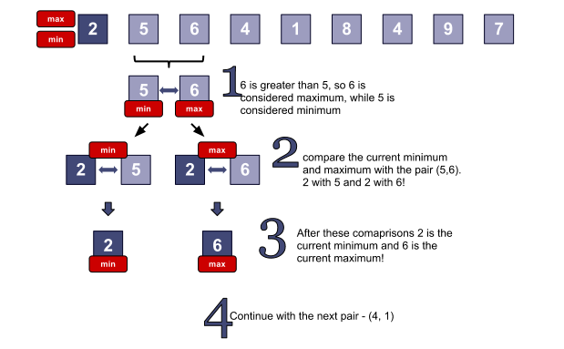

# Computer Algorithms: Minimum and Maximum

## Introduction

To find the minimum value into an array of items itsn’t difficult. There are not many options to do that. The most natural approach is to take the first item and to compare its value against the values of all other elements. Once we find a smaller element we continue the comparisons with its value. Finally we find the minimum.

First thing to note is that we pass through the array with n steps and we need exactly n-1 comparisons. It’s clear that this is the optimal solution, because we must check all the elements. For sure we can’t be sure that we’ve found the minimum (maximum) value without checking every single value.

## Overview

The algorithm above is very simple and we’re sure that it is optimal. Obviously finding both the minimum and the maximum value is O(n) with n-1 comparisons, but what about combining these tasks into one single pass.

Finding the maximum is identical to finding the minimum and requires n-1 comparisons!

Since they both are O(n) and need n-1 comparisons it’s natural to think that combining the two tasks will be O(n) and 2n – 2 comparisons. However we can reduce the number of comparisons!

Instead of taking only one item from the array and comparing it against the minimum and maximum we can take a pair of items at each step. Thus we can first compare them and then compare the smaller value with the currently smallest value and the greater item with the currently greatest value. This will make only 3 comparisons instead of 4.

## Implementation

It’s easy to implement the minimum (maximum) algorithms with a single loop.

The implementation of finding the maximum is practically the same.

Simply merging these two functions will lead us to a O(n) with 2n – 2 comparisons solution.

However we can take a pair of items on each step. First we’ll compare the items from that pair and after that we’ll compare them respectively with the minimum and the maximum value. Because on each iteration we jump by two items, in case the number of array items is even we must check for the array boundaries. This can be overcome by adding a sentinel. Thus the array items are always odd, but this will lead us to a “extra” memory solution.

## Sentinel

## Without sentinel

## Complexity

The complexity of finding both minimum and maximum is O(n). Even after combining the both algorithms in one single pass the complexity remains O(n). However in the second case we can reduce the number of comparisons to 3 * ceil(n/2) instead of 2n – 2!

## Application

This algorithm can be applied in various fields of the computer science, since its nature is so basic. However there are two reasons why this approach is so important.

First we can see how by combining two “algorithms” doesn’t mean that we combine their complexities or the number of operations. With a clever trick and with the observation that the two operations are related (minimum and maximum) we can reduce the number of comparisons.

In the other hand we see how using a sentinel can be very handy and can spare us some comparisons, just like the [sequential search](/2011/11/24/computer-algorithms-sequential-search/).