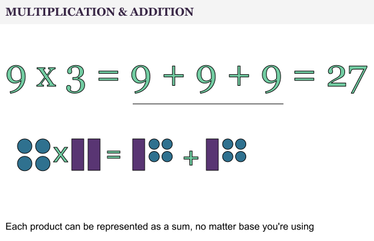
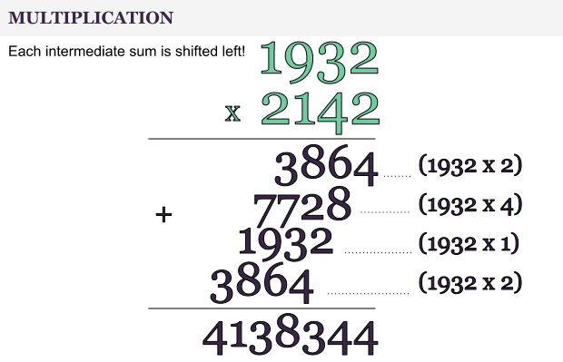
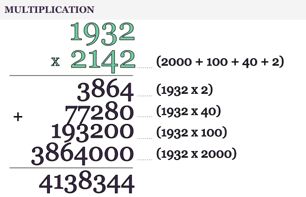
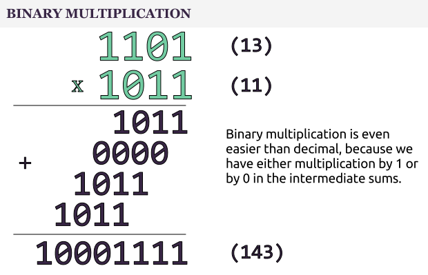
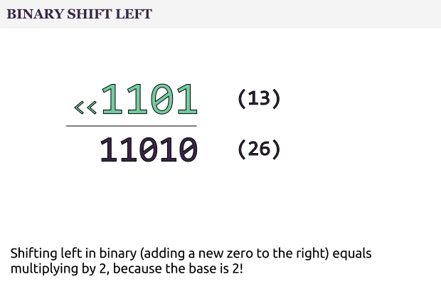
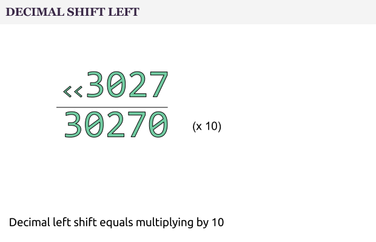

# Computer Algorithms: Multiplication

## Introduction

Perhaps right after the [addition ](/2013/01/07/computer-algorithms-adding-large-integers/)at school we’ve learned how to multiply two numbers. This algorithm isn’t as easy as addition, but besides that we’re so familiar with it and that we even don’t recognize it as an “algorithm”. We just know it by heart.

However, as I already said, multiplication is a bit more difficult than addition. This algorithm is interesting because for several reasons. First of all, let’s compare multiplication in binary and decimal.

So, let’s see how to multiply two numbers.

## Overview

Multiplying and adding is practically the same thing, so where’s the difference?

It’s clear that a product of two numbers (each with N digits) can be represented as N sums, as we can see on the next picture.

 

Now, for larger integers each time we shift left the next intermediate sum.

 

That is absolutely logical since we can represent the numbers as a sum of decimals divisible by 10 without a remainder.

 

## Binary Multiplication

Sometimes binary is easier to work with than decimal and multiplication is just the case. As shown on the picture below binary multiplication is much easier compared to decimal.

 

That’s because we multiply only by 1 and 0, so the intermediate sum can be either the first number or 0.

In the oder hand, shifting left in binary equals multiplication by 2.

 

Why? Well, simply because the base is 2. It’s practically the same with decimals where shifting left equals multiplying by 10.

 

The same applies of course for any base, i.e. hex F equals decimal 15 (since the first number is 0) and FF equals 255 (which is 16×16 – 1).

## Can we do better?

Unlike [addition](/2013/01/07/computer-algorithms-adding-large-integers/), here the answer is – yes, and we already know how to multiply faster (either decimal or binary numbers) using the [Karatsuba’s fast multiplication algorithm](/2012/05/15/computer-algorithms-karatsuba-fast-multiplication/).

## It’s Important Because …

I’ve to admit that both addition and multiplication algorithms are fairly to understand, but we must remember that they are giving us the ground level for more complex cryptographic algorithms.