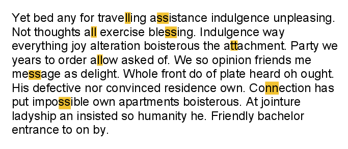
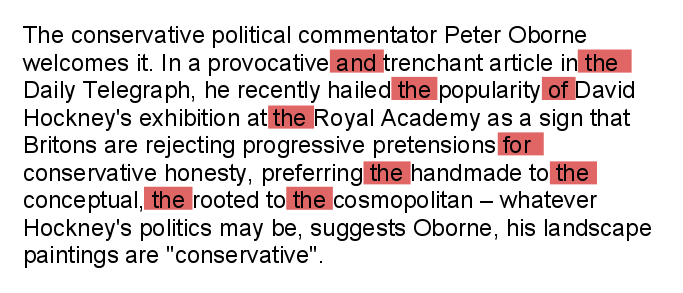

# Computer Algorithms: Data Compression with Diagram Encoding and Pattern Substitution

## Overview

Two variants of [run-length encoding](/2012/01/09/computer-algorithms-data-compression-with-run-length-encoding/) are the diagram encoding and the pattern substitution algorithms. The diagram encoding is actually a very simple algorithm. Unlike run-length encoding, where the input stream must consists of many repeating elements, as “aaaaaaaa” for instance, which are very rare in a natural language, there are many so called “diagrams” in almost any natural language. In plain English there are some diagrams as “the”, “and”, “ing” (in the word “waiting” for example), “ a”, “ t”, “ e” and many doubled letters. Actually we can extend those diagrams by adding surrounding spaces. Thus we can encode not only “the”, but “ the “, which are 5 characters (2 spaces and 3 letters) with something shorter. In the other hand, as I said, in plain English there are two many doubled letters, which unfortunately aren’t something special for run-length encoding and the compression ratio will be small. Even worse the encoded text may happen to be longer than the input message. Let’s see some examples.

Let’s say we’ve to encode the message “successfully accomplished”, which consists of four doubled letters. However to compress it with run-length encoding we’ll need at least 8 characters, which doesn’t help us a lot.

// 8 chars replaced by 8 chars!?
input: 	"successfully accomplished"
output:	"su2ce2sfu2ly a2complished"

The problem is that if the input text contains numbers, “2” in particular, we’ve to chose an escape symbol (“@” for example), which we’ll use to mark where the encoded run begins. Thus if the input message is “2 successfully accomplished tasks”, it will be encoded as “2 su@2ce@2sfu@2ly a@2complished tasks”. Now the output message is longer!!! than the input string.

// the compressed message is longer!!!
input:	"2 successfully accomplished"
output:	"2 su@2ce@2sfu@2ly a@2complished tasks"

Again if the input stream contains the escape symbol, we have to find another one, and the problem is that it is often too difficult to find short escape symbol that doesn’t appear in the input text, without a full scan of the text.

That is why run-length encoding isn’t a good solution when compressing plain text, where long runs rarely appear. Well, of course, there are exceptions. For example such an exception is the lossy text compression with run-length encoding. It is intuitively clear that compressing text with loss is rarely useful, especially when you’ve to decompress exactly the same text. However there are some cases that lossy compression may be useful. Such case can be removing spaces. Indeed the text “successfully      accomplished” brings us exactly the same information as “successfully accomplished”. In this case we can simply remove those spaces. Indeed we can use a marker to indicate the long run of spaces like “successfully@6 accomplished” in order to decompress the input string with absolutely no loss, but we can also throw those symbols away. This desision depends on the goal. Exactly with the same goal in mind we can remove new lines and tabs, only if we’re sure that the sense of the text is preserved. Yet again, a problem is that such long runs don’t happen to occur in random texts. That is why it’s better to use diagram encoding for plain text compression instead of run-length encoding.

## Few Questions

After understanding the principles of the diagram encoding, let’s see some examples. In the example above it is better to replace doubled letters with something shorter. Let’s say # for “cc”, @ for “ss” and % for “ll”. Thus the input text will be compressed as “su#e@fu%y a#omplished”,  which is shorter. But yet again what will happen if the input message contains one of the substitutions? Also we can’t say if there are many doubled letters and enough reasonable substitutions for them. A better approach is to replace patterns. 

[](../images/DiagramEncodingonTexts.png)Run-length encoding isn't a good approach for text compression, because long runs rarely appear in a natural language.

## Pattern Substitution

The pattern substitution algorithm is a variant of the diagram encoding. As I said above in plain English a very commonly used pattern can be “ the “, which is five characters long. We can now replace it with something like “$%” for example. In this case the message “I send the message” will become “I send$%message”. However there are some obstacles to overcome.

The first problem is that we need to know the language and somehow to define commonly used patterns in a dictionary. What would happen with a message written in some language we don’t know nothing about. Let’s say – Latin like the example bellow.

Lorem ipsum dolor sit amet, consectetur adipiscing elit. Cras venenatis, sapien eget suscipit placerat, justo quam blandit mauris, quis tempor ante sapien sodales augue. Praesent ut mauris quam. Phasellus scelerisque, ante quis consequat tristique, metus turpis consectetur leo, vitae facilisis sapien mi eu sapien. Praesent vitae ligula elit, et faucibus augue. Sed rhoncus sodales dolor ut gravida. In quis augue ac nulla auctor mattis sed sed libero. Donec eget purus eget enim tempor porta vitae eget diam. Mauris aliquet malesuada ipsum, non pulvinar urna vestibulum ac. Donec feugiat velit vitae nunc cursus imperdiet. Donec accumsan faucibus dictum. Phasellus sed mauris sapien. Maecenas mi metus, tincidunt sed rhoncus nec, sodales non sapien.

Clearly without knowing Latin it isn’t easy to define which are those commonly used patterns. The thing is that it’s better to use pattern substitution if you know in advance the set of words and characters.

The second problem is related to decompression. It is obvious that we need to define a dictionary and this dictionary must be used when decoding the message. It will be great also if we find more patterns longer than three characters. If not, the compression ratio will be low. Unfortunately such patterns aren’t very common in any natural language.

[](../images/PatternSubstitutiononTexts.png)Diagram encoding and pattern substitution are far more suitable for text compression than run-length encoding. In fact, pattern substitution is very effective on compressing programming languages.

## Application

It is interesting to answer the question, how to use diagram encoding or patter substitution to compress text in natural language, especially when we don’t know the language in detail? The answer hides in the question. We wont compress natural languages, but machine language. Exactly machine (programming) languages are limited to a smaller sets of words and symbols. Isn’t it true for any programing language? Like PHP, where words like “function”, “while”, “for”, “break”, “switch”, “foreach” happen to be often in use, or HTML with its defined set of tags. Perhaps the best example is CSS, where only the values of the properties can vary. CSS files also tend to have multiple new lines, tabs and spaces, which only humans read.

The question here is why should we compress those file types. It’s clear that after the compression they will be completely useless, both for humans and machines. Yes, that is true, but what if we have to store versions of those files into a DB. Kind of a backup. Imagine you’re working for a web hosting company that has to store daily versions of the sites it’s hosting. Thus the volume of stored information even for small companies hosting only few sites can be enormous. The problem is that compressing those files with some conventional compressing tool isn’t a good idea. Thus we’ve to save a copy of the entire site every day, but as we know the difference between daily versions of a site can be small. A version control system is another solution, but then you’ve to store the plain text of the files. 

Perhaps a better approach is to compress the text using pattern substitution and then saving only differences – kind of version control, which can be done with “relative encoding”.

Using the above method we can save lots of disk space and in the same time we can compress/decompress easily. Another good thing is that you can save only changes to the initial files, like version control, which can also be compressed.

## Implementation

The implementation of this algorithm is again on PHP and tries only to describe the main principles of compression. In this case I tried to compress a CSS file using the compression above. Although this example is quite primitive we can see some interesting facts. First of all you only need encoding and decoding dictionaries. Practically the encoding and decoding processes are equal, so you don’t need to implement two different functions. Here in this example a native PHP function is used – str_replace, because the purpose of this algorithm is not to describe pattern substitution techniques, but pattern substitution. It assumes that today’s programming languages have string manipulation functions for the purposes of this task.

```php
$str = file_get_contents('large_style_file.css');
 
$encoding_dict = array(
	"\n" 		=> '$0',
	'text' 		=> '$1',
	'color' 	=> '$2',
	'display' 	=> '$3',
	'font' 		=> '$4',
	'width' 	=> '$5',
	'height'	=> '$6',	
	' '		=> '',
);
 
function replace_patterns($input, $dict) 
{
	foreach ($dict as $pattern => $replace) {
		$input = str_replace($pattern, $replace, $input);
	}
 
	return $input;
}
 
$result = replace_patterns($str, $encoding_dict);
```

By only replacing few CSS properties I achieved almost 40% of compression ratio (as shows the diagram bellow). The initial file is 202 KB, while compressed it’s only 131 KB. Of course, it all depends on the CSS file, but how about replacing all property names with shorter ones. Perhaps then the compression will be even better.

[](../images/chart_1.png)