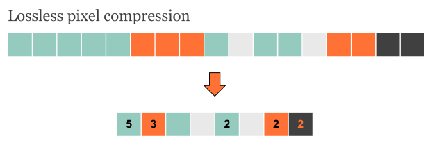
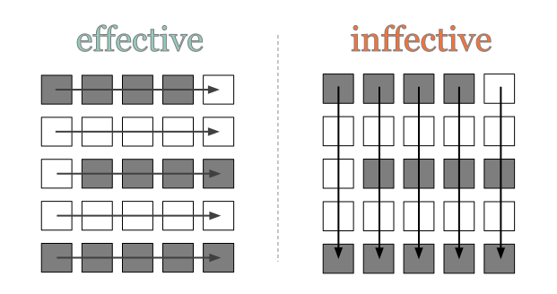
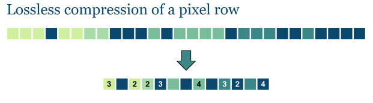
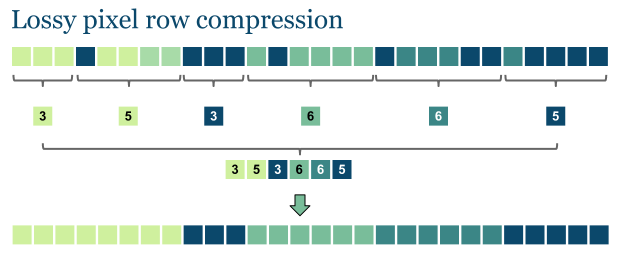
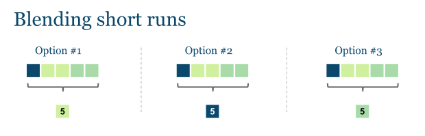
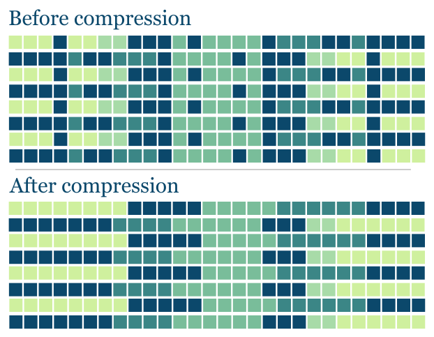

# Computer Algorithms: Lossy Image Compression with Run-Length Encoding

## Introduction

[Run-length encoding](/2012/01/09/computer-algorithms-data-compression-with-run-length-encoding/) is a data compression algorithm that helps us encode large runs of repeating items by only sending one item from the run and a counter showing how many times this item is repeated. Unfortunately this technique is useless when trying to compress natural language texts, because they don’t have long runs of repeating elements. In the other hand RLE is useful when it comes to image compression, because images happen to have long runs pixels with identical color. 

As you can see on the following picture we can compress consecutive pixels by only replacing each run with one pixel from it and a counter showing how many items it contains.

[](../images/1.LosslessRLEforImages.png)Although lossless RLE can be quite effective for image compression, it is still not the best approach!

In this case we can save only counters for pixels that are repeated more than once. Such the input stream “aaaabbaba” will be compressed as “[4]a[2]baba”. 

Actually there are several ways run-length encoding can be used for image compression. A possible way of compressing a picture can be either row by row or column by column, as it is shown on the picture below.

[](../images/2.RowbyRowandColbyCol.png)Row by row or column by column compression.

The problem in practice is that sometimes compressing row by row may be effective, while in other cases the same approach is very ineffective. This is illustrated by the image below.

[](../images/3.EffectiveandIneffectiveCompression.png)Sometimes image compression may be done only after some preprocessing that can help us understand the best compression approach!

Obviously run-length encoding is a very good approach when compressing images, however when we talk about big images with millions of pixels it’s somehow natural to come with some lossy compression.

## Overview

Lossy RLE is a very suitable algorithm when it comes to images, because in most of the cases large images do appear to have big spaces of identical pixel colors, i.e. when the half of the picture is the blue sky. By using lossy compression we can skip very short runs.

First we’ve to say how long will be the shortest run that we will keep in the compression. For instance if 3 is the shortest run, then runs of 2 consecutive elements will be skipped.

[](../images/4.LossessImageRow.png)Lossless compression of a pixel row in some cases can be very inefective!

Of course if we set the shortest run to be only one element long, this will make our compression completely lossless, which isn’t very effective. However when we talk about millions of pixels even runs of three or more elements are very short, so it’s up to the developer to decide how long will be the shortest run.

## Some Examples

Let’s first define the shortest run that we will keep untouched to be at least three element long.

[](../images/5.LossyImageRow.png)We can lose some information that is invisbile to the eye.

The above image is compressed more effectively than the lossless pixel row from the previous picture.

The thing is how to merge short runs. For instance the following three runs have to be blended into one color run.

[](../images/6.BlendingShortRuns.png)We must chose how to blend short runs!

We can choose the middle color (option #1) or not, but this will always depend on the picture and it will be effective in some cases and ineffective in other.

## Implementation

Implementing run-length encoding is easy in general. Here’s a simple [PHP](/category/php/) code that shows a lossy RLE.

```php
/**
 * Compresses an input list of objects by losing some data using
 * run-length encoding
 * 
 * @param mixed $objectList
 * @param int $minLength
 */
function lossyRLE($objectList, $minLength)
{
	$len 		= is_string($objectList) 
			? strlen($objectList)		// string as an input stream
			: count($objectList);		// array as an input stream
	$j 		= 1;
	$compressed = array();				// compressed output
 
	for ($i = 0; $i  $j, $objectList[$i]);
			}
			$j = 1;
		}
	}
 
	return $compressed;
}
 
$input = 'aaaabbaabbbbba';
 
// aaaaaaaabbbbbb
lossyRLE($input, 3);
```

The code above can be modified in order to work with more complex data. Let’s say we have a “pixel” abstraction as on the example above.

```php
/**
 * Pixel abstraction
 */
class Pixel
{
	private $_color = null;
 
	public function __construct($color = '')
	{
		$this->_color = $color;
	}
 
	public function getColor() 
	{
		return $this->_color;
	}
}
 
/**
 * Inits the pixels array
 * 
 * @param array $pixels
 */
function init(array &$pixels = array())
{
	$colors = array('red', 'green', 'blue');
 
	for ($i = 0; $i  $j) {
				$compressed[$l-1]['count'] += $j;
			} else {
				$compressed[] = array('count' => $j, $objectList[$i]);
			}
			$j = 1;
		}
	}
 
	return $compressed;
}
 
$pixels = array();
 
// initializes the pixels array
init($pixels);
 
$compressed = lossyRLE($pixels, 3);
 
print_r($compressed);
```

## Complexity

In general lossless RLE compelxity is linear – O(n) where n is the number of items from the input stream. Even with the small modification above the complexity remains linear. However we can modify the compression in a slightly different manner (in order to get the middle value from consecutive short runs). This will somehow affect the complexity of the algorithm, of course.

## Application

Run-length encoding isn’t a very effective option when compressing texts, but for images where long runs of the identical pixels happen to occur it is quite useful. 

[](../images/7.LossyRLE.png) 

Nevertheless RLE is easy to convert into a lossy algorithm, that makes it very suitable for image compression.