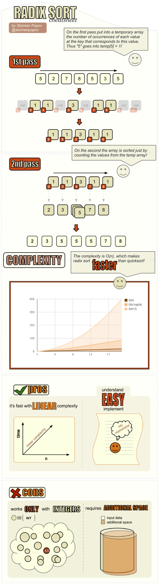

# Algorithm Cheatsheet: Radix Sort

Radix sort is an elegant and fast integer-sorting algorithm as explained in the following cheatsheet. Please click on the image bellow to download the cheatsheet on PDF!

